# 线程与进程

## 进程与进程

### 进程

- 程序由指令和数据组成，但是这些指令要运行，数据要读写，就必须将指令加载到cpu，数据加载至内存。在指令运行过程中还需要用到磁盘，网络等设备，进程就是用来加载指令管理内存管理IO的
- 当一个指令被运行，从磁盘加载这个程序的代码到内存，这时候就开启了一个进程
- 进程就可以视为程序的一个实例，大部分程序都可以运行多个实例进程（例如记事本，浏览器等），部分只可以运行一个实例进程（例如360安全卫士）

### 线程

- 一个进程之内可以分为一到多个线程。
- 一个线程就是一个指令流，将指令流中的一条条指令以一定的顺序交给 CPU 执行
- Java 中，线程作为最小调度单位，进程作为资源分配的最小单位。 在 windows 中进程是不活动的，只是作
  为线程的容器（这里感觉要学了计算机组成原理之后会更有感觉吧！）

### 二者对比

进程基本上相互独立的，而线程存在于进程内，是进程的一个子集
进程拥有共享的资源，如内存空间等，供其内部的线程共享
进程间通信较为复杂
同一台计算机的进程通信称为 IPC（Inter-process communication）
不同计算机之间的进程通信，需要通过网络，并遵守共同的协议，例如 HTTP
线程通信相对简单，因为它们共享进程内的内存，一个例子是多个线程可以访问同一个共享变量
线程更轻量，线程上下文切换成本一般上要比进程上下文切换低


## 并行与并发

### 并发

在单核 cpu 下，线程实际还是串行执行的。操作系统中有一个组件叫做任务调度器，将 cpu 的时间片（windows
下时间片最小约为 15 毫秒）分给不同的程序使用，只是由于 cpu 在线程间（时间片很短）的切换非常快，人类感
觉是同时运行的 。一般会将这种线程轮流使用 CPU 的做法称为并发（concurrent）


### 并行

多核 cpu下，每个核（core） 都可以调度运行线程，这时候线程可以是并行的，不同的线程同时使用不同的cpu在执行。


### 二者对比

引用 Rob Pike 的一段描述：并发（concurrent）是同一时间应对（dealing with）多件事情的能力， 并行（parallel）是同一时间动手做（doing）多件事情的能力

- 家庭主妇做饭、打扫卫生、给孩子喂奶，她一个人轮流交替做这多件事，这时就是并发
- 雇了3个保姆，一个专做饭、一个专打扫卫生、一个专喂奶，互不干扰，这时是并行
- 家庭主妇雇了个保姆，她们一起这些事，这时既有并发，也有并行（这时会产生竞争，例如锅只有一口，一
  个人用锅时，另一个人就得等待）


### 应用

#### 同步和异步的概念

<span style ="color:red">以调用方的角度讲:</span>

- 如果需要等待结果返回才能继续运行就是同步
- 如果不需要等待结果返回就能继续运行就是异步

#### 1) 设计

多线程可以使方法的执行变成异步的，比如说读取磁盘文件时，假设读取操作花费了5秒，如果没有线程的调度机制，这么cpu只能等5秒，啥都不能做。

#### 2) 结论

- 比如在项目中，视频文件需要转换格式等操作比较费时，这时开一个新线程处理视频转换，避免阻塞主线程
- tomcat 的异步 servlet 也是类似的目的，让用户线程处理耗时较长的操作，避免阻塞 tomcat 的工作线程
- ui 程序中，开线程进行其他操作，避免阻塞 ui 线程


# java线程

## 创建和运行线程

### 方法一，直接使用 Thread

```java
// 构造方法的参数是给线程指定名字，，推荐给线程起个名字
Thread t1 = new Thread("t1") {
 @Override
 // run 方法内实现了要执行的任务
 public void run() {
 log.debug("hello");
 }
};
t1.start();
```


### 方法二，使用 Runnable 配合 Thread

把【线程】和【任务】（要执行的代码）分开，Thread 代表线程，Runnable 可运行的任务（线程要执行的代码）Test2.java

```java
// 创建任务对象,Runnable是一个接口
Runnable task2 = new Runnable() {
 @Override
 public void run() {
 log.debug("hello");
 }
};
// 参数1 是任务对象; 参数2 是线程名字，推荐给线程起个名字
Thread t2 = new Thread(task2, "t2");
t2.start();

//或直接用lambda
Thread t = new Thread(()->{ log.debug("running"); }, "t2");
```


### 小结

- 方法1 是把线程和任务合并在了一起

- 方法2 是把线程和任务分开了

  - 用 Runnable 更容易与线程池等高级 API 配合
  - 用 Runnable 让任务类脱离了 Thread 继承体系，更灵活。

  通过查看源码可以发现，方法二其实到底还是通过方法一执行的！


### Thread的构造方法和源码分析

当创建Thread对象时，会依次调用两次init方法：


- 如果构造线程对象时，未传入ThreadGroup，`Thread会默认获取父线程的ThreadGroup作为该线程的ThreadGroup`，此时子线程和父线程会在同一个ThreadGroup中
- 如果没有传递Runnable或者没有覆写Thread的run方法，`该Thread不会调用任何方法`
- 如果传递Runnable接口的实例或者覆写run方法，则`会执行该方法的逻辑单元`（逻辑代码）
- 创建线程对象Thread，`默认有一个线程名，以Thread-开头，从0开始计数`，如“Thread-0、Thread-1、Thread-2 …”
- stackSize可以`提高线程栈的深度`，放更多栈帧，但是会`减少能创建的线程数目`
- stackSize默认是0，`如果是0，代表着被忽略，该参数会被JNI函数调用`，但是注意某些平台可能会失效，`可以通过“-Xss10m”设置`

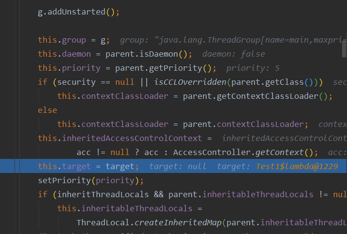

这里的target就是我们的Runnable对象,它会在Run()方法中调用，看下面。


### start方法和run方法源码分析

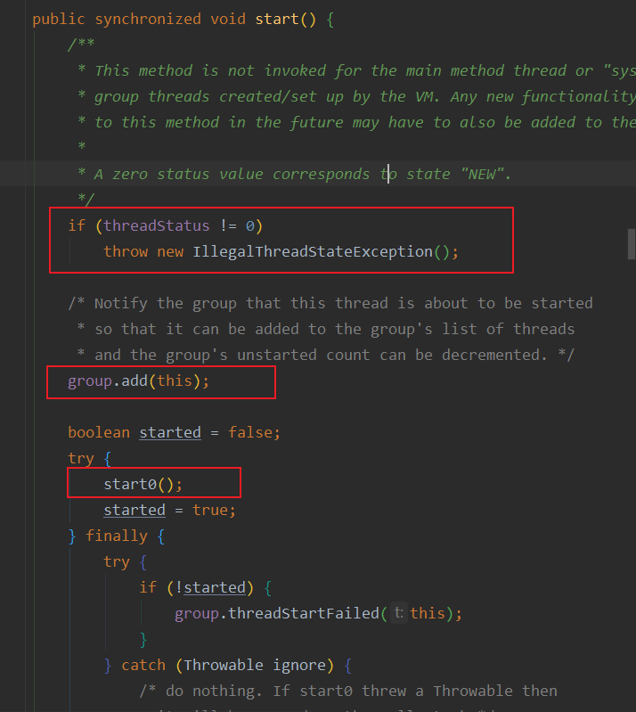

- 当多次调用start()，会抛出throw new IllegalThreadStateException()异常。也就是每一个线程类的对象只允许启动一次，如果重复启动则就抛出此异常。

- start()方法调用了start0()方法：

  ```java
   private native void start0();
  ```

  start0()方法为native,网上搜索可得 JVM自动调用了run()方法，代码被封装了。

  - 如果是方法一，将会直接调用覆盖的run()方法(即我们在Thread类中自己写的run()方法)

  - 如果是方法二，将会调用Thread对象中的run()方法，而这个方法会进行一次target判断，若不为空，就会调用target的run()方法。

    

> Q：可不可以直接调用run()呢？
>
> A：不能！！！直接调用 `run()` 是在主线程中执行了 `run()`，没有启动新的线程。使用 `start()` 是启动新的线程，通过新的线程间接执行 `run()`方法 中的代码

### 方法三，FutureTask 配合 Thread

`FutureTask` 实现了 `RunnableFuture` 接口，而  `RunnableFuture` 接口又分别实现了 `Runnable` 和 `Future` 接口，所以可以推断出 `FutureTask` 具有这两种接口的特性：

- 有 `Runnable` 特性，所以可以用在 `ExecutorService` 中配合线程池使用
- 有 `Future` 特性，所以可以从中获取到执行结果

FutureTask 能够接收 Callable 类型的参数，用来处理有返回结果的情况 Test3.java

```java
    public static void main(String[] args) throws ExecutionException, InterruptedException {
        // 实现多线程的第三种方法可以返回数据
        FutureTask futureTask = new FutureTask<>(new Callable<Integer>() {
            @Override
            public Integer call() throws Exception {
                log.debug("多线程任务");
                Thread.sleep(100);
                return 100;
            }
        });
        // 主线程阻塞，同步等待 task 执行完毕的结果
        new Thread(futureTask,"我的名字").start();
        log.debug("主线程");
        log.debug("{}",futureTask.get());
    }
```

Future就是对于具体的Runnable或者Callable任务的执行结果进行取消、查询是否完成、获取结果。必要时可以通过get方法获取执行结果，该方法会阻塞直到任务返回结果。

```java
public interface Future<V> {
    boolean cancel(boolean mayInterruptIfRunning);
    boolean isCancelled();
    boolean isDone();
    V get() throws InterruptedException, ExecutionException;
    V get(long timeout, TimeUnit unit)
        throws InterruptedException, ExecutionException, TimeoutException;
}

```

  Future提供了三种功能：   　　

1. 判断任务是否完成；   　　

2. 能够中断任务；   　　

3. 能够获取任务执行结果。   

[FutureTask是Future和Runable的实现](https://mp.weixin.qq.com/s/RX5rVuGr6Ab0SmKigmZEag)

   

   

## 线程运行原理

### 虚拟机栈与栈帧

拟机栈描述的是Java方法执行的内存模型：每个方法被执行的时候都会同时创建一个栈帧(stack frame)用于存储局部变量表、操作数栈、动态链接、方法出口等信息，是属于线程的私有的。当java中使用多线程时，每个线程都会维护它自己的栈帧！每个线程只能有一个活动栈帧，对应着当前正在执行的那个方法

### 线程上下文切换（Thread Context Switch）

因为以下一些原因导致 cpu 不再执行当前的线程，转而执行另一个线程的代码

- 线程的 cpu 时间片用完(每个线程轮流执行，看前面并行的概念)
- 垃圾回收
- 有更高优先级的线程需要运行
- 线程自己调用了 `sleep`、`yield`、`wait`、`join`、`park`、`synchronized`、`lock` 等方法

当 Context Switch 发生时，需要由操作系统保存当前线程的状态，并恢复另一个线程的状态，Java 中对应的概念
就是程序计数器（Program Counter Register），它的作用是记住下一条 jvm 指令的执行地址，是线程私有的


## Thread的常见方法


###  start 与 run

#### 调用start

```java
    public static void main(String[] args) {
        Thread thread = new Thread(){
          @Override
          public void run(){
              log.debug("我是一个新建的线程正在运行中");
              FileReader.read(fileName);
          }
        };
        thread.setName("新建线程");
        thread.start();
        log.debug("主线程");
    }
```

输出：程序在 t1 线程运行， `run()`方法里面内容的调用是异步的 Test4.java

```properties
11:59:40.711 [main] DEBUG com.concurrent.test.Test4 - 主线程
11:59:40.711 [新建线程] DEBUG com.concurrent.test.Test4 - 我是一个新建的线程正在运行中
11:59:40.732 [新建线程] DEBUG com.concurrent.test.FileReader - read [test] start ...
11:59:40.735 [新建线程] DEBUG com.concurrent.test.FileReader - read [test] end ... cost: 3 ms
```

#### 调用run

将上面代码的`thread.start();`改为 `thread.run();`输出结果如下：程序仍在 main 线程运行， `run()`方法里面内容的调用还是同步的

```properties
12:03:46.711 [main] DEBUG com.concurrent.test.Test4 - 我是一个新建的线程正在运行中
12:03:46.727 [main] DEBUG com.concurrent.test.FileReader - read [test] start ...
12:03:46.729 [main] DEBUG com.concurrent.test.FileReader - read [test] end ... cost: 2 ms
12:03:46.730 [main] DEBUG com.concurrent.test.Test4 - 主线程
```

#### 小结

直接调用 `run()` 是在主线程中执行了 `run()`，没有启动新的线程
使用 `start()` 是启动新的线程，通过新的线程间接执行 `run()`方法 中的代码


### sleep 与 yield

#### sleep

1. 调用 sleep 会让当前线程从 Running 进入 Timed Waiting 状态（阻塞）
2. 其它线程可以使用 interrupt 方法打断正在睡眠的线程，那么被打断的线程这时就会抛出 `InterruptedException`异常【注意：这里打断的是正在休眠的线程，而不是其它状态的线程】
3. 睡眠结束后的线程未必会立刻得到执行(需要分配到cpu时间片)
4. 建议用 TimeUnit 的 `sleep()` 代替 Thread 的 `sleep()`来获得更好的可读性


#### yield

1. 调用 yield 会让当前线程从 Running 进入 Runnable 就绪状态，然后调度执行其它线程
2. 具体的实现依赖于操作系统的任务调度器(就是可能没有其它的线程正在执行，虽然调用了yield方法，但是也没有用)

#### 小结

yield使cpu调用其它线程，但是cpu可能会再分配时间片给该线程；而sleep需要等过了休眠时间之后才有可能被分配cpu时间片

### 线程优先级

线程优先级会提示（hint）调度器优先调度该线程，`但它仅仅是一个提示，调度器可以忽略它`
如果 cpu 比较忙，那么优先级高的线程会获得更多的时间片，但 cpu 闲时，优先级几乎没作用

### join

当前线程必须等待调用线程执行完毕/指定时间才能继续执行。

join可以理解成插队，能保证一个线程在另一个线程之前完成。

```java
    private static void test1() throws InterruptedException {
        log.debug("开始");
        Thread t1 = new Thread(() -> {
            log.debug("开始");
            sleep(1);
            log.debug("结束");
            r = 10;
        },"t1");
        t1.start();
        t1.join();
        log.debug("结果为:{}", r);
        log.debug("结束");
    }
```

- join()中默认传入的数字为0(即会调用join(0)方法)，如果调用线程执行完时等待的时间小于设置的时间，会提前结束
- 在join()方法中实际上会调用wait()方法。也就是说，join()方法阻塞调用此方法的线程(calling thread)进入 `TIMED_WAITING`或`WAITING `状态。直到线程t完成，此线程再继续。


> 应用：同步


### interrupt 方法详解

#### 打断 sleep，wait，join 的线程

先了解一些interrupt()方法的相关知识：[博客地址](https://www.cnblogs.com/noteless/p/10372826.html#0)

- 如果打断的正在运行或park的线程，则会设置 打断标记 ；
- 如果被打断线程正在 sleep，wait，join 会设置打断标记，并抛出 InterruptedException，并清除 打断标记 ；
- synchronized的等待线程不可以被中断，ReentrantLock的等待线程可以被中断(lock.lockInterruptibly())。

```java
    public static void main(String[] args) throws InterruptedException {
        Thread t1 = new Thread() {
            @Override
            public void run() {
                log.debug("线程任务执行");
                try {
                    Thread.sleep(10000); // wait, join
                } catch (InterruptedException e) {
                    //e.printStackTrace();
                    log.debug("被打断");
                }
            }
        };
        t1.start();
        Thread.sleep(500);
        log.debug("111是否被打断？{}",t1.isInterrupted());
        t1.interrupt();
        log.debug("222是否被打断？{}",t1.isInterrupted());
        Thread.sleep(500);
        log.debug("222是否被打断？{}",t1.isInterrupted());
        log.debug("主线程");
    }
```
输出结果：（我下面将中断和打断两个词混用）可以看到，打断 sleep 的线程, 会清空中断状态，刚被中断完之后`t1.isInterrupted()`的值为`true`，后来变为`false`，即中断状态会被清除。那么线程是否被中断过可以通过异常来判断。【同时要注意如果打断被`join()`，`wait()` blocked的线程也是一样会被清除，被清除(interrupt status will be cleared)的意思即中断状态设置为`false`，被设置( interrupt status will be set)的意思就是中断状态设置为`true`】

```properties
17:06:11.890 [Thread-0] DEBUG com.concurrent.test.Test7 - 线程任务执行
17:06:12.387 [main] DEBUG com.concurrent.test.Test7 - 111是否被打断？false
17:06:12.390 [Thread-0] DEBUG com.concurrent.test.Test7 - 被打断
17:06:12.390 [main] DEBUG com.concurrent.test.Test7 - 222是否被打断？true
17:06:12.890 [main] DEBUG com.concurrent.test.Test7 - 222是否被打断？false
17:06:12.890 [main] DEBUG com.concurrent.test.Test7 - 主线程
```


#### 打断正常运行的线程

打断正常运行的线程, 线程并不会暂停，只是调用方法`Thread.currentThread().isInterrupted();`的返回值为true，可以判断`Thread.currentThread().isInterrupted();`的值来手动停止线程

```java
    public static void main(String[] args) throws InterruptedException {
        Thread t1 = new Thread(() -> {
            while(true) {
                boolean interrupted = Thread.currentThread().isInterrupted();
                if(interrupted) {
                    log.debug("被打断了, 退出循环");
                    break;
                }
            }
        }, "t1");
        t1.start();
        Thread.sleep(1000);
        log.debug("interrupt");
        t1.interrupt();
    }
```


#### 两个判断中断状态的方法

```java
public static boolean interrupted() //这个会清除中断状态

public boolean isInterrupted()
```

为什么要这么设置呢？原因在于：

* interrupted()是一个静态方法，会清除中断标记
* isInterrupted()是一个Thread的实例方法，不会清除中断标记

```java
public class ThreadInterrupt {
    public static void main(String[] args) throws InterruptedException {
        Thread t1 = new Thread(() -> {
            System.out.println(Thread().interrupted());
        });  //这个new Thread用的是runnable接口那个构造函数

        Thread t2 = new Thread(){
            @Override
            public void run() {
                System.out.println(Thread().currentThread().isInterrupted());
            }
        };//这个new Thread用的就是Thread的空参构造

    }
}

```


#### 终止线程

1. ~~使用stop()终止线程~~
   - 这个方法会将线程直接杀掉，没有任何喘息机会，一旦线程被杀死，后面的代码逻辑就再也无法得到执行，而且我们无法确定线程关闭的时机，也就是说线程有可能在任何一行代码突然停止执行，这是非常危险的。
   - 假如这个线程正持有某个锁，贸然将其杀死，会导致该线程持有的锁马上被释放，而曾经被该锁保护的资源，可能正处于一种非原子的状态中，此时被其他线程访问到，会产生不可预知的风险。

2. ~~使用suspend()挂起线程，resume()恢复线程~~
3. 使用中断

Two Phase Termination，就是考虑在一个线程T1中如何优雅地终止另一个线程T2？这里的优雅指的是给T2一个料理后事的机会（如释放锁）。

如下所示：那么线程的`isInterrupted()`方法可以取得线程的打断标记

- 如果是在程序正常运行期间被打断的，那么打断标记就被自动设置为`true`。
- 如果线程在睡眠`sleep`期间被打断，打断标记是不会变的，为false，但是`sleep`期间被打断会抛出异常，我们据此手动设置打断标记为`true`；

处理好这两种情况那我们就可以放心地来料理后事啦！


代码实现如下：

```java
@Slf4j
public class Test11 {
    public static void main(String[] args) throws InterruptedException {
        TwoParseTermination twoParseTermination = new TwoParseTermination();
        twoParseTermination.start();
        Thread.sleep(3000);  // 让监控线程执行一会儿
        twoParseTermination.stop(); // 停止监控线程
    }
}


@Slf4j
class TwoParseTermination{
    Thread thread ;
    public void start(){
        thread = new Thread(()->{
            while(true){
                if (Thread.currentThread().isInterrupted()){
                    log.debug("线程结束。。正在料理后事中");
                    break;
                }
                try {
                    Thread.sleep(500);
                    log.debug("正在执行监控的功能");
                } catch (InterruptedException e) {
                    //手动设置
                    Thread.currentThread().interrupt();
                    e.printStackTrace();
                }
            }
        });
        thread.start();
    }
    public void stop(){
        thread.interrupt();
    }
}
```

###  


### sleep，yiled，wait，join 对比

1. sleep，join，yield是Thread类中的方法
2. wait/notify是object中的方法，需要和synchronized一起使用

- sleep 不释放锁、释放cpu
- yiled 不释放锁、释放cpu
- wait 释放锁、释放cpu
- join 释放锁、抢占cpu


##   守护线程

默认情况下，java进程需要等待所有的线程结束后才会停止，但是有一种特殊的线程，叫做守护线程，在其他线程全部结束的时候即使守护线程还未结束代码未执行完java进程也会停止。

守护线程是一种支持型线程，可以通过 `setDaemon(true)` 将线程设置为守护线程，但必须在线程启动前设置。

* 当主线程死亡后，守护线程会跟着死亡
* 可以帮助做一些辅助性的东西，如“心跳检测”
* 设置守护线程：`public final void setDaemon(boolean on)`


>- 垃圾回收器线程就是一种守护线程
>- Tomcat 中的 Acceptor 和 Poller 线程都是守护线程，所以 Tomcat 接收到 shutdown 命令后，不会等待它们处理完当前请求


## 线程状态之五种状态

五种状态的划分主要是从操作系统的层面进行划分的


1. 初始状态，仅仅是在语言层面上创建了线程对象，即`Thead thread = new Thead();`，还未与操作系统线程关联
2. 可运行状态，也称就绪状态，指该线程已经被创建，与操作系统相关联，等待cpu给它分配时间片就可运行
3. 运行状态，指线程获取了CPU时间片，正在运行
   1. 当CPU时间片用完，线程会转换至【可运行状态】，等待 CPU再次分配时间片，会导致我们前面讲到的上下文切换
4. 阻塞状态
   1. 如果调用了阻塞API，如BIO读写文件，那么线程实际上不会用到CPU，不会分配CPU时间片，会导致上下文切换，进入【阻塞状态】
   2. 等待BIO操作完毕，会由操作系统唤醒阻塞的线程，转换至【可运行状态】
   3. 与【可运行状态】的区别是，只要操作系统一直不唤醒线程，调度器就一直不会考虑调度它们，CPU就一直不会分配时间片
5. 终止状态，表示线程已经执行完毕，生命周期已经结束，不会再转换为其它状态

## 线程状态之六种状态

这是从 Java API 层面来描述的，我们主要研究的就是这种。状态转换详情图：[地址](https://www.jianshu.com/p/ec94ed32895f)
根据 Thread.State 枚举，分为六种状态 Test12.java


1. NEW：新建状态，线程被创建且未启动，还未调用 `start`  方法。

2. RUNNABLE ：当调用了 `start()` 方法之后的状态，注意，Java API 层面的 `RUNNABLE` 状态涵盖了操作系统层面的【就绪状态】、【运行状态】和【阻塞状态(os层面的阻塞状态/IO阻塞状态】（由于 BIO 导致的线程阻塞，在 Java 里无法区分，仍然认为是可运行）

3. `BLOCKED` ， `WAITING` ， `TIMED_WAITING` 都是 Java API 层面对【阻塞状态】的细分，后面会在状态转换一节详述
- BLOCKED：锁
   - WAITING：wait(),join(),park()
   - TIME_WAITING：sleep(100),wait(100),join(100),parkNanos(100),parkUntil(100)


具体转换：

1. RUNNABLE <--> WAITING

   1. 线程用synchronized(obj)获取了对象锁后
      1. 调用obj.wait()方法时，t 线程从RUNNABLE --> WAITING
      2. 调用obj.notify()，obj.notifyAll()，t.interrupt()时
         1. 竞争锁成功，t 线程从WAITING --> RUNNABLE
         2. 竞争锁失败，t 线程从WAITING --> BLOCKED
   2. Test27.java

2. RUNNABLE <--> WAITING

   1. 当前线程调用 LockSupport.park() 方法会让当前线程从 RUNNABLE --> WAITING
   2. 调用 LockSupport.unpark(目标线程) 或调用了线程 的 interrupt() ，会让目标线程从 WAITING -->
      RUNNABLE

3. RUNNABLE <--> WAITING

   1. 当前线程调用 t.join() 方法时，当前线程从 RUNNABLE --> WAITING
      注意是当前线程在t 线程对象的监视器上等待
   2. t 线程运行结束，或调用了当前线程的 interrupt() 时，当前线程从 WAITING --> RUNNABLE

4. RUNNABLE <--> TIMED_WAITING

   t 线程用 synchronized(obj) 获取了对象锁后

   1. 调用 obj.wait(long n) 方法时，t 线程从 RUNNABLE --> TIMED_WAITING
   2. t 线程等待时间超过了 n 毫秒，或调用 obj.notify() ， obj.notifyAll() ， t.interrupt() 时
      1. 竞争锁成功，t 线程从 TIMED_WAITING --> RUNNABLE
      2. 竞争锁失败，t 线程从 TIMED_WAITING --> BLOCKED

5. RUNNABLE <--> TIMED_WAITING

   1. 当前线程调用 t.join(long n) 方法时，当前线程从 RUNNABLE --> TIMED_WAITING
      注意是当前线程在t 线程对象的监视器上等待
   2. 当前线程等待时间超过了 n 毫秒，或t 线程运行结束，或调用了当前线程的 interrupt() 时，当前线程从
      TIMED_WAITING --> RUNNABLE

6. RUNNABLE <--> TIMED_WAITING

   1. 当前线程调用 Thread.sleep(long n) ，当前线程从 RUNNABLE --> TIMED_WAITING
   2. 当前线程等待时间超过了 n 毫秒或调用了线程 的 interrupt() ，当前线程从 TIMED_WAITING --> RUNNABLE

7. RUNNABLE <--> TIMED_WAITING

   1. 当前线程调用 LockSupport.parkNanos(long nanos) 或 LockSupport.parkUntil(long millis) 时，当前线
      程从 RUNNABLE --> TIMED_WAITING
   2. 调用 LockSupport.unpark(目标线程) 或调用了线程 的 interrupt() ，或是等待超时，会让目标线程从
      TIMED_WAITING--> RUNNABLE

## ThreadLocal

提供线程内的局部变量，不同的线程之间不会相互干扰，这种变量在线程的生命周期内起作用，减少同一个线程内多个函数或组件之间一些公共变量传递的复杂度。

ThreadLoacl 有一个静态内部类 ThreadLocalMap，其 Key 是 ThreadLocal 对象，值是 Entry 对象，Entry 中只有一个 Object 类的 vaule 值。ThreadLocal 是线程共享的，但 ThreadLocalMap 是每个线程私有的。ThreadLocal 主要有 set、get 和 remove 三个方法。

|        | synchronized                                                 | ThreadLocal                                                  |
| ------ | ------------------------------------------------------------ | ------------------------------------------------------------ |
| 原理   | 同步机制采用’以时间换空间’的方式, 只提供了一份变量,让不同的线程排队访问 | ThreadLocal采用’以空间换时间’的方式, 为每一个线程都提供了一份变量的副本,从而实现同时访问而相不干扰 |
| 侧重点 | 多个线程之间访问资源的同步性                                 | 多线程中让每个线程之间的数据相互隔离                         |


# 线程问题

## 线程出现问题的根本原因分析

线程出现问题的根本原因是因为线程上下文切换，导致线程里的指令没有执行完就切换执行其它线程了，下面举一个例子 Test13.java

```java
    static int count = 0;
    public static void main(String[] args) throws InterruptedException {
        Thread t1 = new Thread(()->{
            for (int i = 1;i<5000;i++){
                count++;
            }
        });
        Thread t2 =new Thread(()->{
            for (int i = 1;i<5000;i++){
                count--;
            }
        });
        t1.start();
        t2.start();
        t1.join();
        t2.join();
        log.debug("count的值是{}",count);
    }
```

我将从字节码的层面进行分析：


```java
getstatic i // 获取静态变量i的值
iconst_1 // 准备常量1
iadd // 自增
putstatic i // 将修改后的值存入静态变量i
    
getstatic i // 获取静态变量i的值
iconst_1 // 准备常量1
isub // 自减
putstatic i // 将修改后的值存入静态变量i
```

可以看到`count++` 和 `count--` 操作实际都是需要这个4个指令完成的，那么这里问题就来了！Java 的内存模型如下，完成静态变量的自增，自减需要在主存和工作内存中进行数据交换：


如果代码是正常按顺序运行的，那么count的值不会计算错


出现负数的情况：


出现正数的情况：


### 问题的进一步描述

#### 临界区

1. 一个程序运行多线程本身是没有问题的

2. 问题出现在多个线程共享资源的时候

   1. 多个线程同时对共享资源进行读操作本身也没有问题
   2. 问题出现在对对共享资源同时进行读写操作时就有问题了 

3. 先定义一个叫做临界区的概念：一段代码内如果存在对共享资源的多线程读写操作，那么称这段代码为临界区

   1. 如

      ```java
      static int counter = 0;
      static void increment()
      {// 临界区
       counter++;
      }
      static void decrement()
      {// 临界区
       counter--;
      }
      ```

#### 竞态条件

多个线程在临界区执行，那么由于代码指令的执行不确定而导致的结果问题，称为竞态条件

## synchronized 解决方案

为了避免临界区中的竞态条件发生，由多种手段可以达到

- 阻塞式解决方案：synchronized ，Lock
- 非阻塞式解决方案：原子操作(CAS)

现在讨论使用synchronized来进行解决，即俗称的对象锁，它采用互斥的方式让同一时刻至多只有一个线程持有对象锁，其他线程如果想获取这个锁就会阻塞住，这样就能保证拥有锁的线程可以安全的执行临界区内的代码，不用担心线程上下文切换

> 注意
> 虽然 java 中互斥和同步都可以采用 synchronized 关键字来完成，但它们还是有区别的：互斥是保证临界区的竞态条件发生，同一时刻只能有一个线程执行临界区的代码 同步是由于线程执行的先后，顺序不同但是需要一个线程等待其它线程运行到某个点。

### synchronized

```java
synchronized(对象) // 线程1获得锁， 那么线程2的状态是(blocked)
{
 临界区
}
```

上面的实例程序使用synchronized后如下，计算出的结果是正确！Test13.java

```java
static int counter = 0;
static final Object room = new Object();
public static void main(String[] args) throws InterruptedException {
     Thread t1 = new Thread(() -> {
         for (int i = 0; i < 5000; i++) {
             synchronized (room) {
             counter++;
        	}
 		}
 	}, "t1");
     Thread t2 = new Thread(() -> {
         for (int i = 0; i < 5000; i++) {
             synchronized (room) {
             counter--;
         }
     }
     }, "t2");
     t1.start();
     t2.start();
     t1.join();
     t2.join();
     log.debug("{}",counter);
}

```

### synchronized作用

- **原子性**：**所谓原子性就是指一个操作或者多个操作，要么全部执行并且执行的过程不会被任何因素打断，要么就都不执行。** 被`synchronized`修饰的类或对象的所有操作都是原子的，因为在执行操作之前必须先获得类或对象的锁，直到执行完才能释放。
- **可见性**： **可见性是指多个线程访问一个资源时，该资源的状态、值信息等对于其他线程都是可见的。** synchronized和volatile都具有可见性，synchronized规定，线程在加锁时， 先清空工作内存→在使用共享变量时从主内存中拷贝共享变量的到工作内存 →执行完代码→将更改后的共享变量的值刷新到主内存中→释放互斥锁。
- **有序性**：**有序性值程序执行的顺序按照代码先后执行**  synchronized和volatile都具有有序性，**synchronized代码块内部可以被重排序，若该变量整个都在synchronized代码块的保护范围内，就不会出现重排序问题**。 Java允许编译器和处理器对指令进行重排，但是指令重排并不会影响单线程的顺序，它影响的是多线程并发执行的顺序性。synchronized保证了每个时刻都只有一个线程访问同步代码块，也就确定了线程执行同步代码块是分先后顺序的，保证了有序性。


### synchronized原理

synchronized实际上利用对象`保证了临界区代码的原子性`，临界区内的代码在外界看来是不可分割的，不会被线程切换所打断


### synchronized 类型(对象，类，方法)

```java
    class Test{
        //锁住实例对象
        public synchronized void test() {

        }
    }
    //等价于
    class Test{
        public void test() {
            synchronized(this) {

            }  
        }
    }
//---------------- --------------------------------------------------------------------------------
    class Test{
        //锁住类对象
        public synchronized static void test() {
        }
    }
   // 等价于
    class Test{
        public static void test() {
            synchronized(Test.class) {

            }
        }
    }

```


## 变量的线程安全分析

### 成员变量和静态变量的线程安全分析

- 如果没有变量没有在线程间共享，那么变量是安全的
- 如果变量在线程间共享
  - 如果只有读操作，则线程安全
  - 如果有读写操作，则这段代码是临界区，需要考虑线程安全

### 局部变量线程安全分析

- 局部变量【局部变量被初始化为基本数据类型】是安全的
- 局部变量引用的对象未必是安全的
  - 如果局部变量引用的对象没有 暴露给了另一个线程/引用线程共享的对象，那么是线程安全的
  - 如果局部变量引用的对象 暴露给了另一个线程/引用了一个线程共享的对象，那么要考虑线程安全的

#### 线程安全的情况

局部变量【局部变量被初始化为基本数据类型】是安全的，示例如下

```java
public static void test1() {
     int i = 10;
     i++;
}
```

每个线程调用 test1() 方法时局部变量 i，会在每个线程的栈帧内存中被创建多份，因此不存在共享


#### 线程不安全的情况

为 ThreadSafe 类添加子类，子类覆盖 method2 或 method3 方法。

下面可以看到：

- method1()中局部变量list暴露给了method3()中的线程
- method3()中的线程引用了list这个局部变量

```java
class ThreadSafe {
    public  void method1(int loopNumber) {
        ArrayList<String> list = new ArrayList<>();
        for (int i = 0; i < loopNumber; i++) {
            method2(list);
            method3(list);
        }
    }
    public void method2(ArrayList<String> list) {
        list.add("1");
    }
    public void method3(ArrayList<String> list) {
        new Thread(() -> {
            list.remove(0);
        }).start();
    }
}
```


### 常见线程安全类

1. String
2. Integer
3. StringBuffer
4. Random
5. Vector
6. Hashtable
7. java.util.concurrent 包下的类

这里说它们是线程安全的是指，<span style ="color:red">多个线程调用它们同一个实例的某个方法时，是线程安全的</span>。也可以理解为它们的每个方法是原子的

```java
Hashtable table = new Hashtable();
new Thread(()->{
 	table.put("key", "value1");
}).start();
new Thread(()->{
 	table.put("key", "value2");
}).start();

```

#### 线程安全类方法的组合

但注意它们多个方法的组合不是原子的，见下面分析

```java
Hashtable table = new Hashtable();
// 线程1，线程2
if( table.get("key") == null) {
 table.put("key", value);
}
```


#### 不可变类的线程安全

`String`和`Integer`类都是不可变的类，因为其类内部状态是不可改变的，因此它们的方法都是线程安全的，有同学或许有疑问，`String` 有 `replace`，`substring` 等方法【可以】改变值啊，其实调用这些方法返回的已经是一个新创建的对象了！

```java
public class Immutable{
     private int value = 0;
     public Immutable(int value){
     this.value = value;
 	}
     public int getValue(){
         return this.value;
     }
     public Immutable add(int v){
         return new Immutable(this.value + v);
     }
}
```

#### 示例分析-是否线程安全

##### 示例一

分析线程是否安全，先对类的成员变量，类变量，局部变量进行考虑，如果变量会在各个线程之间共享，那么就得考虑线程安全问题了，如果变量A引用的是线程安全类的实例，并且只调用该线程安全类的一个方法，那么该变量A是线程安全的的。下面对实例一进行分析：此类不是线程安全的，`MyAspect`切面类只有一个实例，成员变量`start` 会被多个线程同时进行读写操作

```java
@Aspect
@Component
public class MyAspect {
        // 是否安全？
        private long start = 0L;

        @Before("execution(* *(..))")
        public void before() {
            start = System.nanoTime();
        }

        @After("execution(* *(..))")
        public void after() {
            long end = System.nanoTime();
            System.out.println("cost time:" + (end-start));
        }
    }
```

##### 示例二

此例是典型的三层模型调用，`MyServlet` `UserServiceImpl` `UserDaoImpl`类都只有一个实例，`UserDaoImpl`类中没有成员变量，`update`方法里的变量引用的对象不是线程共享的，所以是线程安全的；`UserServiceImpl`类中只有一个线程安全的`UserDaoImpl`类的实例，那么`UserServiceImpl`类也是线程安全的，同理 `MyServlet`也是线程安全的

```java
public class MyServlet extends HttpServlet {
 // 是否安全
 private UserService userService = new UserServiceImpl();

 public void doGet(HttpServletRequest request, HttpServletResponse response) {
 userService.update(...);
 }
}
public class UserServiceImpl implements UserService {
 // 是否安全
 private UserDao userDao = new UserDaoImpl();
 public void update() {
 userDao.update();
 }
}
public class UserDaoImpl implements UserDao {
 public void update() {
 String sql = "update user set password = ? where username = ?";
 // 是否安全
 try (Connection conn = DriverManager.getConnection("","","")){
 // ...
 } catch (Exception e) {
 // ...
 }
 }
}
```

##### 示例三

跟示例二大体相似，`UserDaoImpl`类中有成员变量，那么多个线程可以对成员变量`conn` 同时进行操作，故是不安全的

```java
public class MyServlet extends HttpServlet {
    // 是否安全
    private UserService userService = new UserServiceImpl();

    public void doGet(HttpServletRequest request, HttpServletResponse response) {
        userService.update(...);
    }
}
public class UserServiceImpl implements UserService {
    // 是否安全
    private UserDao userDao = new UserDaoImpl();
    public void update() {
        userDao.update();
    }
}
public class UserDaoImpl implements UserDao {
    // 是否安全
    private Connection conn = null;
    public void update() throws SQLException {
        String sql = "update user set password = ? where username = ?";
        conn = DriverManager.getConnection("","","");
        // ...
        conn.close();
    }
}
```

##### 示例四

跟示例三大体相似，`UserServiceImpl`类的update方法中 UserDao是作为局部变量存在的，所以每个线程访问的时候都会新建有一个`UserDao`对象，新建的对象是线程独有的，所以是线程安全的

```java
public class MyServlet extends HttpServlet {
    // 是否安全
    private UserService userService = new UserServiceImpl();
    public void doGet(HttpServletRequest request, HttpServletResponse response) {
        userService.update(...);
    }
}
public class UserServiceImpl implements UserService {
    public void update() {
        UserDao userDao = new UserDaoImpl();
        userDao.update();
    }
}
public class UserDaoImpl implements UserDao {
    // 是否安全
    private Connection = null;
    public void update() throws SQLException {
        String sql = "update user set password = ? where username = ?";
        conn = DriverManager.getConnection("","","");
        // ...
        conn.close();
    }
}
```

##### 示例五

```java
public abstract class Test {
    public void bar() {
        // 是否安全
        SimpleDateFormat sdf = new SimpleDateFormat("yyyy-MM-dd HH:mm:ss");
        foo(sdf);
    }
    public abstract foo(SimpleDateFormat sdf);
    public static void main(String[] args) {
        new Test().bar();
    }
}
```

其中 foo 的行为是不确定的，可能导致不安全的发生，被称之为**外星方法**，因为foo方法可以被重写，导致线程不安全。在String类中就考虑到了这一点，String类是`finally`的，子类不能重写它的方法。

```java
    public void foo(SimpleDateFormat sdf) {
        String dateStr = "1999-10-11 00:00:00";
        for (int i = 0; i < 20; i++) {
            new Thread(() -> {
                try {
                    sdf.parse(dateStr);
                } catch (ParseException e) {
                    e.printStackTrace();
                }
            }).start();
        }
    }
```


## Monitor 概念

### Java 对象头

以 32 位虚拟机为例,普通对象的对象头结构如下，其中的Klass Word为指针，指向对应的Class对象；


数组对象


其中 Mark Word 结构为


所以一个对象的结构如下：


### Monitor 原理

Monitor被翻译为监视器或者说管程

每个java对象都可以关联一个Monitor，如果使用`synchronized`给对象上锁（当锁膨胀变为重量级锁的时候），该对象头的Mark Word中就被设置为指向Monitor对象的指针 


- 刚开始时Monitor中的Owner为null

- 当Thread-2 执行synchronized(obj){}代码时就会将Monitor的所有者Owner 设置为 Thread-2，上锁成功，Monitor中同一时刻只能有一个Owner

- 当Thread-2 占据锁时，如果线程Thread-3，Thread-4也来执行synchronized(obj){}代码，就会进入EntryList中变成`BLOCKED`状态

- Thread-2 执行完同步代码块的内容，然后唤醒 EntryList 中等待的线程来竞争锁，竞争时是非公平的

- 图中 WaitSet 中的 Thread-0，Thread-1 是之前获得过锁，但条件不满足，调用wait方法，即可进入WaitSet变为WAITING状态/TIME_WAITING状态。

  WaitSet中的线程会在Owner线程调用notify或者notifyAll时唤醒，进入EntryList等待获取锁;或者等待时间结束后进入EntryList。

> 注意：synchronized 必须是进入同一个对象的 monitor 才有上述的效果不加 synchronized 的对象不会关联监视器，不遵从以上规则


### 字节码层面分析
- 同步代码块采用**monitorenter**、**monitorexit**指令显式的实现。
- 同步方法则使用**ACC_SYNCHRONIZED**标记符隐式的实现。

#### 同步代码块
```java
static final Object lock=new Object();
    static int counter = 0;
    public static void main(String[] args) {
        synchronized (lock) {
            counter++;
        }
    }
```
反编译后的部分字节码
```java
 # 取得lock的引用（synchronized开始了）
 0 getstatic #2 <com/concurrent/test/Test17.lock>
 # 复制操作数栈栈顶的值放入栈顶，即复制了一份lock的引用
 3 dup    
 # 操作数栈栈顶的值弹出，即将lock的引用存到局部变量表中
 4 astore_1
 # 尝试获取对象锁。如果这个对象没有被锁定，或当前线程已经持有锁，就把锁的计数器加 1
 5 monitorenter
 6 getstatic #3 <com/concurrent/test/Test17.counter>
 9 iconst_1
10 iadd
11 putstatic #3 <com/concurrent/test/Test17.counter>
# 从局部变量表中取得lock的引用，放入操作数栈栈顶
14 aload_1
# 将锁计数器减 1。一旦计数器为 0 锁随即就被释放。
15 monitorexit
# 下面是异常处理指令，可以看到，如果出现异常，也能自动地释放锁
16 goto 24 (+8)
19 astore_2
20 aload_1
21 monitorexit
22 aload_2
23 athrow
24 return

```

#### 同步方法
```java
public synchronized void add(){
	i++;
}
```


这个标志用来告诉JVM这是一个同步方法，在进入该方法之前先获取相应的锁，锁的计数器加1，方法结束后计数器-1。

<br/>


### synchronized 原理

#### 轻量级锁

轻量级锁的使用场景是：如果一个对象虽然有多个线程要对它进行加锁，但是加锁的时间是错开的（也就是没有人可以竞争的），那么可以使用轻量级锁来进行优化。

轻量级锁对使用者是透明的，即语法仍然是`synchronized`，假设有两个方法同步块，利用同一个对象加锁

```java
static final Object obj = new Object();
public static void method1() {
     synchronized( obj ) {
         // 同步块 A
         method2();
     }
}
public static void method2() {
     synchronized( obj ) {
         // 同步块 B
     }
}
```

1. 每次指向到synchronized代码块时，都会创建锁记录（Lock Record）对象，每个线程都会包括一个锁记录的结构，锁记录内部可以储存对象的Mark Word和对象引用reference

   
   
2. 让锁记录中的Object reference指向对象，并且尝试用cas(compare and sweep)替换Object对象的Mark Word ，将Mark Word 的值存入锁记录中

   
   
3. 如果cas替换成功，那么对象的对象头储存的就是锁记录的地址和状态01，如下所示

   
   
4. 如果cas失败，有两种情况

   - 如果是其它线程已经持有了该Object的轻量级锁，那么表示有竞争，将进入锁膨胀阶段
   - 如果是自己的线程已经执行了synchronized进行加锁，那么那么再添加一条 Lock Record 作为重入的计数

   

5. 当线程退出synchronized代码块的时候，**如果获取的是取值为 null 的锁记录 **，表示有重入，这时重置锁记录，表示重入计数减一

   
   
6. 当线程退出synchronized代码块的时候，如果获取的锁记录取值不为 null，那么使用cas将Mark Word的值恢复给对象

   - 成功则解锁成功
   - 失败，则说明轻量级锁进行了锁膨胀或已经升级为重量级锁，进入重量级锁解锁流程

#### 锁膨胀和重量级锁

如果在尝试加轻量级锁的过程中，cas操作无法成功，这是有一种情况就是其它线程已经为这个对象加上了轻量级锁，这是就要进行锁膨胀，将轻量级锁变成重量级锁。

重量级锁是依赖对象内部的monitor锁来实现的，而monitor又依赖操作系统的MutexLock(互斥锁)来实现的，所以重量级锁也被成为**互斥锁**。

> Q：重量级锁为什么开销大？
>
> A：唤醒一个线程时，都需要操作系统来帮忙，这就需要从**用户态**转换到**内核态**，而转换状态是需要消耗很多时间的，有可能比用户执行代码的时间还要长。

1. 当 Thread-1 进行轻量级加锁时，Thread-0 已经对该对象加了轻量级锁

   
   
2. 这时 Thread-1 加轻量级锁失败，进入锁膨胀流程

   即为对象申请Monitor锁，让Object指向重量级锁地址，然后自己进入Monitor 的EntryList 变成BLOCKED状态

   
   
3. 当Thread-0 退出synchronized同步块时，使用cas将Mark Word的值恢复给对象头，失败，那么会进入重量级锁的解锁过程，即按照Monitor的地址找到Monitor对象，将Owner设置为null，唤醒EntryList 中的Thread-1线程

   

#### 自旋优化

重量级锁竞争的时候，还可以使用自旋来进行优化，如果当前线程自旋成功（即在自旋的时候持锁的线程释放了锁），那么当前线程就可以不用进行上下文切换就获得了锁

1. 自旋重试成功的情况

   
2. 自旋重试失败的情况，自旋了一定次数还是没有等到持锁的线程释放锁

   

自旋会占用 CPU 时间，单核 CPU 自旋就是浪费，`多核 CPU 自旋才能发挥优势`。

在 Java 6 之后自旋锁是自适应的，比如对象刚刚的一次自旋操作成功过，那么认为这次自旋成功的可能性会高，就多自旋几次；反之，就少自旋甚至不自旋，总之，比较智能。Java 7 之后不能控制是否开启自旋功能

#### 偏向锁

在轻量级的锁中，我们可以发现，如果同一个线程对同一个2对象进行重入锁时，也需要执行CAS操作，这是有点耗时，那么java6开始引入了偏向锁的，只有第一次使用CAS时将对象的Mark Word头设置为入锁线程ID，**之后这个入锁线程再进行重入锁时，发现线程ID是自己的，那么就不用再进行CAS了。**


 竞争激烈时不适合使用偏向锁，jvm会判断是否使用。

##### 偏向状态


一个对象的创建过程

1. 如果开启了偏向锁（默认是开启的），那么对象刚创建之后，Mark Word 最后三位的值101，并且这是它的Thread，epoch，age都是0，在加锁的时候进行设置这些的值.

2. 偏向锁默认是延迟的，不会在程序启动的时候立刻生效，如果想避免延迟，可以添加虚拟机参数来禁用延迟：-`XX:BiasedLockingStartupDelay=0`来禁用延迟

3. 注意：处于偏向锁的对象解锁后，线程 id 仍存储于对象头中

4. 加上虚拟机参数-XX:BiasedLockingStartupDelay=0进行测试

   ```java
   public static void main(String[] args) throws InterruptedException {
           Test1 t = new Test1();
           test.parseObjectHeader(getObjectHeader(t))；
           synchronized (t){
               test.parseObjectHeader(getObjectHeader(t));
           }
           test.parseObjectHeader(getObjectHeader(t));
       }
   ```

   输出结果如下，三次输出的状态码都为101

   ```properties
   biasedLockFlag (1bit): 1
   	LockFlag (2bit): 01
   biasedLockFlag (1bit): 1
   	LockFlag (2bit): 01
   biasedLockFlag (1bit): 1
   	LockFlag (2bit): 01
   ```

   

测试禁用：如果没有开启偏向锁，那么对象创建后最后三位的值为001，这时候它的hashcode，age都为0，hashcode是第一次用到`hashcode`时才赋值的。在上面测试代码运行时在添加 VM 参数`-XX:-UseBiasedLocking`禁用偏向锁（禁用偏向锁则优先使用轻量级锁），退出`synchronized`状态变回001

1. 测试代码Test18.java 虚拟机参数`-XX:-UseBiasedLocking`

2. 输出结果如下，最开始状态为001，然后加轻量级锁变成00，最后恢复成001

   ```properties
   biasedLockFlag (1bit): 0
   	LockFlag (2bit): 01
   LockFlag (2bit): 00
   biasedLockFlag (1bit): 0
   	LockFlag (2bit): 01
   ```

##### 撤销偏向锁

###### hashcode方法

测试 `hashCode`：当调用对象的hashcode方法的时候就会撤销这个对象的偏向锁，因为使用偏向锁时没有位置存`hashcode`的值了

测试代码如下，使用虚拟机参数`-XX:BiasedLockingStartupDelay=0`  ，确保我们的程序最开始使用了偏向锁！但是结果显示程序还是使用了轻量级锁。  Test20.java

```java
    public static void main(String[] args) throws InterruptedException {
        Test1 t = new Test1();
        t.hashCode();
        test.parseObjectHeader(getObjectHeader(t));

        synchronized (t){
            test.parseObjectHeader(getObjectHeader(t));
        }
        test.parseObjectHeader(getObjectHeader(t));
    }
```

输出结果

```properties
biasedLockFlag (1bit): 0
	LockFlag (2bit): 01
LockFlag (2bit): 00
biasedLockFlag (1bit): 0
	LockFlag (2bit): 01
```


###### 其它线程使用对象，批量重偏向，批量撤销

`在没有发生竞争的情况下，当另一个线程获取对象锁时，偏向锁就会上升为轻量锁。`(可以理解为本来是偏向Thread-1的，现在Thread-2获得了对象锁，就撤销了对Thread-1的偏向，变为轻量级锁)(在发生竞争的情况下，依然是上升为重量锁)

`批量重偏向`：**如果超过20个对象对同一个线程如Thread-1撤销偏向时，那么第20个及以后的对象可以将撤销对Thread-1的偏向变为偏向Thread-2。**

`批量撤销`：**如果线程撤销超过40次，jvm知道竞争太激烈，整个类的所有对象都会变为不可偏向，新建的对象也是不可偏向的。**


###### 调用 wait/notify

会使对象的锁变成重量级锁，因为调用Wait方法的锁一定是重量级锁

#### 锁消除

```java
public class MyBenchmark {
    static int x = 0;
    @Benchmark
    public void a() throws Exception {
        x++;
    }
    @Benchmark
    // JIT  即时编译器
    public void b() throws Exception {
        Object o = new Object();
        synchronized (o) {
            x++;
        }
    }
}
```

在b()方法中，局部变量o不会被共享，加锁没有意义，JIT就会将锁去掉，执行的时候和a()一样。


#### 锁粗化

```java
synchronized(this) {

}

synchronized(this) { 

}

 
synchronized(this) {

}
```

JIT编译器如果发现有代码里连续多次加锁释放锁的代码，会给合并为一个锁，就是锁粗化，把一个锁给搞粗了，避免频繁多次加锁释放锁


## wait和notify

### 介绍

wait是重量级锁，需要和synchronized一起使用

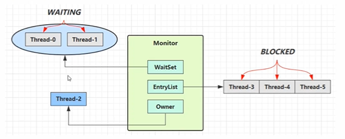

- Owner线程发现条件不满足，调用wait方法，即可进入WaitSet变为WAITING状态/TIME_WAITING状态。
- WaitSet中的线程会在Owner线程调用notify或者notifyAll时唤醒，进入EntryList等待获取锁;或者等待时间结束后进入EntryList。

正确使用

```java
synchronized(lock){
    while(条件不成立){
        lock.wait();
    }
    //
}

//另一个线程
synchronized(lock){
    //操作
    lock.notifyAll();
}
```


### 同步模式之保护性暂停

即 Guarded Suspension，用在一个线程等待另一个线程的执行结果，要点：

1. 有一个结果需要从一个线程传递到另一个线程，让他们关联同一个 GuardedObject
2. 如果有结果不断从一个线程到另一个线程那么可以使用消息队列（见生产者/消费者）
3. JDK 中，join 的实现、Future 的实现，采用的就是此模式
4. 因为要等待另一方的结果，因此归类到同步模式

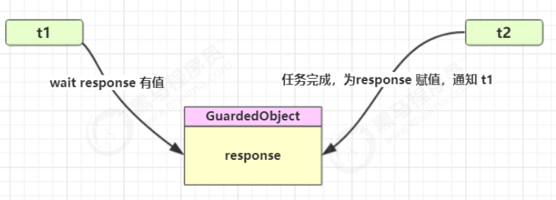

在join(long millis) 的源码中得到了体现：

```java
    public final synchronized void join(long millis)
    throws InterruptedException {
        long base = System.currentTimeMillis();
        long now = 0;

        if (millis < 0) {
            throw new IllegalArgumentException("timeout value is negative");
        }
		
        if (millis == 0) {
            while (isAlive()) {
                wait(0);
            }
        } else {
        // join一个指定的时间
            while (isAlive()) {
                long delay = millis - now;
                if (delay <= 0) {
                    break;
                }
                wait(delay);
                now = System.currentTimeMillis() - base;
            }
        }
    }
```


多任务版 GuardedObject图中 Futures 就好比居民楼一层的信箱（每个信箱有房间编号），左侧的 t0，t2，t4 就好比等待邮件的居民，右侧的 t1，t3，t5 就好比邮递员。如果需要在多个类之间使用 GuardedObject 对象，作为参数传递不是很方便，因此设计一个用来解耦的中间类，这样不仅能够解耦【结果等待者】和【结果生产者】，还能够同时支持多个任务的管理。和生产者消费者模式的区别就是：这个生产者和消费者之间是一一对应的关系，但是生产者消费者模式并不是。rpc框架的调用中就使用到了这种模 式。  Test24.java

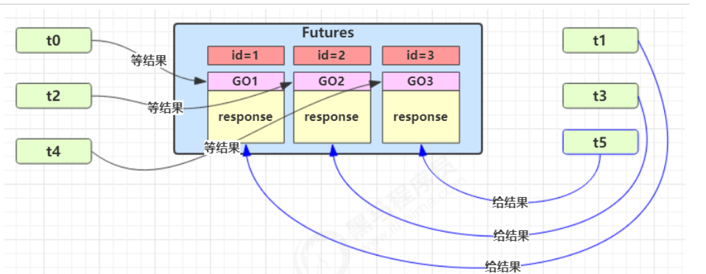


### 异步模式之生产者/消费者

要点

1. 与前面的保护性暂停中的 GuardObject 不同，不需要产生结果和消费结果的线程一一对应
2. 消费队列可以用来平衡生产和消费的线程资源
3. 生产者仅负责产生结果数据，不关心数据该如何处理，而消费者专心处理结果数据
4. 消息队列是有容量限制的，满时不会再加入数据，空时不会再消耗数据
5. JDK 中各种[阻塞队列](https://blog.csdn.net/yanpenglei/article/details/79556591)，采用的就是这种模式

“异步”的意思就是生产者产生消息之后消息没有被立刻消费，而“同步模式”中，消息在产生之后被立刻消费了。


我们写一个线程间通信的消息队列，要注意区别，像rabbit mq等消息框架是进程间通信的。


## park & unpack

###  基本使用

它们是 LockSupport 类中的方法   Test26.java

```java
// 暂停当前线程
LockSupport.park();
// 恢复某个线程的运行
LockSupport.unpark(Thread t);
```

### park与wait

- wait，notify 和 notifyAll 必须在synchronized中使用，而 park，unpark 不必
- park & unpark 是以线程为单位来【阻塞】和【唤醒】线程，而 notify 只能随机唤醒一个等待线程，notifyAll 是唤醒所有等待线程，就不那么【精确】
- park & unpark 可以先 unpark，而 wait & notify 不能先 notify


### park unpark 原理

#### 先调用park再调用upark的过程

1.先调用park

1. 当前线程调用 Unsafe.park() 方法
2. 检查 _counter ，本情况为 0，这时，获得 _mutex 互斥锁
3. 线程进入 _cond 条件变量阻塞
4. 设置 _counter = 0


2.调用upark

1. 调用 Unsafe.unpark(Thread_0) 方法，设置 _counter 为 1
2. 唤醒 _cond 条件变量中的 Thread_0
3. Thread_0 恢复运行
4. 设置 _counter 为 0

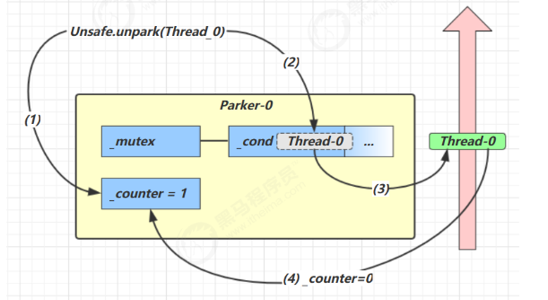

#### 先调用upark再调用park的过程

1. 调用 Unsafe.unpark(Thread_0) 方法，设置 _counter 为 1
2.  当前线程调用 Unsafe.park() 方法
3. 检查 _counter ，本情况为 1，这时线程无需阻塞，继续运行
4. 设置 _counter 为 0


<br/>


## ReentrantLock

相对于 synchronized 它具备如下特点 

1. 可中断
2. 可以设置为公平锁
3. 可以设置超时时间
4. 支持多个条件变量，即对与不满足条件的线程可以放到不同的集合中等待

与 synchronized 一样，都支持可重入

基本语法

```java
// 获取锁
reentrantLock.lock();
try {
 // 临界区
} finally {
 // 释放锁
 reentrantLock.unlock();
}

```


### 可重入

可重入是指同一个线程如果首次获得了这把锁，那么因为它是这把锁的拥有者，因此有权利再次获取这把锁如果是不可重入锁，那么第二次获得锁时，自己也会被锁挡住

```java
static ReentrantLock lock = new ReentrantLock();
public static void main(String[] args) {
 	method1();
}
public static void method1() {
     lock.lock();
     try {
     	log.debug("execute method1");
    	 method2();
     } finally {
     	lock.unlock();
     }
}
public static void method2() {
     lock.lock();
     try {
     	log.debug("execute method2");
     	method3();
     } finally {
    	 lock.unlock();
     }
}
public static void method3() {
     lock.lock();
         try {
         log.debug("execute method3");
     } finally {
     	lock.unlock();
     }
}
```


### 可打断

- lock.lockInterruptibly();是可以打断的。

- lock.lock()是不可以打断的。

lock.lockInterruptibly()底层会调用：

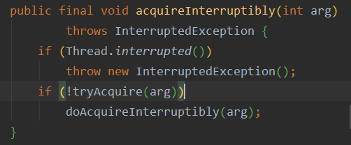

```java
ReentrantLock lock = new ReentrantLock();
Thread t1 = new Thread(() -> { 
	log.debug("启动...");
     try {
     	lock.lockInterruptibly();
     } catch (InterruptedException e) {
         e.printStackTrace();
         log.debug("等锁的过程中被打断");
     	return;
     }
     try {
    	 log.debug("获得了锁");
     } finally {
    	 lock.unlock();
     }
}, "t1");
lock.lock();
log.debug("获得了锁");
t1.start();
try {
     sleep(1);
     t1.interrupt();
     log.debug("执行打断");
} finally {
 	lock.unlock();
}
```

输出：

```java
18:02:40.520 [main] c.TestInterrupt - 获得了锁
18:02:40.524 [t1] c.TestInterrupt - 启动... 
18:02:41.530 [main] c.TestInterrupt - 执行打断
java.lang.InterruptedException 
 at 
java.util.concurrent.locks.AbstractQueuedSynchronizer.doAcquireInterruptibly(AbstractQueuedSynchr
onizer.java:898) 
 at 
java.util.concurrent.locks.AbstractQueuedSynchronizer.acquireInterruptibly(AbstractQueuedSynchron
izer.java:1222) 
 at java.util.concurrent.locks.ReentrantLock.lockInterruptibly(ReentrantLock.java:335) 
 at cn.itcast.n4.reentrant.TestInterrupt.lambda$main$0(TestInterrupt.java:17) 
 at java.lang.Thread.run(Thread.java:748) 
18:02:41.532 [t1] c.TestInterrupt - 等锁的过程中被打断
```


### 公平锁

synchronized锁中，在entrylist等待的锁在竞争时不是按照先到先得来获取锁的，所以说synchronized锁时不公平的；

ReentranLock锁默认是不公平的，但是可以通过设置实现公平锁。

```java
ReentrantLock lock = new ReentrantLock(true);
```


本意是为了解决之前提到的饥饿问题，但是公平锁一般没有必要，会降低并发度，`使用trylock更好`。

其实这两种实现的差别只有两点(<a href="#fair_unfair">后面的原理的获取锁中我们会讲到</a>)：

1. 在lock()方法开始的时候非公平锁会尝试cas抢占锁插一次队；
2. 在tryAcquire()方法发现state为0的时候，非公平锁会抢占一次锁，而公平锁会判断AQS链表中是否存在等待的线程，没有等待的线程才会去抢占锁。


### 锁超时

```java
private static ReentrantLock lock = new ReentrantLock();
public static void main(String[] args) {
    Thread t1 = new Thread(() -> {
        log.debug("尝试获得锁");
        try {
            lock.lockInterruptibly();
            //等待2s后没获取锁就超时了
            if (! lock.tryLock(2, TimeUnit.SECONDS)) {
                log.debug("获取不到锁");
                return;
            }
        } catch (InterruptedException e) {
            e.printStackTrace();
            log.debug("获取不到锁");
            return;
        }
        try {
            log.debug("获得到锁");
        } finally {
            lock.unlock();
        }
    }, "t1");

    lock.lock();
    log.debug("获得到锁");
    t1.start();
    sleep(1);
    log.debug("释放了锁");
    lock.unlock();
}
```


### 条件变量

synchronized 中也有条件变量，就是我们讲原理时那个 waitSet 休息室，当条件不满足时进入 waitSet 等待
ReentrantLock 的条件变量比 synchronized 强大之处在于，它是支持多个条件变量的，这就好比

1. synchronized 是那些不满足条件的线程都在一间休息室等消息
2. 而 ReentrantLock 支持多间休息室，有专门等烟的休息室、专门等早餐的休息室、唤醒时也是按休息室来唤醒

使用要点：  

1. **await 前需要获得锁**
2. await 执行后，会释放锁，进入 conditionObject 等待
3. await 的线程被唤醒（或打断、或超时）取重新竞争 lock 锁，执行唤醒的线程爷必须先获得锁
4. 竞争 lock 锁成功后，从 await 后继续执行

```java
static final Object room = new Object();
static boolean hasCigarette = false;
static boolean hasTakeout = false;
static ReentrantLock ROOM = new ReentrantLock();
// 等待烟的休息室
static Condition waitCigaretteSet = ROOM.newCondition();
// 等外卖的休息室
static Condition waitTakeoutSet = ROOM.newCondition();

public static void main(String[] args) {
    new Thread(() -> {
        ROOM.lock();
        try {
            log.debug("有烟没？[{}]", hasCigarette);
            while (!hasCigarette) { 
                log.debug("没烟，先歇会！");
                try {
                    waitCigaretteSet.await();
                } catch (InterruptedException e) {
                    e.printStackTrace();
                }
            }
            log.debug("可以开始干活了");
        } finally {
            ROOM.unlock();
        }
    }, "小南").start();

    new Thread(() -> {
        ROOM.lock();
        try {
            log.debug("外卖送到没？[{}]", hasTakeout);
            while (!hasTakeout) {
                log.debug("没外卖，先歇会！");
                try {
                    waitTakeoutSet.await();
                } catch (InterruptedException e) {
                    e.printStackTrace();
                }
            }
            log.debug("可以开始干活了");
        } finally {
            ROOM.unlock();
        }
    }, "小女").start();

    sleep(1);
    new Thread(() -> {
        ROOM.lock();
        try {
            hasTakeout = true;
            waitTakeoutSet.signal();
        } finally {
            ROOM.unlock();
        }
    }, "送外卖的").start();

    sleep(1);

    new Thread(() -> {
        ROOM.lock();
        try {
            hasCigarette = true;
            waitCigaretteSet.signal();
        } finally {
            ROOM.unlock();
        }
    }, "送烟的").start();
}
```


### 原理

当我们new一个ReentrantLock对象时，底层会帮我们new一个NonfairSync对象，NonfairSync FairSync都是基于AQS队列实现，**AbstractQueuedSynchronizer简称为AQS队列(队列同步器)**。

#### AQS

- 基于先进先出**FIFO**实现的等待队列，AQS队列是由Node节点组成的**双向链表**实现的，所有的操作都是在这个AQS队列当中，如果一个线程获取锁就直接成功，如果失败了就将其放入等待队列当中。
- 用 state 属性来表示资源的状态
  - getState - 获取 state 状态
  - setState - 设置 state 状态
  - compareAndSetState - cas 机制设置 state 状态

- 每当有新线程请求同步状态时都会进入一个等待队列，等待队列通过双向链表实现，线程被封装在链表的 Node 节点中，Node 的等待状态包括：CANCELLED(1，取消)，SIGNAL(-1，等待被唤醒)，CONDITION(-2，线程正在等待)，PROPAGATE(-3，后继节点会传播唤醒操作，只作用于共享模式)，其中ReentrantLock涉及到的状态就是SIGNAL，CANCELLED。

- 两种模式

  - **独占模式**下锁只会被一个线程占用，其他线程必须等持有锁的线程释放锁后才能获取锁。(**ReentrantLock**)

    获取同步状态时，调用 `acquire` 方法的 `tryAcquire` 方法安全地获取同步状态，获取失败的线程会被构造同步节点并通过 `addWaiter` 方法加入到同步队列的尾部，在队列中自旋。之后调用 `acquireQueued` 方法使得节点以死循环的方式获取同步状态，如果获取不到则阻塞，被阻塞线程的唤醒依靠前驱节点的出队或中断。后继节点的线程被唤醒后需要检查自己的前驱节点是否是头节点，目的是维护同步队列的 FIFO 原则，节点之间在循环检查的过程中基本不通信，而是简单判断自己的前驱是否为头节点。

    释放同步状态时，同步器调用 `tryRelease` 方法释放同步状态，然后调用 `unparkSuccessor` 方法唤醒头节点的后继节点，使后继节点重新尝试获取同步状态。

  - **共享模式**下多个线程可以获取同一个锁。(**ReentrantReadWriteLock**，**semaphoer**)

    获取同步状态时，调用 `acquireShared` 方法的 `tryAcquireShared` 方法，返回值为 int 类型，值不小于 0 表示能去获取锁。

    释放同步状态时，调用 `releaseShared` 方法，释放后会唤醒后续处于等待状态的节点。它和独占式的区别在于 `tryReleaseShared` 方法必须确保同步状态安全释放，通过循环 CAS 保证。

  


<span id="fair_unfair"></span>

#### 获取锁

- CAS操作抢占锁，抢占成功则修改锁的状态为1，并设置锁的owner

  不公平：

  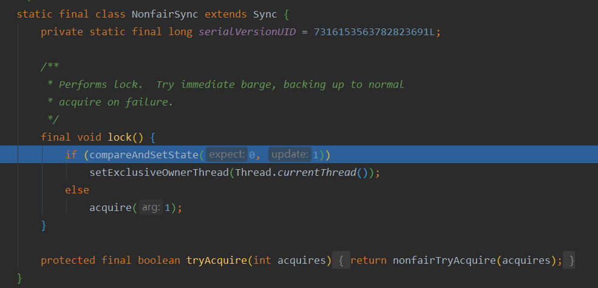

  公平：

  

- 抢占不成功

  

  - 先通过**tryAcquire**尝试获取锁：

    若锁状态为0，则CAS操作抢占锁，抢占成功则修改锁的状态为1，并设置锁的owner

    若锁状态不为0，则判断是否是owner线程，若是，则再次获取锁，并将锁状态+1

    不公平：

    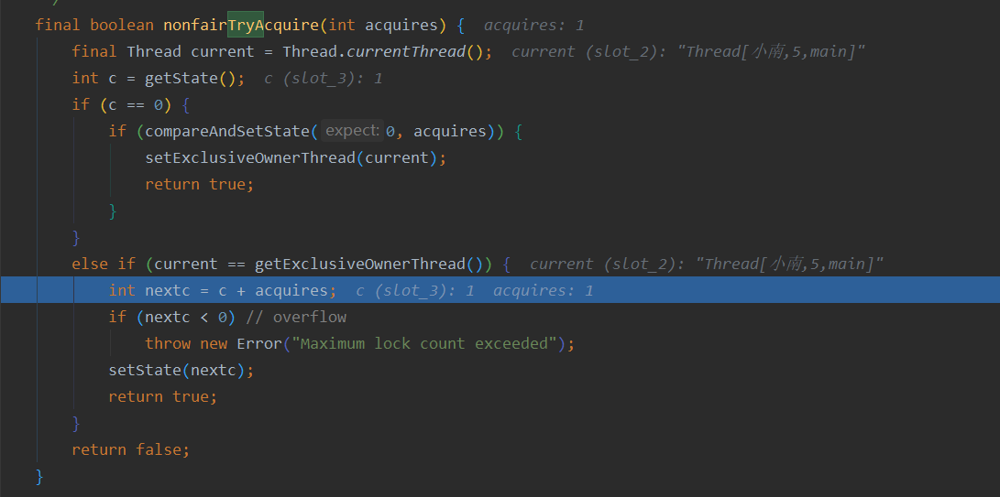

    公平：

    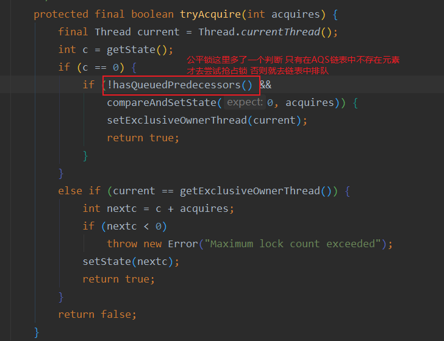

    

  - 若tryAcquire没有获取锁：

    **addWaiter(Node)**：新建一个Node节点插入到当前AQS队列的尾部，如没有AQS队列，则新建一个并插入。

    **acquireQueued(Node)**：通过自旋获取锁或阻塞

    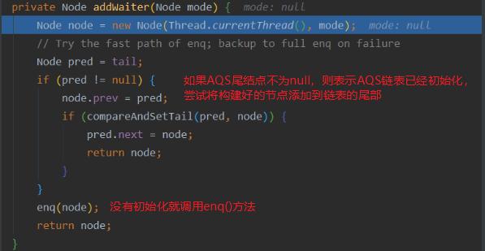

    ```java
    private Node enq(final Node node) {
        //自旋
        for (;;) {
            Node t = tail;
            //尾结点为空 说明AQS链表还没有初始化 那么进行初始化
            if (t == null) { // Must initialize
                //cas 将AQS的head节点 初始化 成功初始化head之后，将尾结点也初始化
                //注意 这里我们可以看到head节点是不存储线程信息的 也就是说head节点相当于是一个虚拟节点
                if (compareAndSetHead(new Node()))
                    tail = head;
            } else {
                //尾结点不为空 那么直接添加到链表的尾部即可
                node.prev = t;
                if (compareAndSetTail(t, node)) {
                    t.next = node;
                    return t;
                }
            }
        }
    }
    ```

    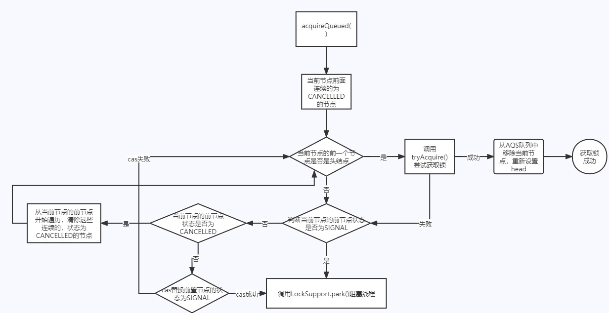

    ```java
    final boolean acquireQueued(final Node node, int arg) {
        boolean failed = true;
        try {
            boolean interrupted = false;
            //进入自旋
            for (;;) {
                //获取当前节点的前一个节点
                final Node p = node.predecessor();
                // 如果前一个节点是head 而且再次尝试获取锁成功，将节点从AQS队列中去除 并替换head 同时返回中断标志
                if (p == head && tryAcquire(arg)) {
                    setHead(node);
                    p.next = null; // help GC
                    failed = false;
                    //注意 只有抢占到锁才会跳出这个for循环
                    return interrupted;
                }
                //去除状态为CANCELLED的节点 并且阻塞线程 线程被阻塞在这
                //注意 线程被唤醒之后继续执行这个for循环 尝试抢占锁 没有抢占到的话又会阻塞
                if (shouldParkAfterFailedAcquire(p, node) &&
                    parkAndCheckInterrupt())
                    interrupted = true;
            }
        } finally {
            if (failed)
                //如果失败 将node状态修改为CANCELLED
                cancelAcquire(node);
        }
    }
    
    ```

    ```java
    private static boolean shouldParkAfterFailedAcquire(Node pred, Node node) {
        int ws = pred.waitStatus;
        if (ws == Node.SIGNAL)
            //如果节点是SIGNAL状态 不需要处理 直接返回
            return true;
        if (ws > 0) {
            //如果节点状态>0 说明节点是取消状态 这种状态的节点需要被清除 用do while循环顺便清除一下前面的连续的、状态为取消的节点
            do {
                node.prev = pred = pred.prev;
            } while (pred.waitStatus > 0);
            pred.next = node;
        } else {
            //正常的情况下 利用cas将前一个节点的状态替换为 SIGNAL状态 也就是-1
            //注意 这样队列中节点的状态 除了最后一个都是-1 包括head节点
            compareAndSetWaitStatus(pred, ws, Node.SIGNAL);
        }
        return false;
    }
    ```

    ```java
    private final boolean parkAndCheckInterrupt() {
        //挂起当前线程 并且返回中断标志  LockSupport.park(thread) 会调用UNSAFE.park()方法将线程阻塞起来（是一个native方法）
        LockSupport.park(this);
        return Thread.interrupted();
    }
    ```

    


#### 释放锁

- 获取锁的状态值，将状态值 -1
- 判断当前线程是否是锁的owner线程，若不是则抛出异常。
- 若状态值为0，则锁的owner设为null
- 通过unpark唤醒头节点下一个状态不为CANCELLED的节点

```java
public final boolean release(int arg) {
    //只有tryRelease返回true 说明已经释放锁 需要将阻塞的线程唤醒 否则不需要唤醒别的线程
    if (tryRelease(arg)) {
        Node h = head;
        //如果头结点不为空 而且状态不为0 代表同步队列已经初始化 且存在需要唤醒的node
        //注意 同步队列的头结点相当于是一个虚拟节点  这一点我们可以在构建节点的代码中很清楚的知道
        //并且在shouldParkAfterFailedAcquire方法中 会把head节点的状态修改为-1
        //如果head的状态为0 那么代表队列中没有需要被唤醒的元素 直接返回true
        if (h != null && h.waitStatus != 0)
            //唤醒头结点的下一个节点
            unparkSuccessor(h);
        return true;
    }
    return false;
}
```

```java
protected final boolean tryRelease(int releases) {
    //减少重入次数
    int c = getState() - releases;
    //如果获取锁的线程不是当前线程 抛出异常
    if (Thread.currentThread() != getExclusiveOwnerThread())
        throw new IllegalMonitorStateException();
    boolean free = false;
    //如果state为0 说明已经彻底释放了锁 返回true
    if (c == 0) {
        free = true;
        //将获取锁的线程设置为null
        setExclusiveOwnerThread(null);
    }
    //重置state的值
    setState(c);
    //如果释放了锁 就返回true 否则返回false
    return free;
}
```

```java
private void unparkSuccessor(Node node) {
    //获取头结点的状态 将头结点状态设置为0 代表现在正在有线程被唤醒 如果head状态为0 就不会进入这个方法了
    int ws = node.waitStatus;
    if (ws < 0)
        //将头结点状态设置为0
        compareAndSetWaitStatus(node, ws, 0);
    //唤醒头结点的下一个状态不是cancelled的节点 （因为头结点是不存储阻塞线程的）
    Node s = node.next;
    //当前节点是null 或者是cancelled状态
    if (s == null || s.waitStatus > 0) {
        s = null;
        //从aqs链表的尾部开始遍历 找到离头结点最近的 不为空的 状态不是cancelled的节点 赋值给s 这里为什么从尾结点开始遍历而是头结点 应该是因为添加结点的时候是先初始化结点的prev的， 从尾结点开始遍历 不会出现prve没有赋值的情况 
        for (Node t = tail; t != null && t != node; t = t.prev)
            if (t.waitStatus <= 0)
                s = t;
    }
    if (s != null)
        //调用LockSupport.unpark()唤醒指定的线程
        LockSupport.unpark(s.thread);
}	
```

#### 可重入

```java
static final class NonfairSync extends Sync {
    // ...

    // Sync 继承过来的方法
    final boolean nonfairTryAcquire(int acquires) {
        final Thread current = Thread.currentThread();
        int c = getState();
        if (c == 0) {
            if (compareAndSetState(0, acquires)) {
                setExclusiveOwnerThread(current);
                return true;
            }
        }
        // 如果已经获得了锁, 线程还是当前线程, 表示发生了锁重入
        else if (current == getExclusiveOwnerThread()) {
            // state++
            int nextc = c + acquires;
            if (nextc < 0) // overflow
                throw new Error("Maximum lock count exceeded");
            setState(nextc);
            return true;
        }
        return false;
    }

    // Sync 继承过来的方法
    protected final boolean tryRelease(int releases) {
        // state--
        int c = getState() - releases;
        if (Thread.currentThread() != getExclusiveOwnerThread())
            throw new IllegalMonitorStateException();
        boolean free = false;
        // 支持锁重入, 只有 state 减为 0, 才释放成功
        if (c == 0) {
            free = true;
            setExclusiveOwnerThread(null);
        }
        setState(c);
        return free;
    }
}

```

#### 可打断

不可打断模式：在此模式下，即使它被打断，仍会驻留在 AQS 队列中，一直要等到获得锁后方能得知自己被打断了，仅仅是设置了打断标记

```java
// Sync 继承自 AQS
static final class NonfairSync extends Sync {
    // ...

    private final boolean parkAndCheckInterrupt() {
        // 如果打断标记已经是 true, 则 park 会失效
        LockSupport.park(this);
        // interrupted 会清除打断标记
        return Thread.interrupted();
    }

    final boolean acquireQueued(final Node node, int arg) {
        boolean failed = true;
        try {
            boolean interrupted = false;
            for (;;) {
                final Node p = node.predecessor();
                if (p == head && tryAcquire(arg)) {
                    setHead(node);
                    p.next = null;
                    failed = false;
                    // 还是需要获得锁后, 才能返回打断状态
                    return interrupted;
                }
                if (
                        shouldParkAfterFailedAcquire(p, node) &&
                                parkAndCheckInterrupt()
                ) {
                    // 如果是因为 interrupt 被唤醒, 返回打断状态为 true
                    interrupted = true;
                }
            }
        } finally {
            if (failed)
                cancelAcquire(node);
        }
    }

    public final void acquire(int arg) {
        if (
                !tryAcquire(arg) &&
                        acquireQueued(addWaiter(Node.EXCLUSIVE), arg)
        ) {
            // 如果打断状态为 true
            selfInterrupt();
        }
    }

    static void selfInterrupt() {
        // 重新产生一次中断，这时候线程是如果正常运行的状态，那么不是出于sleep等状态，interrupt方法就不会报错
        Thread.currentThread().interrupt();
    }
}
}
```

可打断模式

```java
static final class NonfairSync extends Sync {
    public final void acquireInterruptibly(int arg) throws InterruptedException {
        if (Thread.interrupted())
            throw new InterruptedException();
        // 如果没有获得到锁, 进入 ㈠
        if (!tryAcquire(arg))
            doAcquireInterruptibly(arg);
    }

    // ㈠ 可打断的获取锁流程
    private void doAcquireInterruptibly(int arg) throws InterruptedException {
        final Node node = addWaiter(Node.EXCLUSIVE);
        boolean failed = true;
        try {
            for (;;) {
                final Node p = node.predecessor();
                if (p == head && tryAcquire(arg)) {
                    setHead(node);
                    p.next = null; // help GC
                    failed = false;
                    return;
                }
                if (shouldParkAfterFailedAcquire(p, node) &&
                        parkAndCheckInterrupt()) {
                    // 在 park 过程中如果被 interrupt 会进入此
                    // 这时候抛出异常, 而不会再次进入 for (;;)
                    throw new InterruptedException();
                }
            }
        } finally {
            if (failed)
                cancelAcquire(node);
        }
    }
}

```

#### 公平锁

其实这两种实现的差别只有两点(<a href="#fair_unfair">前面的原理的获取锁中我们已经讲到了</a>)：

1. 在lock()方法开始的时候非公平锁会尝试cas抢占锁插一次队；
2. 在tryAcquire()方法发现state为0的时候，非公平锁会抢占一次锁，而公平锁会判断AQS链表中是否存在等待的线程，没有等待的线程才会去抢占锁。


#### 条件变量实现原理

##### 图解流程

每个条件变量其实就对应着一个等待队列，其实现类是 ConditionObject

await 流程
开始 Thread-0 持有锁，调用 await，进入 ConditionObject 的 addConditionWaiter 流程
创建新的 Node 状态为 -2（Node.CONDITION），关联 Thread-0，加入等待队列尾部


接下来进入 AQS 的 fullyRelease 流程，释放同步器上的锁


unpark AQS 队列中的下一个节点，竞争锁，假设没有其他竞争线程，那么 Thread-1 竞争成功


park 阻塞 Thread-0


signal 流程

假设 Thread-1 要来唤醒 Thread-0


进入 ConditionObject 的 doSignal 流程，取得等待队列中第一个 Node，即 Thread-0 所在 Node


执行 transferForSignal 流程，将该 Node 加入 AQS 队列尾部，将 Thread-0 的 waitStatus 改为 0，Thread-3 的waitStatus 改为 -1


Thread-1 释放锁，进入 unlock 流程，略

##### 源码分析

```java
public class ConditionObject implements Condition, java.io.Serializable {
    private static final long serialVersionUID = 1173984872572414699L;

    // 第一个等待节点
    private transient Node firstWaiter;

    // 最后一个等待节点
    private transient Node lastWaiter;
    public ConditionObject() { }
    // ㈠ 添加一个 Node 至等待队列
    private Node addConditionWaiter() {
        Node t = lastWaiter;
        // 所有已取消的 Node 从队列链表删除, 见 ㈡
        if (t != null && t.waitStatus != Node.CONDITION) {
            unlinkCancelledWaiters();
            t = lastWaiter;
        }
        // 创建一个关联当前线程的新 Node, 添加至队列尾部
        Node node = new Node(Thread.currentThread(), Node.CONDITION);
        if (t == null)
            firstWaiter = node;
        else
            t.nextWaiter = node;
        lastWaiter = node;
        return node;
    }
    // 唤醒 - 将没取消的第一个节点转移至 AQS 队列
    private void doSignal(Node first) {
        do {
            // 已经是尾节点了
            if ( (firstWaiter = first.nextWaiter) == null) {
                lastWaiter = null;
            }
            first.nextWaiter = null;
        } while (
            // 将等待队列中的 Node 转移至 AQS 队列, 不成功且还有节点则继续循环 ㈢
                !transferForSignal(first) &&
                        // 队列还有节点
                        (first = firstWaiter) != null
        );
    }

    // 外部类方法
    // ㈢ 如果节点状态是取消, 返回 false 表示转移失败, 否则转移成功
    final boolean transferForSignal(Node node) {
        // 设置当前node状态为0（因为处在队列末尾），如果状态已经不是 Node.CONDITION, 说明被取消了
        if (!compareAndSetWaitStatus(node, Node.CONDITION, 0))
            return false;
        // 加入 AQS 队列尾部
        Node p = enq(node);
        int ws = p.waitStatus;
        if (
            // 插入节点的上一个节点被取消
                ws > 0 ||
                        // 插入节点的上一个节点不能设置状态为 Node.SIGNAL
                        !compareAndSetWaitStatus(p, ws, Node.SIGNAL)
        ) {
            // unpark 取消阻塞, 让线程重新同步状态
            LockSupport.unpark(node.thread);
        }
        return true;
    }
// 全部唤醒 - 等待队列的所有节点转移至 AQS 队列
private void doSignalAll(Node first) {
    lastWaiter = firstWaiter = null;
    do {
        Node next = first.nextWaiter;
        first.nextWaiter = null;
        transferForSignal(first);
        first = next;
    } while (first != null);
}

    // ㈡
    private void unlinkCancelledWaiters() {
        // ...
    }
    // 唤醒 - 必须持有锁才能唤醒, 因此 doSignal 内无需考虑加锁
    public final void signal() {
        // 如果没有持有锁，会抛出异常
        if (!isHeldExclusively())
            throw new IllegalMonitorStateException();
        Node first = firstWaiter;
        if (first != null)
            doSignal(first);
    }
    // 全部唤醒 - 必须持有锁才能唤醒, 因此 doSignalAll 内无需考虑加锁
    public final void signalAll() {
        if (!isHeldExclusively())
            throw new IllegalMonitorStateException();
        Node first = firstWaiter;
        if (first != null)
            doSignalAll(first);
    }
    // 不可打断等待 - 直到被唤醒
    public final void awaitUninterruptibly() {
        // 添加一个 Node 至等待队列, 见 ㈠
        Node node = addConditionWaiter();
        // 释放节点持有的锁, 见 ㈣
        int savedState = fullyRelease(node);
        boolean interrupted = false;
        // 如果该节点还没有转移至 AQS 队列, 阻塞
        while (!isOnSyncQueue(node)) {
            // park 阻塞
            LockSupport.park(this);
            // 如果被打断, 仅设置打断状态
            if (Thread.interrupted())
                interrupted = true;
        }
        // 唤醒后, 尝试竞争锁, 如果失败进入 AQS 队列
        if (acquireQueued(node, savedState) || interrupted)
            selfInterrupt();
    }
    // 外部类方法
    // ㈣ 因为某线程可能重入，需要将 state 全部释放，获取state，然后把它全部减掉，以全部释放
    final int fullyRelease(Node node) {
        boolean failed = true;
        try {
            int savedState = getState();
            // 唤醒等待队列队列中的下一个节点
            if (release(savedState)) {
                failed = false;
                return savedState;
            } else {
                throw new IllegalMonitorStateException();
            }
        } finally {
            if (failed)
                node.waitStatus = Node.CANCELLED;
        }
    }
    // 打断模式 - 在退出等待时重新设置打断状态
    private static final int REINTERRUPT = 1;
    // 打断模式 - 在退出等待时抛出异常
    private static final int THROW_IE = -1;
    // 判断打断模式
    private int checkInterruptWhileWaiting(Node node) {
        return Thread.interrupted() ?
                (transferAfterCancelledWait(node) ? THROW_IE : REINTERRUPT) :
                0;
    }
    // ㈤ 应用打断模式
    private void reportInterruptAfterWait(int interruptMode)
            throws InterruptedException {
        if (interruptMode == THROW_IE)
            throw new InterruptedException();
        else if (interruptMode == REINTERRUPT)
            selfInterrupt();
    }
    // 等待 - 直到被唤醒或打断
    public final void await() throws InterruptedException {
        if (Thread.interrupted()) {
            throw new InterruptedException();
        }
        // 添加一个 Node 至等待队列, 见 ㈠
        Node node = addConditionWaiter();
        // 释放节点持有的锁
        int savedState = fullyRelease(node);
        int interruptMode = 0;
        // 如果该节点还没有转移至 AQS 队列, 阻塞
        while (!isOnSyncQueue(node)) {
            // park 阻塞              
            LockSupport.park(this);
            // 如果被打断, 退出等待队列
            if ((interruptMode = checkInterruptWhileWaiting(node)) != 0)
                break;
        }
        // 退出等待队列后, 还需要获得 AQS 队列的锁
        if (acquireQueued(node, savedState) && interruptMode != THROW_IE)
            interruptMode = REINTERRUPT;
        // 所有已取消的 Node 从队列链表删除, 见 ㈡
        if (node.nextWaiter != null)
            unlinkCancelledWaiters();
        // 应用打断模式, 见 ㈤
        if (interruptMode != 0)
            reportInterruptAfterWait(interruptMode);
    }
    // 等待 - 直到被唤醒或打断或超时
    public final long awaitNanos(long nanosTimeout) throws InterruptedException {
        if (Thread.interrupted()) {
            throw new InterruptedException();
        }
        // 添加一个 Node 至等待队列, 见 ㈠
        Node node = addConditionWaiter();
        // 释放节点持有的锁
        int savedState = fullyRelease(node);
        // 获得最后期限
        final long deadline = System.nanoTime() + nanosTimeout;
        int interruptMode = 0;
        // 如果该节点还没有转移至 AQS 队列, 阻塞
        while (!isOnSyncQueue(node)) {
            // 已超时, 退出等待队列
            if (nanosTimeout <= 0L) {
                transferAfterCancelledWait(node);
                break;
            }
            // park 阻塞一定时间, spinForTimeoutThreshold 为 1000 ns
            if (nanosTimeout >= spinForTimeoutThreshold)
                LockSupport.parkNanos(this, nanosTimeout);
            // 如果被打断, 退出等待队列
            if ((interruptMode = checkInterruptWhileWaiting(node)) != 0)
                break;
            nanosTimeout = deadline - System.nanoTime();
        }
        // 退出等待队列后, 还需要获得 AQS 队列的锁
        if (acquireQueued(node, savedState) && interruptMode != THROW_IE)
            interruptMode = REINTERRUPT;
        // 所有已取消的 Node 从队列链表删除, 见 ㈡
        if (node.nextWaiter != null)
            unlinkCancelledWaiters();
        // 应用打断模式, 见 ㈤
        if (interruptMode != 0)
            reportInterruptAfterWait(interruptMode);
        return deadline - System.nanoTime();
    }
    // 等待 - 直到被唤醒或打断或超时, 逻辑类似于 awaitNanos
    public final boolean awaitUntil(Date deadline) throws InterruptedException {
        // ...
    }
    // 等待 - 直到被唤醒或打断或超时, 逻辑类似于 awaitNanos
    public final boolean await(long time, TimeUnit unit) throws InterruptedException {
        // ...
    }
    // 工具方法 省略 ...
}

```


## 本章小结

本章我们需要重点掌握的是

1. 分析多线程访问共享资源时，哪些代码片段属于临界区
2. 使用 synchronized 互斥解决临界区的线程安全问题
   1. 掌握 synchronized 锁对象语法
   2. 掌握 synchronzied 加载成员方法和静态方法语法
   3. 掌握 wait/notify 同步方法
3. 使用 lock 互斥解决临界区的线程安全问题
   掌握 lock 的使用细节：可打断、锁超时、公平锁、条件变量
4. 学会分析变量的线程安全性、掌握常见线程安全类的使用
5. 了解线程活跃性问题：死锁、活锁、饥饿
6. 应用方面
   1. **互斥：使用 synchronized 或 Lock 达到共享资源互斥效果，实现原子性效果，保证线程安全。**
   2. **同步：使用 wait/notify 或 Lock 的条件变量来达到线程间通信效果。**
7. 原理方面
   1. monitor、synchronized 、wait/notify 原理
   2. synchronized 进阶原理 
   3. park & unpark 原理
8. 模式方面
   1. 同步模式之保护性暂停
   2. 异步模式之生产者消费者
   3. 同步模式之顺序控制


思考：

1. sleep, yield    

2. wait/notify

3. join

4. park,unpark

5. synchronized,reentrantlock(都可保证原子性，可见性，有序性),读写锁(reentrantReadWritelock,StampedLock)，信号量(semaphore)，countdownLatch,CyclicBarrier,exchanger,ThreadLocal

   cas

6. hashmap,correntHashmap,LinkedBlockingQueue,concurrentLnkedQueue,CopyOnWriteArrayList
