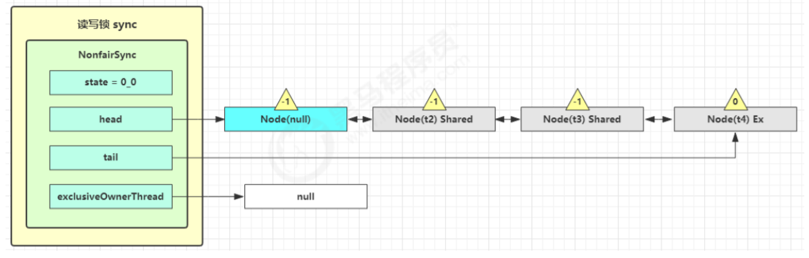
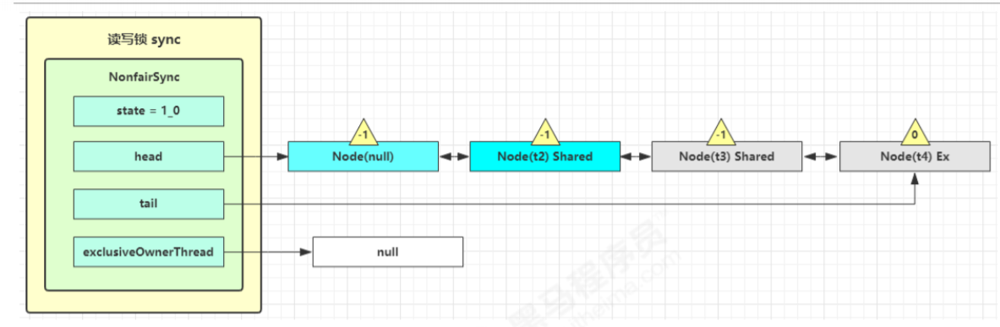
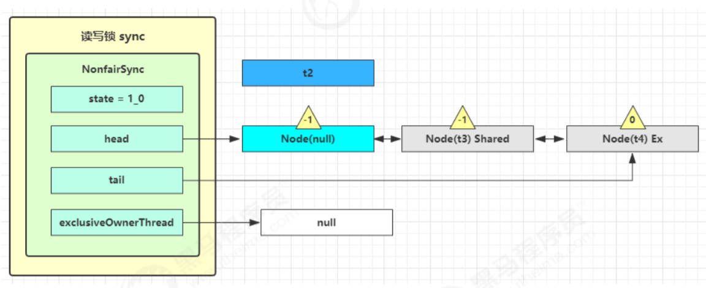
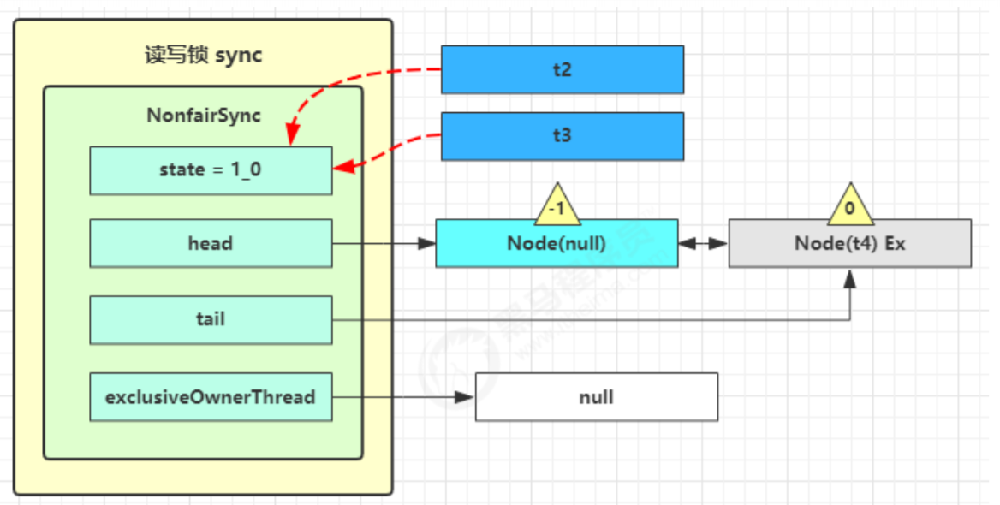
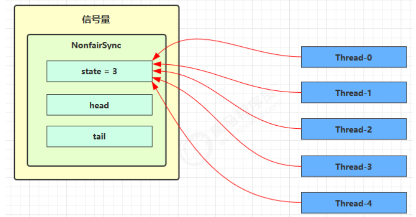
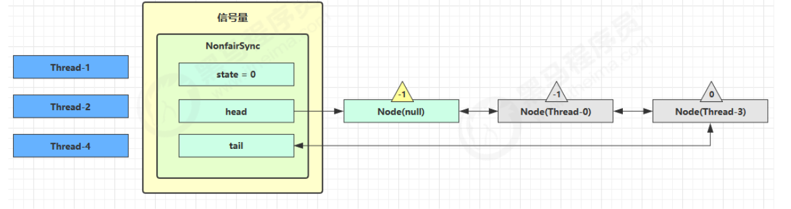
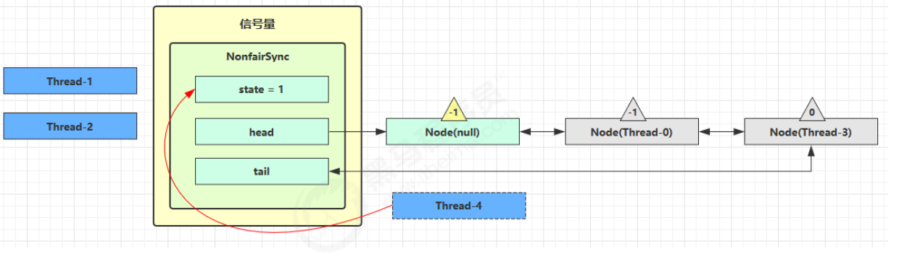
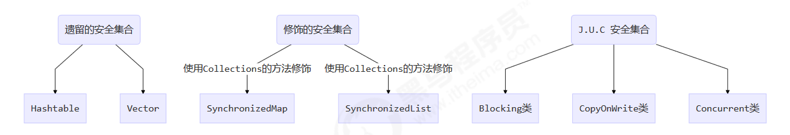

#  共享模型之工具

##  线程池

> 池化技术相比大家已经屡见不鲜了，线程池、数据库连接池、Http 连接池等等都是对这个思想的应用。池化技术的思想主要是为了减少每次获取资源的消耗，提高对资源的利用率。

线程池提供了一种限制和管理资源（包括执行一个任务）。 每个线程池还维护一些基本统计信息，例如已完成任务的数量。

这里借用《Java 并发编程的艺术》提到的来说一下使用线程池的好处：

- 降低资源消耗。通过重复利用已创建的线程降低线程创建和销毁造成的消耗。
- 提高响应速度。当任务到达时，任务可以不需要的等到线程创建就能立即执行。
- 提高线程的可管理性。线程是稀缺资源，如果无限制的创建，不仅会消耗系统资源，还会降低系统的稳定性，使用线程池可以进行统一的分配，调优和监控。

###  自定义线程池


实例代码设计步骤：Test18.java

1. 步骤1：自定义拒绝策略接口

   ```java
   @FunctionalInterface // 拒绝策略
   interface RejectPolicy<T> {
       void reject(BlockingQueue<T> queue, T task);
   }
   ```

2. 步骤2：自定义任务队列

   ```java
   class BlockingQueue<T> {
       // 1. 任务队列
       private Deque<T> queue = new ArrayDeque<>();
       // 2. 锁
       private ReentrantLock lock = new ReentrantLock();
       // 3. 生产者条件变量
       private Condition fullWaitSet = lock.newCondition();
       // 4. 消费者条件变量
       private Condition emptyWaitSet = lock.newCondition();
       // 5. 容量
       private int capcity;
       public BlockingQueue(int capcity) {
           this.capcity = capcity;
       }
       // 带超时阻塞获取
       public T poll(long timeout, TimeUnit unit) {
           lock.lock();
           try {
               // 将 timeout 统一转换为 纳秒
               long nanos = unit.toNanos(timeout);
               while (queue.isEmpty()) {
                   try {
                       // 返回值是剩余时间
                       if (nanos <= 0) {
                           return null;
                       }
                       nanos = emptyWaitSet.awaitNanos(nanos);
                   } catch (InterruptedException e) {
                       e.printStackTrace();
                   }
               }
               T t = queue.removeFirst();
               fullWaitSet.signal();
               return t;
           } finally {
               lock.unlock();
           }
       }
       // 阻塞获取
       public T take() {
           lock.lock();
           try {
               while (queue.isEmpty()) {
                   try {
                       emptyWaitSet.await();
                   } catch (InterruptedException e) {
                       e.printStackTrace();
                   }
               }
               T t = queue.removeFirst();
               fullWaitSet.signal();
               return t;
           } finally {
               lock.unlock();
           }
       }
       // 阻塞添加
       public void put(T task) {
           lock.lock();
           try {
               while (queue.size() == capcity) {
                   try {
                       log.debug("等待加入任务队列 {} ...", task);
                       fullWaitSet.await();
                   } catch (InterruptedException e) {
                       e.printStackTrace();
                   }
               }
               log.debug("加入任务队列 {}", task);
               queue.addLast(task);
               emptyWaitSet.signal();
           } finally {
               lock.unlock();
           }
       }
       // 带超时时间阻塞添加
       public boolean offer(T task, long timeout, TimeUnit timeUnit) {
           lock.lock();
           try {
               long nanos = timeUnit.toNanos(timeout);
               while (queue.size() == capcity) {
                   try {
                       if(nanos <= 0) {
                           return false;
                       }
                       log.debug("等待加入任务队列 {} ...", task);
                       nanos = fullWaitSet.awaitNanos(nanos);
                   } catch (InterruptedException e) {
                       e.printStackTrace();
                   }
               }
               log.debug("加入任务队列 {}", task);
               queue.addLast(task);
               emptyWaitSet.signal();
               return true;
           } finally {
               lock.unlock();
           }
       }
       public int size() {
           lock.lock();
           try {
               return queue.size();
           } finally {
               lock.unlock();
           }
       }
       public void tryPut(RejectPolicy<T> rejectPolicy, T task) {
           lock.lock();
           try {
               // 判断队列是否满
               if(queue.size() == capcity) {
                   rejectPolicy.reject(this, task);
               } else { // 有空闲
                   log.debug("加入任务队列 {}", task);
                   queue.addLast(task);
                   emptyWaitSet.signal();
               }
           } finally {
               lock.unlock();
           }
       }
   }
   ```

   

3. 步骤3：自定义线程池

   ```java
   class ThreadPool {
       // 任务队列
       private BlockingQueue<Runnable> taskQueue;
       // 线程集合
       private HashSet<Worker> workers = new HashSet<>();
       // 核心线程数
       private int coreSize;
       // 获取任务时的超时时间
       private long timeout;
       private TimeUnit timeUnit;
       private RejectPolicy<Runnable> rejectPolicy;
       // 执行任务
       public void execute(Runnable task) {
           // 当任务数没有超过 coreSize 时，直接交给 worker 对象执行
           // 如果任务数超过 coreSize 时，加入任务队列暂存
           synchronized (workers) {
               if(workers.size() < coreSize) {
                   Worker worker = new Worker(task);
                   log.debug("新增 worker{}, {}", worker, task);
                   workers.add(worker);
                   worker.start();
               } else {
                   // taskQueue.put(task);
                   // 1) 死等
                   // 2) 带超时等待
                   // 3) 让调用者放弃任务执行
                   // 4) 让调用者抛出异常
                   // 5) 让调用者自己执行任务
                   taskQueue.tryPut(rejectPolicy, task);
               }
           }
       }
       public ThreadPool(int coreSize, long timeout, TimeUnit timeUnit, int queueCapcity, 
                         RejectPolicy<Runnable> rejectPolicy) {
           this.coreSize = coreSize;
           this.timeout = timeout;
           this.timeUnit = timeUnit;
           this.taskQueue = new BlockingQueue<>(queueCapcity);
           this.rejectPolicy = rejectPolicy;
       }
       class Worker extends Thread{
           private Runnable task;
           public Worker(Runnable task) {
               this.task = task;
           }
           @Override
           public void run() {
               // 执行任务
               // 1) 当 task 不为空，执行任务
               // 2) 当 task 执行完毕，再接着从任务队列获取任务并执行
               // while(task != null || (task = taskQueue.take()) != null) {
               while(task != null || (task = taskQueue.poll(timeout, timeUnit)) != null) {
                   try {
                       log.debug("正在执行...{}", task);
                       task.run();
                   } catch (Exception e) {
                       e.printStackTrace();
                   } finally {
                       task = null;
                   }
               }
               synchronized (workers) {
                   log.debug("worker 被移除{}", this);
                   workers.remove(this);
               }
           }
       }
   }
   ```

   

4. 步骤4：测试

   ```java
   public static void main(String[] args) {
       ThreadPool threadPool = new ThreadPool(1,
                                              1000, TimeUnit.MILLISECONDS, 1, (queue, task)->{
                                                  // 1. 死等
                                                  // queue.put(task);
                                                  // 2) 带超时等待
                                                  // queue.offer(task, 1500, TimeUnit.MILLISECONDS);
                                                  // 3) 让调用者放弃任务执行
                                                  // log.debug("放弃{}", task);
                                                  // 4) 让调用者抛出异常
                                                  // throw new RuntimeException("任务执行失败 " + task);
                                                  // 5) 让调用者自己执行任务
                                                  task.run();
                                              });
       for (int i = 0; i < 4; i++) {
           int j = i;
           threadPool.execute(() -> {
               try {
                   Thread.sleep(1000L);
               } catch (InterruptedException e) {
                   e.printStackTrace();
               }
               log.debug("{}", j);
           });
       }
   }
   ```

   


###  ThreadPoolExecutor


Executor 框架结构(主要由三大部分组成

1. 任务(`Runnable` /`Callable`)

执行任务需要实现的 Runnable 接口 或 Callable接口。Runnable 接口或 Callable 接口 实现类都可以被 ThreadPoolExecutor 或 ScheduledThreadPoolExecutor 执行。

2. 任务的执行(`Executor`)

如上图所示，包括任务执行机制的核心接口 Executor ，以及继承自 `Executor` 接口的 ExecutorService 接口。ThreadPoolExecutor 和 ScheduledThreadPoolExecutor 这两个关键类实现了 ExecutorService 接口。

这里提了很多底层的类关系，但是，实际上我们需要更多关注的是 ThreadPoolExecutor 这个类，这个类在我们实际使用线程池的过程中，使用频率还是非常高的。

3. 异步计算的结果(`Future`)

Future 接口以及 `Future` 接口的实现类 FutureTask 类都可以代表异步计算的结果。

当我们把 Runnable接口 或 Callable 接口 的实现类提交给 ThreadPoolExecutor 或 ScheduledThreadPoolExecutor 执行。（调用 `submit()` 方法时会返回一个 FutureTask 对象）

4.Executor 框架的使用示意图


1. 主线程首先要创建实现 Runnable 或者 Callable 接口的任务对象。
2. 把创建完成的实现 Runnable/Callable接口的 对象直接交给 ExecutorService 执行: `ExecutorService.execute（Runnable command）`）或者也可以把 `Runnable` 对象或`Callable` 对象提交给 `ExecutorService` 执行（`ExecutorService.submit（Runnable task）`或 `ExecutorService.submit（Callable <T> task）`）。
3. 如果执行 ExecutorService.submit（…），ExecutorService 将返回一个实现Future接口的对象（我们刚刚也提到过了执行 `execute()`方法和 `submit()`方法的区别，`submit()`会返回一个 `FutureTask` 对象）。
4. 最后，主线程可以执行 FutureTask.get()方法来等待任务执行完成。主线程也可以执行 FutureTask.cancel（boolean mayInterruptIfRunning）来取消此任务的执行

#### 线程池状态

ThreadPoolExecutor 使用 int 的**高 3 位**来表示线程池状态，低 29 位表示线程数量


从数字上比较(第一位是符号位)，**TERMINATED > TIDYING > STOP > SHUTDOWN > RUNNING**
这些信息存储在一个原子变量 ctl 中，目的是将线程池状态与线程个数合二为一，这样就可以用一次 cas 原子操作
进行赋值

```java
// c 为旧值， ctlOf 返回结果为新值
ctl.compareAndSet(c, ctlOf(targetState, workerCountOf(c))));
// rs 为高 3 位代表线程池状态， wc 为低 29 位代表线程个数，ctl 是合并它们
private static int ctlOf(int rs, int wc) { return rs | wc; }
```

####  构造方法

下面看一下参数最多的 一个线程方法

```java
public ThreadPoolExecutor(int corePoolSize,
 int maximumPoolSize,
 long keepAliveTime,
 TimeUnit unit,
 BlockingQueue<Runnable> workQueue,
 ThreadFactory threadFactory,
RejectedExecutionHandler handler){
}
```

1. corePoolSize 核心线程数目 (最多保留的线程数)
2. maximumPoolSize 最大线程数目(核心线程数加上救急线程数)
3. keepAliveTime 多余空闲线程的生存时间。当前线程池数量超过 corePoolSize 时，当空闲时间达到 keepAliveTime 值时，多余空闲线程会被销毁直到只剩下 corePoolSize 个线程为止
4. unit keepAliveTime 的时间单位
5. workQueue 阻塞队列，被提交但尚未被执行的任务
6. threadFactory 线程工厂 - 可以为线程创建时起个好名字
7. handler 拒绝策略，表示当队列满了并且工作线程大于等于线程池的最大线程数(maximumPoolSize)时，如何拒绝新的任务


1. 线程池中刚开始没有线程，当一个任务提交给线程池后，线程池会创建一个新线程来执行任务。
2. 当线程数达到 corePoolSize 并没有线程空闲，这时再加入任务，新加的任务会被加入workQueue 队列排队，直到有空闲的线程。
3. 如果队列选择了有界队列，那么任务超过了队列大小时，会创建 maximumPoolSize - corePoolSize 数目的线程来救急。
4. 如果线程到达 maximumPoolSize 仍然有新任务这时会执行拒绝策略。拒绝策略 jdk 提供了 下面的前4 种实现，其它著名框架也提供了实现
   1. ThreadPoolExecutor.AbortPolicy让调用者抛出 RejectedExecutionException 异常，这是默认策略
   2. ThreadPoolExecutor.CallerRunsPolicy 让调用者运行任务
   3. ThreadPoolExecutor.DiscardPolicy 放弃本次任务
   4. ThreadPoolExecutor.DiscardOldestPolicy 放弃队列中最早的任务，本任务取而代之
   5. Dubbo 的实现，在抛出 RejectedExecutionException 异常之前会记录日志，并 dump 线程栈信息，方便定位问题
   6. Netty 的实现，是创建一个新线程来执行任务
   7. ActiveMQ 的实现，带超时等待（60s）尝试放入队列，类似我们之前自定义的拒绝策略
   8. PinPoint 的实现，它使用了一个拒绝策略链，会逐一尝试策略链中每种拒绝策略
5. 当高峰过去后，超过corePoolSize 的救急线程如果一段时间没有任务做，需要结束节省资源，这个时间由keepAliveTime 和 unit 来控制。


根据这个构造方法，JDK Executors 类中提供了众多工厂方法来创建各种用途的线程池


#### 创建线程池

##### newFixedThreadPool

这个是Executors类提供的工厂方法来创建线程池！Executors 是Executor 框架的工具类！ Test19.java

```java
    public static ExecutorService newFixedThreadPool(int nThreads) {
        return new ThreadPoolExecutor(nThreads, nThreads,
                                      0L, TimeUnit.MILLISECONDS,
                                      new LinkedBlockingQueue<Runnable>());
    }
```

通过源码可以看到 new ThreadPoolExecutor(xxx)方法其实是是调用了之前说的完整参数的构造方法，使用了默认的线程工厂和拒绝策略!

```java
    public ThreadPoolExecutor(int corePoolSize,
                              int maximumPoolSize,
                              long keepAliveTime,
                              TimeUnit unit,
                              BlockingQueue<Runnable> workQueue) {
        this(corePoolSize, maximumPoolSize, keepAliveTime, unit, workQueue,
             Executors.defaultThreadFactory(), defaultHandler);
    }
```

特点

1. **核心线程数 == 最大线程数**（没有救急线程被创建），因此也无需超时时间
2. **阻塞队列是无界的**，可以放任意数量的任务
3. 适用于任务量已知，相对耗时的任务


##### newCachedThreadPool

```java
public static ExecutorService newCachedThreadPool() {
 return new ThreadPoolExecutor(0, Integer.MAX_VALUE,
 60L, TimeUnit.SECONDS,
 new SynchronousQueue<Runnable>());
}

```

特点

1. 核心线程数是 0， 最大线程数是 Integer.MAX_VALUE，救急线程的空闲生存时间是 60s，意味着
   1. 全部都是救急线程（空闲 60s 后可以回收）
   2. 救急线程可以无限创建
2. 队列采用了 SynchronousQueue 实现特点是，它没有容量，**提交或者消费线程会阻塞，只有有一对提交和消费线程，才同时退出**
3. 适合任务数比较密集，但每个任务执行时间较短的情况


#####  newSingleThreadExecutor

```java
public static ExecutorService newSingleThreadExecutor() {
 return new FinalizableDelegatedExecutorService
 (new ThreadPoolExecutor(1, 1,0L, TimeUnit.MILLISECONDS,new LinkedBlockingQueue<Runnable>()));
}

```

使用场景：

1. **核心线程数和最大线程数为 1**，任务执行完毕，这唯一的线程也不会被释放。

2. **阻塞队列是无界的**

3. 希望多个任务排队执行。

4. 区别：
   1. 和自己创建单线程执行任务的区别：自己创建一个单线程串行执行任务，如果任务执行失败而终止那么没有任何补救措施，而线程池还会新建一个线程，保证池的正常工作
   2. Executors.newSingleThreadExecutor() 线程个数始终为1，不能修改

      FinalizableDelegatedExecutorService 应用的是装饰器模式，只对外暴露了 ExecutorService 接口，因此不能调用 ThreadPoolExecutor 中特有的方法
   3. 和Executors.newFixedThreadPool(1) 初始时为1时的区别：Executors.newFixedThreadPool(1) 初始时为1，以后还可以修改，对外暴露的是 ThreadPoolExecutor 对象，可以强转后调用 setCorePoolSize 等方法进行修改

##### 缺点

> Executors 返回线程池对象的弊端如下：
>
> - FixedThreadPool 和 SingleThreadExecutor ： 允许请求的队列长度为 Integer.MAX_VALUE,可能堆积大量的请求，从而导致 OOM。
> - CachedThreadPool 和 ScheduledThreadPool ： 允许创建的线程数量为 Integer.MAX_VALUE ，可能会创建大量线程，从而导致 OOM。

说白了就是：使用有界队列，控制线程创建数量。

除了避免 OOM 的原因之外，不推荐使用 `Executors`提供的两种快捷的线程池的原因还有：

1. 实际使用中需要根据自己机器的性能、业务场景来手动配置线程池的参数比如核心线程数、使用的任务队列、饱和策略等等。
2. 我们应该显示地给我们的线程池命名，这样有助于我们定位问题。

##### newScheduledThreadPool

在『任务调度线程池』功能加入之前，可以使用 java.util.Timer 来实现定时功能，Timer 的优点在于简单易用，但由于所有任务都是由同一个线程来调度，因此所有任务都是串行执行的，同一时间只能有一个任务在执行，前一个任务的延迟或异常都将会影响到之后的任务。

```java
Timer timer = new Timer();
TimerTask task1 = new TimerTask() {
    @Override
    public void run() {
        log.debug("task 1");
        sleep(2);
    }
};
TimerTask task2 = new TimerTask() {
    @Override
    public void run() {
        log.debug("task 2");
    }
};
// 使用 timer 添加两个任务，希望它们都在 1s 后执行
// 但由于 timer 内只有一个线程来顺序执行队列中的任务，因此『任务1』的延时，影响了『任务2』的执行
timer.schedule(task1, 1000);
timer.schedule(task2, 1000);
```


使用 ScheduledExecutorService 改写：

有三个方法：

* **schedule**(commod,delay,unit) ，这个方法是说系统启动后，需要等待多久执行，delay是等待时间。只执行一次，没有周期性。

* **scheduleAtFixedRate**(commod,initialDelay,period,unit)，这个是以period为固定周期时间，按照一定频率来重复执行任务，initialDelay是说系统启动后，需要等待多久才开始执行。例如：如果设置了period为5秒，线程启动之后执行了大于5秒，线程结束之后，立即启动线程的下一次，如果线程启动之后只执行了3秒就结束了那执行下一次，需要等待2秒再执行。这个是优先保证任务执行的频率，

  两次开始执行的间隔时间：**Max(执行时间，period)**

* **scheduleWithFixedDelay**(commod,initialDelay,delay,unit)，这个是以delay为固定延迟时间，按照一定的等待时间来执行任务，initialDelay意义与上面的相同。例如：设置了delay为5秒，线程启动之后不管执行了多久，结束之后都需要等待5秒，才能执行下一次。这个是优先保证任务执行的间隔。

  两次开始执行的间隔时间：**执行时间+period**

```java
ScheduledExecutorService executor = Executors.newScheduledThreadPool(2);
// schedule 添加两个任务，希望它们都在 1s 后执行
executor.schedule(() -> {
    System.out.println("任务1，执行时间：" + new Date());
    try { Thread.sleep(2000); } catch (InterruptedException e) { }
}, 1000, TimeUnit.MILLISECONDS);

executor.schedule(() -> {
    System.out.println("任务2，执行时间：" + new Date());
}, 1000, TimeUnit.MILLISECONDS);

//scheduleAtFixedRate  一开始，延时 1s，接下来，由于任务执行时间 > 间隔时间，间隔被『撑』到了 2s,每隔2s执行一次
pool.scheduleAtFixedRate(() -> {
 log.debug("running...");
}, 1, 1, TimeUnit.SECONDS);

//一开始，延时 1s，scheduleWithFixedDelay 的间隔是 上一个任务结束 <-> 延时 <-> 下一个任务开始 所以间隔都是 3s
pool.scheduleWithFixedDelay(()-> {
 log.debug("running...");
 sleep(2);
}, 1, 1, TimeUnit.SECONDS);
```

- 核心线程数固定，最大线程数为Integer.MAX_VALUE，keepAliveTime=0，即只要线程数大于核心线程数，且线程空闲立马销毁。
- **阻塞队列是无界的**。


#### 执行/提交任务

Test21.java

```java
// 执行任务
void execute(Runnable command);
// 提交任务 task，用返回值 Future 获得任务执行结果，Future的原理就是利用我们之前讲到的保护性暂停模式来接受返回结果的，主线程可以执行 FutureTask.get()方法来等待任务执行完成
<T> Future<T> submit(Callable<T> task);
// 提交 tasks 中所有任务
<T> List<Future<T>> invokeAll(Collection<? extends Callable<T>> tasks)
 throws InterruptedException;

// 提交 tasks 中所有任务，带超时时间
<T> List<Future<T>> invokeAll(Collection<? extends Callable<T>> tasks,
 long timeout, TimeUnit unit)
 throws InterruptedException;

// 提交 tasks 中所有任务，哪个任务先成功执行完毕，返回此任务执行结果，其它任务取消
<T> T invokeAny(Collection<? extends Callable<T>> tasks)
 throws InterruptedException, ExecutionException;
// 提交 tasks 中所有任务，哪个任务先成功执行完毕，返回此任务执行结果，其它任务取消，带超时时间

<T> T invokeAny(Collection<? extends Callable<T>> tasks,
 long timeout, TimeUnit unit)
 throws InterruptedException, ExecutionException, TimeoutException;

```

以submit为例：

```java
ExecutorService pool = Executors.newFixedThreadPool(2);
//        Future<String> future = pool.submit(new Callable<String>() {
//            @Override
//            public String call() throws Exception {
//                Thread.sleep(1);
//                return "ok";
//            }
//        });
Future<String> future = pool.submit(() -> {
    Thread.sleep(1);
    return "ok";
});
String res = future.get();
```


#### 关闭线程池

**shutdown**

```java
/*
线程池状态变为 SHUTDOWN
- 不会接收新任务
- 但已提交任务会执行完，包括等待队列里面的
- 此方法不会阻塞调用线程的执行
*/
void shutdown();
```

```java
public void shutdown() {
    final ReentrantLock mainLock = this.mainLock;
    mainLock.lock();
    try {
        checkShutdownAccess();
        // 修改线程池状态
        advanceRunState(SHUTDOWN);
        // 仅会打断空闲线程
        interruptIdleWorkers();
        onShutdown(); // 扩展点 ScheduledThreadPoolExecutor
    } finally {
        mainLock.unlock();
    }
    // 尝试终结(没有运行的线程可以立刻终结)
    tryTerminate();
}

private void interruptIdleWorkers() {
    interruptIdleWorkers(false);
}  

private void interruptIdleWorkers(boolean onlyOne) {
    final ReentrantLock mainLock = this.mainLock;
    mainLock.lock();
    try {
        for (Worker w : workers) {
            Thread t = w.thread;
            if (!t.isInterrupted() && w.tryLock()) {
                try {
                    t.interrupt();
                } catch (SecurityException ignore) {
                } finally {
                    w.unlock();
                }
            }
            if (onlyOne)
                break;
        }
    } finally {
        mainLock.unlock();
    }
}

```


**shutdownNow**

```java
/*
线程池状态变为 STOP
- 不会接收新任务
- 会将队列中的任务返回
- 并用 interrupt 的方式中断正在执行的任务
*/
List<Runnable> shutdownNow();
```

```java
public List<Runnable> shutdownNow() {

    List<Runnable> tasks;
    final ReentrantLock mainLock = this.mainLock;
    mainLock.lock();
    try {
        checkShutdownAccess();
        // 修改线程池状态
        advanceRunState(STOP);
        // 打断所有线程
        interruptWorkers();
        // 获取队列中剩余任务
        tasks = drainQueue();
    } finally {
        mainLock.unlock();
    }
    // 尝试终结
    tryTerminate();
    return tasks;
}

private void interruptWorkers() {
    final ReentrantLock mainLock = this.mainLock;
    mainLock.lock();
    try {
        for (Worker w : workers)
            w.interruptIfStarted();
    } finally {
        mainLock.unlock();
    }
}

void interruptIfStarted() {
    Thread t;
    if (getState() >= 0 && (t = thread) != null && !t.isInterrupted()) {
        try {
            t.interrupt();
        } catch (SecurityException ignore) {
        }
    }
}

```


其它方法

```java
// 不在 RUNNING 状态的线程池，此方法就返回 true
boolean isShutdown();
// 线程池状态是否是 TERMINATED
boolean isTerminated();
// 调用 shutdown 后，由于调用使线程结束线程的方法是异步的并不会等待所有任务运行结束就返回，因此如果它想在线程池 TERMINATED 后做些其它事情，可以利用此方法等待
boolean awaitTermination(long timeout, TimeUnit unit) throws InterruptedException;

```


#### 饥饿问题

1. 两个工人是同一个线程池中的两个线程
2. 他们要做的事 情是：为客人点餐和到后厨做菜，这是两个阶段的工作
   1. 客人点餐：必须先点完餐，等菜做好，上菜，在此期间处理点餐的工人必须等待
   2. 后厨做菜：没啥说的，做就是了
3. 比如工人A 处理了点餐任务，接下来它要等着 工人B 把菜做好，然后上菜，他俩也配合的蛮好，但现在同时来了两个客人，这个时候工人A 和工人B 都去处理点餐了，这时没人做饭了，饥饿。

解决方法可以增加线程池的大小，不过不是根本解决方案，还是前面提到的，**不同的任务类型，采用不同的线程池。**


#### 线程数量设置

线程数过小会导致程序不能充分地利用系统资源、容易导致饥饿，过大会导致更多的线程上下文切换，占用更多内存。

- CPU 密集型运算
  公式：**cpu 核数 + 1** 

  +1 是保证当线程由于页缺失故障（操作系统）或其它原因导致暂停时，额外的这个线程就能顶上去，保证 CPU 时钟周期不被浪费

- I/O 密集型运算
  CPU 不总是处于繁忙状态，例如，当你执行业务计算时，这时候会使用 CPU 资源，但当你执行 I/O 操作时、远程RPC 调用时，包括进行数据库操作时，这时候 CPU 就闲下来了，你可以利用多线程提高它的利用率。

  公式：**线程数 = 核数 * 期望 CPU 利用率 * 总时间(CPU计算时间+等待时间) / CPU 计算时间**

  - 例如 4 核 CPU 计算时间是 50% ，其它等待时间是 50%，期望 cpu 被 100% 利用，套用公式
    4 * 100% * 100% / 50% = 8
  - 例如 4 核 CPU 计算时间是 10% ，其它等待时间是 90%，期望 cpu 被 100% 利用，套用公式
    4 * 100% * 100% / 10% = 40


#### 正确处理执行任务异常

可以发现，如果线程池中的线程执行任务时，如果任务抛出了异常，默认是中断执行该任务而不是抛出异常或者打印异常信息。

方法1：主动捉异常

```java
ExecutorService pool = Executors.newFixedThreadPool(1);
pool.submit(() -> {
    try {
        log.debug("task1");
        int i = 1 / 0;
    } catch (Exception e) {
        log.error("error:", e);
    }
});

```

方法2：使用 Future，错误信息都被封装进submit方法的返回方法中！

```java
ExecutorService pool = Executors.newFixedThreadPool(1);
Future<Boolean> f = pool.submit(() -> {
    log.debug("task1");
    int i = 1 / 0;
    return true;
});
log.debug("result:{}", f.get());
```


### Tomcat 线程池

#### 介绍

Tomcat 在哪里用到了线程池呢


1. **LimitLatch** 用来限流，可以控制最大连接个数，类似 J.U.C 中的 Semaphore 后面再讲
2. **Acceptor** 只负责【接收新的 socket 连接】
3. **Poller** 只负责监听 socket channel(使用ConcurrentLinkedQueue实现) 是否有【可读的 I/O 事件】，一旦可读，封装一个任务对象（socketProcessor），提交给 Executor 线程池处理
5. **Executor** 线程池中的工作线程最终负责【处理请求】

Tomcat 线程池扩展了 ThreadPoolExecutor，行为稍有不同

1. 如果总线程数达到 maximumPoolSize，这时不会立刻抛 RejectedExecutionException 异常，而是再次尝试将任务放入队列，如果还失败，才抛出 RejectedExecutionException 异常

源码 tomcat-7.0.42

```java
public void execute(Runnable command, long timeout, TimeUnit unit) {
    submittedCount.incrementAndGet();
    try {
        super.execute(command);
    } catch (RejectedExecutionException rx) {
        if (super.getQueue() instanceof TaskQueue) {
            final TaskQueue queue = (TaskQueue)super.getQueue();
            try {
                // 使任务从新进入阻塞队列
                if (!queue.force(command, timeout, unit)) {
                    submittedCount.decrementAndGet();
                    throw new RejectedExecutionException("Queue capacity is full.");
                }
            } catch (InterruptedException x) {
                submittedCount.decrementAndGet();
                Thread.interrupted();
                throw new RejectedExecutionException(x);
            }
        } else {
            submittedCount.decrementAndGet();
            throw rx;
        }
    }
}
```

TaskQueue.java

```java
public boolean force(Runnable o, long timeout, TimeUnit unit) throws InterruptedException {
    if ( parent.isShutdown() )
        throw new RejectedExecutionException(
        "Executor not running, can't force a command into the queue"
    );
    return super.offer(o,timeout,unit); //forces the item onto the queue, to be used if the task
    is rejected
}
```

#### Connector 配置


#### Executor 线程配置

> 守护线程的意思就是线程会随着主线程的结束而结束


下面的这张图有点错误，提交任务<核心线程的时候应该直接交给核心线程执行。


### Fork/Join

1) 概念

1. Fork/Join 是 JDK 1.7 加入的新的线程池实现，它体现的是一种分治思想，适用于能够进行任务拆分的 cpu 密集型运算
2. 所谓的任务拆分，是将一个大任务拆分为算法上相同的小任务，直至不能拆分可以直接求解。跟递归相关的一些计算，如归并排序、斐波那契数列、都可以用分治思想进行求解
3. Fork/Join 在分治的基础上加入了多线程，可以把每个任务的分解和合并交给不同的线程来完成，进一步提升了运算效率
4. Fork/Join 默认会创建与 cpu 核心数大小相同的线程池

2) 使用
提交给 Fork/Join 线程池的任务需要继承 RecursiveTask（有返回值）或 RecursiveAction（没有返回值），例如下面定义了一个对 1~n 之间的整数求和的任务 

```java
public static void main(String[] args) {
    ForkJoinPool pool = new ForkJoinPool(4);
    System.out.println(pool.invoke(new AddTask1(5)));
}

class AddTask1 extends RecursiveTask<Integer> {
    int n;
    public AddTask1(int n) {
        this.n = n;
    }
    @Override
    public String toString() {
        return "{" + n + '}';
    }
    @Override
    protected Integer compute() {
        // 如果 n 已经为 1，可以求得结果了
        if (n == 1) {
            log.debug("join() {}", n);
            return n;
        }

        // 将任务进行拆分(fork)
        AddTask1 t1 = new AddTask1(n - 1);
        t1.fork();
        log.debug("fork() {} + {}", n, t1);

        // 合并(join)结果
        int result = n + t1.join();
        log.debug("join() {} + {} = {}", n, t1, result);
        return result;
    }
}
```

改进的算法：

```java
public static void main(String[] args) {
    ForkJoinPool pool = new ForkJoinPool(4);
    System.out.println(pool.invoke(new AddTask3(1, 10)));
}

class AddTask3 extends RecursiveTask<Integer> {

    int begin;
    int end;
    public AddTask3(int begin, int end) {
        this.begin = begin;
        this.end = end;
    }
    @Override
    public String toString() {
        return "{" + begin + "," + end + '}';
    }
    @Override
    protected Integer compute() {
        // 5, 5
        if (begin == end) {
            log.debug("join() {}", begin);
            return begin;
        }
        // 4, 5
        if (end - begin == 1) {
            log.debug("join() {} + {} = {}", begin, end, end + begin);
            return end + begin;
        }

        // 1 5
        int mid = (end + begin) / 2; // 3
        AddTask3 t1 = new AddTask3(begin, mid); // 1,3
        t1.fork();
        AddTask3 t2 = new AddTask3(mid + 1, end); // 4,5
        t2.fork();
        log.debug("fork() {} + {} = ?", t1, t2);
        int result = t1.join() + t2.join();
        log.debug("join() {} + {} = {}", t1, t2, result);
        return result;
    }
}
```


逻辑图


### ThreadLocal

提供线程内的局部变量，不同的线程之间不会相互干扰，这种变量在线程的生命周期内起作用，减少同一个线程内多个函数或组件之间一些公共变量传递的复杂度。

ThreadLoacl 有一个静态内部类 ThreadLocalMap，其 Key 是 ThreadLocal 对象，值是 Entry 对象，Entry 中只有一个 Object 类的 vaule 值。ThreadLocal 是线程共享的，但 ThreadLocalMap 是每个线程私有的。ThreadLocal 主要有 set、get 和 remove 三个方法。

|        | synchronized                                                 | ThreadLocal                                                  |
| ------ | ------------------------------------------------------------ | ------------------------------------------------------------ |
| 原理   | 同步机制采用’以时间换空间’的方式, 只提供了一份变量,让不同的线程排队访问 | ThreadLocal采用’以空间换时间’的方式, 为每一个线程都提供了一份变量的副本,从而实现同时访问而相不干扰 |
| 侧重点 | 多个线程之间访问资源的同步性                                 | 多线程中让每个线程之间的数据相互隔离                         |


## JUC

### AQS 原理

1. 概述：全称是 AbstractQueuedSynchronizer，是阻塞式锁和相关的同步器工具的框架
2. 特点：
   1. 用 state 属性来表示资源的状态（分独占模式和共享模式），子类需要定义如何维护这个状态，控制如何获取锁和释放锁
      1. getState - 获取 state 状态
      2. setState - 设置 state 状态
      3. compareAndSetState - cas 机制设置 state 状态
      4. 独占模式是只有一个线程能够访问资源，而共享模式可以允许多个线程访问资源
   2. 提供了基于 FIFO 的等待队列，类似于 Monitor 的 EntryList
   3. 条件变量来实现等待、唤醒机制，支持多个条件变量，类似于 Monitor 的 WaitSet

子类主要实现这样一些方法（默认抛出 UnsupportedOperationException）

1. tryAcquire
2. tryRelease
3. tryAcquireShared
4. tryReleaseShared
5. isHeldExclusively

```java
//获取锁的姿势
// 如果获取锁失败
if (!tryAcquire(arg)) {
 // 入队, 可以选择阻塞当前线程 park unpark
}

//释放锁的姿势
// 如果释放锁成功
if (tryRelease(arg)) {
 // 让阻塞线程恢复运行
}
```

下面实现一个不可重入的阻塞式锁：使用AbstractQueuedSynchronizer自定义一个同步器来实现自定义锁！


### ReentrantLock 原理

可以看到ReentrantLock提供了两个同步器，实现公平锁和非公平锁，默认是非公平锁！


#### 非公平锁实现原理

##### 图解流程

加锁解锁流程，先从构造器开始看，默认为非公平锁实现

```java
public ReentrantLock() {
 sync = new NonfairSync();
}
```

NonfairSync 继承自 AQS

没有竞争时


第一个竞争出现时，查看源码的NonfairSync的lock方法


Thread-1 执行了

1. lock方法中CAS 尝试将 state 由 0 改为 1，结果失败
2. lock方法中进一步调用acquire方法，进入 tryAcquire 逻辑，这里我们认为这时 state 已经是1，结果仍然失败   
3. 接下来进入 acquire方法的addWaiter 逻辑，构造 Node 队列
   1. 图中黄色三角表示该 Node 的 waitStatus 状态，其中 0 为默认正常状态
   2. Node 的创建是懒惰的
   3. 其中第一个 Node 称为 Dummy（哑元）或哨兵，用来占位，并不关联线程


当前线程进入  acquire方法的 acquireQueued 逻辑

1. acquireQueued 会在一个死循环中不断尝试获得锁，失败后进入 park 阻塞

2. 如果自己是紧邻着 head（排第二位），那么再次 tryAcquire 尝试获取锁，我们这里设置这时 state 仍为 1，失败

3. 进入 shouldParkAfterFailedAcquire 逻辑，将前驱 node，即 head 的 waitStatus 改为 -1，这次返回 false

   

4. shouldParkAfterFailedAcquire 执行完毕回到 acquireQueued ，再次 tryAcquire 尝试获取锁，当然这时state 仍为 1，失败
   
5. 当再次进入 shouldParkAfterFailedAcquire 时，这时因为其前驱 node 的 waitStatus 已经是 -1，这次返回true
   
6. 进入 parkAndCheckInterrupt， Thread-1 park（灰色表示已经阻塞）

   

再次有多个线程经历上述过程竞争失败，变成这个样子


Thread-0 调用unlock方法里的release方法释放锁，进入tryRelease(使用ctrl+alt+b查看tryRelease方法的具体`ReentrantLock`实现) 流程，如果成功，设置 exclusiveOwnerThread 为 null，state = 0


unlock方法里的release方法方法中，如果当前队列不为 null，并且 head 的 waitStatus = -1，进入 unparkSuccessor 流程：
unparkSuccessor中会找到队列中离 head 最近的一个 Node（没取消的），unpark 恢复其运行，本例中即为 Thread-1
回到 Thread-1 的 acquireQueued 流程


如果加锁成功（没有竞争），会设置  （acquireQueued 方法中）

1. exclusiveOwnerThread 为 Thread-1，state = 1
2. head 指向刚刚 Thread-1 所在的 Node，该 Node 清空 Thread
3. 原本的 head 因为从链表断开，而可被垃圾回收

如果这时候有其它线程来竞争（非公平的体现），例如这时有 Thread-4 来了


如果不巧又被 Thread-4 占了先

1. Thread-4 被设置为 exclusiveOwnerThread，state = 1
2. Thread-1 再次进入 acquireQueued 流程，获取锁失败，重新进入 park 阻塞


##### 加锁源码

```java
// Sync 继承自 AQS
static final class NonfairSync extends Sync {
    private static final long serialVersionUID = 7316153563782823691L;

     // 加锁实现
    final void lock() {
        // 首先用 cas 尝试（仅尝试一次）将 state 从 0 改为 1, 如果成功表示获得了独占锁
        if (compareAndSetState(0, 1))
            setExclusiveOwnerThread(Thread.currentThread());
        else
            // 如果尝试失败，进入 ㈠
            acquire(1);
    }

    // ㈠ AQS 继承过来的方法, 方便阅读, 放在此处
    public final void acquire(int arg) {
        // ㈡ tryAcquire
        if (
                !tryAcquire(arg) &&
            	// 当 tryAcquire 返回为 false 时, 先调用 addWaiter ㈣, 接着 acquireQueued ㈤
                 acquireQueued(addWaiter(Node.EXCLUSIVE), arg)
        ) {
            selfInterrupt();
        }
    }

    // ㈡ 进入 ㈢
    protected final boolean tryAcquire(int acquires) {
        return nonfairTryAcquire(acquires);
    }

    // ㈢ Sync 继承过来的方法, 方便阅读, 放在此处
    final boolean nonfairTryAcquire(int acquires) {
        final Thread current = Thread.currentThread();
        int c = getState();
        // 如果还没有获得锁
        if (c == 0) {
            // 尝试用 cas 获得, 这里体现了非公平性: 不去检查 AQS 队列
            if (compareAndSetState(0, acquires)) {
                setExclusiveOwnerThread(current);
                return true;
            }
        }
        // 如果已经获得了锁, 线程还是当前线程, 表示发生了锁重入
        else if (current == getExclusiveOwnerThread()) {
            // state++
            int nextc = c + acquires;
            if (nextc < 0) // overflow
                throw new Error("Maximum lock count exceeded");
            setState(nextc);
            return true;
        }
        // 获取失败, 回到调用处
        return false;
    }

    // ㈣ AQS 继承过来的方法, 方便阅读, 放在此处
    private Node addWaiter(Node mode) {
// 将当前线程关联到一个 Node 对象上, 模式为独占模式，新建的Node的waitstatus默认为0，因为waitstatus是成员变量，默认被初始化为0
        Node node = new Node(Thread.currentThread(), mode);
        // 如果 tail 不为 null, cas 尝试将 Node 对象加入 AQS 队列尾部
        Node pred = tail;
        if (pred != null) {
            node.prev = pred;
            if (compareAndSetTail(pred, node)) {
                // 双向链表
                pred.next = node;
                return node;
            }
        }
        //如果tail为null，尝试将 Node 加入 AQS, 进入 ㈥
        enq(node);
        return node;
    }

    // ㈥ AQS 继承过来的方法, 方便阅读, 放在此处
    private Node enq(final Node node) {
        for (;;) {
            Node t = tail;
            if (t == null) {
                // 还没有, 设置 head 为哨兵节点（不对应线程，状态为 0）
                if (compareAndSetHead(new Node())) {
                    tail = head;
                }
            } else {
                // cas 尝试将 Node 对象加入 AQS 队列尾部
                node.prev = t;
                if (compareAndSetTail(t, node)) {
                    t.next = node;
                    return t;
                }
            }
        }
    }

    // ㈤ AQS 继承过来的方法, 方便阅读, 放在此处
    final boolean acquireQueued(final Node node, int arg) {
        boolean failed = true;
        try {
            boolean interrupted = false;
            for (;;) {
                final Node p = node.predecessor();
                // 上一个节点是 head, 表示轮到自己（当前线程对应的 node）了, 尝试获取
                if (p == head && tryAcquire(arg)) {
                    // 获取成功, 设置自己（当前线程对应的 node）为 head
                    setHead(node);
                    // 上一个节点 help GC
                    p.next = null;
                    failed = false;
                    // 返回中断标记 false
                    return interrupted;
                }
                if (
                    // 判断是否应当 park, 进入 ㈦
                    shouldParkAfterFailedAcquire(p, node) &&
                    // park 等待, 此时 Node 的状态被置为 Node.SIGNAL ㈧
                    parkAndCheckInterrupt()
                ) {
                    interrupted = true;
                }
            }
        } finally {
            if (failed)
                cancelAcquire(node);
        }
    }

    // ㈦ AQS 继承过来的方法, 方便阅读, 放在此处
    private static boolean shouldParkAfterFailedAcquire(Node pred, Node node) {
        // 获取上一个节点的状态
        int ws = pred.waitStatus;
        if (ws == Node.SIGNAL) {
            // 上一个节点都在阻塞, 那么自己也阻塞好了
            return true;
        }
        // > 0 表示取消状态
        if (ws > 0) {
            // 上一个节点取消, 那么重构删除前面所有取消的节点, 返回到外层循环重试
            do {
                node.prev = pred = pred.prev;
            } while (pred.waitStatus > 0);
            pred.next = node;
        } else {
            // 这次还没有阻塞
            // 但下次如果重试不成功, 则需要阻塞，这时需要设置上一个节点状态为 Node.SIGNAL
            compareAndSetWaitStatus(pred, ws, Node.SIGNAL);
        }
        return false;
    }

    // ㈧ 阻塞当前线程
    private final boolean parkAndCheckInterrupt() {
        LockSupport.park(this);
        return Thread.interrupted();
    }
}
```

##### 解锁源码


```java
// Sync 继承自 AQS
static final class NonfairSync extends Sync {
    // 解锁实现
    public void unlock() {
        sync.release(1);
    }

    // AQS 继承过来的方法, 方便阅读, 放在此处
    public final boolean release(int arg) {
        // 尝试释放锁, 进入 ㈠
        if (tryRelease(arg)) {
            // 队列头节点 unpark
            Node h = head;
            if (
                // 队列不为 null
                h != null &&
                // waitStatus == Node.SIGNAL 才需要 unpark
                h.waitStatus != 0
            ) {
                // unpark AQS 中等待的线程, 进入 ㈡
                unparkSuccessor(h);
            }
            return true;
        }
        return false;
    }

    // ㈠ Sync 继承过来的方法, 方便阅读, 放在此处
    protected final boolean tryRelease(int releases) {
        // state--
        int c = getState() - releases;
        if (Thread.currentThread() != getExclusiveOwnerThread())
            throw new IllegalMonitorStateException();
        boolean free = false;
        // 支持锁重入, 只有 state 减为 0, 才释放成功
        if (c == 0) {
            free = true;
            setExclusiveOwnerThread(null);
        }
        setState(c);
        return free;
    }

    // ㈡ AQS 继承过来的方法, 方便阅读, 放在此处
    private void unparkSuccessor(Node node) {
        // 如果状态为 Node.SIGNAL 尝试重置状态为 0, 如果线程获取到了锁那么后来头结点会被抛弃掉
        // 不成功也可以
        int ws = node.waitStatus;
        if (ws < 0) {
            compareAndSetWaitStatus(node, ws, 0);
        }
        // 找到需要 unpark 的节点, 但本节点从 AQS 队列中脱离, 是由唤醒节点完成的
        Node s = node.next;
        // 不考虑已取消的节点, 从 AQS 队列从后至前找到队列最前面需要 unpark 的节点
        if (s == null || s.waitStatus > 0) {
            s = null;
            for (Node t = tail; t != null && t != node; t = t.prev)
                if (t.waitStatus <= 0)
                    s = t;
        }
        if (s != null)
            LockSupport.unpark(s.thread);
    }
}
```

#### 可重入原理

```java
static final class NonfairSync extends Sync {
    // ...

    // Sync 继承过来的方法, 方便阅读, 放在此处
    final boolean nonfairTryAcquire(int acquires) {
        final Thread current = Thread.currentThread();
        int c = getState();
        if (c == 0) {
            if (compareAndSetState(0, acquires)) {
                setExclusiveOwnerThread(current);
                return true;
            }
        }
        // 如果已经获得了锁, 线程还是当前线程, 表示发生了锁重入
        else if (current == getExclusiveOwnerThread()) {
            // state++
            int nextc = c + acquires;
            if (nextc < 0) // overflow
                throw new Error("Maximum lock count exceeded");
            setState(nextc);
            return true;
        }
        return false;
    }

    // Sync 继承过来的方法, 方便阅读, 放在此处
    protected final boolean tryRelease(int releases) {
        // state--
        int c = getState() - releases;
        if (Thread.currentThread() != getExclusiveOwnerThread())
            throw new IllegalMonitorStateException();
        boolean free = false;
        // 支持锁重入, 只有 state 减为 0, 才释放成功
        if (c == 0) {
            free = true;
            setExclusiveOwnerThread(null);
        }
        setState(c);
        return free;
    }
}

```

#### 可打断原理

不可打断模式：在此模式下，即使它被打断，仍会驻留在 AQS 队列中，一直要等到获得锁后方能得知自己被打断了

```java
// Sync 继承自 AQS
static final class NonfairSync extends Sync {
    // ...

    private final boolean parkAndCheckInterrupt() {
        // 如果打断标记已经是 true, 则 park 会失效
        LockSupport.park(this);
        // interrupted 会清除打断标记
        return Thread.interrupted();
    }

    final boolean acquireQueued(final Node node, int arg) {
        boolean failed = true;
        try {
            boolean interrupted = false;
            for (;;) {
                final Node p = node.predecessor();
                if (p == head && tryAcquire(arg)) {
                    setHead(node);
                    p.next = null;
                    failed = false;
                    // 还是需要获得锁后, 才能返回打断状态
                    return interrupted;
                }
                if (
                        shouldParkAfterFailedAcquire(p, node) &&
                                parkAndCheckInterrupt()
                ) {
                    // 如果是因为 interrupt 被唤醒, 返回打断状态为 true
                    interrupted = true;
                }
            }
        } finally {
            if (failed)
                cancelAcquire(node);
        }
    }

    public final void acquire(int arg) {
        if (
                !tryAcquire(arg) &&
                        acquireQueued(addWaiter(Node.EXCLUSIVE), arg)
        ) {
            // 如果打断状态为 true
            selfInterrupt();
        }
    }

    static void selfInterrupt() {
        // 重新产生一次中断，这时候线程是如果正常运行的状态，那么不是出于sleep等状态，interrupt方法就不会报错
        Thread.currentThread().interrupt();
    }
}
}
```

可打断模式

```java
static final class NonfairSync extends Sync {
    public final void acquireInterruptibly(int arg) throws InterruptedException {
        if (Thread.interrupted())
            throw new InterruptedException();
        // 如果没有获得到锁, 进入 ㈠
        if (!tryAcquire(arg))
            doAcquireInterruptibly(arg);
    }

    // ㈠ 可打断的获取锁流程
    private void doAcquireInterruptibly(int arg) throws InterruptedException {
        final Node node = addWaiter(Node.EXCLUSIVE);
        boolean failed = true;
        try {
            for (;;) {
                final Node p = node.predecessor();
                if (p == head && tryAcquire(arg)) {
                    setHead(node);
                    p.next = null; // help GC
                    failed = false;
                    return;
                }
                if (shouldParkAfterFailedAcquire(p, node) &&
                        parkAndCheckInterrupt()) {
                    // 在 park 过程中如果被 interrupt 会进入此
                    // 这时候抛出异常, 而不会再次进入 for (;;)
                    throw new InterruptedException();
                }
            }
        } finally {
            if (failed)
                cancelAcquire(node);
        }
    }
}

```

#### 公平锁实现原理

```java
static final class FairSync extends Sync {
    private static final long serialVersionUID = -3000897897090466540L;
    final void lock() {
        acquire(1);
    }

    // AQS 继承过来的方法, 方便阅读, 放在此处
    public final void acquire(int arg) {
        if (
                !tryAcquire(arg) &&
                        acquireQueued(addWaiter(Node.EXCLUSIVE), arg)
        ) {
            selfInterrupt();
        }
    }
    // 与非公平锁主要区别在于 tryAcquire 方法的实现
    protected final boolean tryAcquire(int acquires) {
        final Thread current = Thread.currentThread();
        int c = getState();
        if (c == 0) {
            // 先检查 AQS 队列中是否有前驱节点, 没有才去竞争
            if (!hasQueuedPredecessors() &&
                    compareAndSetState(0, acquires)) {
                setExclusiveOwnerThread(current);
                return true;
            }
        }
        else if (current == getExclusiveOwnerThread()) {
            int nextc = c + acquires;
            if (nextc < 0)
                throw new Error("Maximum lock count exceeded");
            setState(nextc);
            return true;
        }
        return false;
    }

    // ㈠ AQS 继承过来的方法, 方便阅读, 放在此处
    public final boolean hasQueuedPredecessors() {
        Node t = tail;
        Node h = head;
        Node s;
        // h != t 时表示队列中有 Node
        return h != t &&
                (
                        // (s = h.next) == null 表示队列中还有没有老二
                        (s = h.next) == null || // 或者队列中老二线程不是此线程
                                s.thread != Thread.currentThread()
                );
    }
}

```


#### 条件变量实现原理

##### 图解流程

每个条件变量其实就对应着一个等待队列，其实现类是 ConditionObject

await 流程
开始 Thread-0 持有锁，调用 await，进入 ConditionObject 的 addConditionWaiter 流程
创建新的 Node 状态为 -2（Node.CONDITION），关联 Thread-0，加入等待队列尾部


接下来进入 AQS 的 fullyRelease 流程，释放同步器上的锁


unpark AQS 队列中的下一个节点，竞争锁，假设没有其他竞争线程，那么 Thread-1 竞争成功


park 阻塞 Thread-0


signal 流程

假设 Thread-1 要来唤醒 Thread-0


进入 ConditionObject 的 doSignal 流程，取得等待队列中第一个 Node，即 Thread-0 所在 Node


执行 transferForSignal 流程，将该 Node 加入 AQS 队列尾部，将 Thread-0 的 waitStatus 改为 0，Thread-3 的waitStatus 改为 -1


Thread-1 释放锁，进入 unlock 流程，略

##### 源码分析

```java
public class ConditionObject implements Condition, java.io.Serializable {
    private static final long serialVersionUID = 1173984872572414699L;

    // 第一个等待节点
    private transient Node firstWaiter;

    // 最后一个等待节点
    private transient Node lastWaiter;
    public ConditionObject() { }
    // ㈠ 添加一个 Node 至等待队列
    private Node addConditionWaiter() {
        Node t = lastWaiter;
        // 所有已取消的 Node 从队列链表删除, 见 ㈡
        if (t != null && t.waitStatus != Node.CONDITION) {
            unlinkCancelledWaiters();
            t = lastWaiter;
        }
        // 创建一个关联当前线程的新 Node, 添加至队列尾部
        Node node = new Node(Thread.currentThread(), Node.CONDITION);
        if (t == null)
            firstWaiter = node;
        else
            t.nextWaiter = node;
        lastWaiter = node;
        return node;
    }
    // 唤醒 - 将没取消的第一个节点转移至 AQS 队列
    private void doSignal(Node first) {
        do {
            // 已经是尾节点了
            if ( (firstWaiter = first.nextWaiter) == null) {
                lastWaiter = null;
            }
            first.nextWaiter = null;
        } while (
            // 将等待队列中的 Node 转移至 AQS 队列, 不成功且还有节点则继续循环 ㈢
                !transferForSignal(first) &&
                        // 队列还有节点
                        (first = firstWaiter) != null
        );
    }

    // 外部类方法, 方便阅读, 放在此处
    // ㈢ 如果节点状态是取消, 返回 false 表示转移失败, 否则转移成功
    final boolean transferForSignal(Node node) {
        // 设置当前node状态为0（因为处在队列末尾），如果状态已经不是 Node.CONDITION, 说明被取消了
        if (!compareAndSetWaitStatus(node, Node.CONDITION, 0))
            return false;
        // 加入 AQS 队列尾部
        Node p = enq(node);
        int ws = p.waitStatus;
        if (
            // 插入节点的上一个节点被取消
                ws > 0 ||
                        // 插入节点的上一个节点不能设置状态为 Node.SIGNAL
                        !compareAndSetWaitStatus(p, ws, Node.SIGNAL)
        ) {
            // unpark 取消阻塞, 让线程重新同步状态
            LockSupport.unpark(node.thread);
        }
        return true;
    }
// 全部唤醒 - 等待队列的所有节点转移至 AQS 队列
private void doSignalAll(Node first) {
    lastWaiter = firstWaiter = null;
    do {
        Node next = first.nextWaiter;
        first.nextWaiter = null;
        transferForSignal(first);
        first = next;
    } while (first != null);
}

    // ㈡
    private void unlinkCancelledWaiters() {
        // ...
    }
    // 唤醒 - 必须持有锁才能唤醒, 因此 doSignal 内无需考虑加锁
    public final void signal() {
        // 如果没有持有锁，会抛出异常
        if (!isHeldExclusively())
            throw new IllegalMonitorStateException();
        Node first = firstWaiter;
        if (first != null)
            doSignal(first);
    }
    // 全部唤醒 - 必须持有锁才能唤醒, 因此 doSignalAll 内无需考虑加锁
    public final void signalAll() {
        if (!isHeldExclusively())
            throw new IllegalMonitorStateException();
        Node first = firstWaiter;
        if (first != null)
            doSignalAll(first);
    }
    // 不可打断等待 - 直到被唤醒
    public final void awaitUninterruptibly() {
        // 添加一个 Node 至等待队列, 见 ㈠
        Node node = addConditionWaiter();
        // 释放节点持有的锁, 见 ㈣
        int savedState = fullyRelease(node);
        boolean interrupted = false;
        // 如果该节点还没有转移至 AQS 队列, 阻塞
        while (!isOnSyncQueue(node)) {
            // park 阻塞
            LockSupport.park(this);
            // 如果被打断, 仅设置打断状态
            if (Thread.interrupted())
                interrupted = true;
        }
        // 唤醒后, 尝试竞争锁, 如果失败进入 AQS 队列
        if (acquireQueued(node, savedState) || interrupted)
            selfInterrupt();
    }
    // 外部类方法, 方便阅读, 放在此处
    // ㈣ 因为某线程可能重入，需要将 state 全部释放，获取state，然后把它全部减掉，以全部释放
    final int fullyRelease(Node node) {
        boolean failed = true;
        try {
            int savedState = getState();
            // 唤醒等待队列队列中的下一个节点
            if (release(savedState)) {
                failed = false;
                return savedState;
            } else {
                throw new IllegalMonitorStateException();
            }
        } finally {
            if (failed)
                node.waitStatus = Node.CANCELLED;
        }
    }
    // 打断模式 - 在退出等待时重新设置打断状态
    private static final int REINTERRUPT = 1;
    // 打断模式 - 在退出等待时抛出异常
    private static final int THROW_IE = -1;
    // 判断打断模式
    private int checkInterruptWhileWaiting(Node node) {
        return Thread.interrupted() ?
                (transferAfterCancelledWait(node) ? THROW_IE : REINTERRUPT) :
                0;
    }
    // ㈤ 应用打断模式
    private void reportInterruptAfterWait(int interruptMode)
            throws InterruptedException {
        if (interruptMode == THROW_IE)
            throw new InterruptedException();
        else if (interruptMode == REINTERRUPT)
            selfInterrupt();
    }
    // 等待 - 直到被唤醒或打断
    public final void await() throws InterruptedException {
        if (Thread.interrupted()) {
            throw new InterruptedException();
        }
        // 添加一个 Node 至等待队列, 见 ㈠
        Node node = addConditionWaiter();
        // 释放节点持有的锁
        int savedState = fullyRelease(node);
        int interruptMode = 0;
        // 如果该节点还没有转移至 AQS 队列, 阻塞
        while (!isOnSyncQueue(node)) {
            // park 阻塞              
            LockSupport.park(this);
            // 如果被打断, 退出等待队列
            if ((interruptMode = checkInterruptWhileWaiting(node)) != 0)
                break;
        }
        // 退出等待队列后, 还需要获得 AQS 队列的锁
        if (acquireQueued(node, savedState) && interruptMode != THROW_IE)
            interruptMode = REINTERRUPT;
        // 所有已取消的 Node 从队列链表删除, 见 ㈡
        if (node.nextWaiter != null)
            unlinkCancelledWaiters();
        // 应用打断模式, 见 ㈤
        if (interruptMode != 0)
            reportInterruptAfterWait(interruptMode);
    }
    // 等待 - 直到被唤醒或打断或超时
    public final long awaitNanos(long nanosTimeout) throws InterruptedException {
        if (Thread.interrupted()) {
            throw new InterruptedException();
        }
        // 添加一个 Node 至等待队列, 见 ㈠
        Node node = addConditionWaiter();
        // 释放节点持有的锁
        int savedState = fullyRelease(node);
        // 获得最后期限
        final long deadline = System.nanoTime() + nanosTimeout;
        int interruptMode = 0;
        // 如果该节点还没有转移至 AQS 队列, 阻塞
        while (!isOnSyncQueue(node)) {
            // 已超时, 退出等待队列
            if (nanosTimeout <= 0L) {
                transferAfterCancelledWait(node);
                break;
            }
            // park 阻塞一定时间, spinForTimeoutThreshold 为 1000 ns
            if (nanosTimeout >= spinForTimeoutThreshold)
                LockSupport.parkNanos(this, nanosTimeout);
            // 如果被打断, 退出等待队列
            if ((interruptMode = checkInterruptWhileWaiting(node)) != 0)
                break;
            nanosTimeout = deadline - System.nanoTime();
        }
        // 退出等待队列后, 还需要获得 AQS 队列的锁
        if (acquireQueued(node, savedState) && interruptMode != THROW_IE)
            interruptMode = REINTERRUPT;
        // 所有已取消的 Node 从队列链表删除, 见 ㈡
        if (node.nextWaiter != null)
            unlinkCancelledWaiters();
        // 应用打断模式, 见 ㈤
        if (interruptMode != 0)
            reportInterruptAfterWait(interruptMode);
        return deadline - System.nanoTime();
    }
    // 等待 - 直到被唤醒或打断或超时, 逻辑类似于 awaitNanos
    public final boolean awaitUntil(Date deadline) throws InterruptedException {
        // ...
    }
    // 等待 - 直到被唤醒或打断或超时, 逻辑类似于 awaitNanos
    public final boolean await(long time, TimeUnit unit) throws InterruptedException {
        // ...
    }
    // 工具方法 省略 ...
}

```


### 读写锁

#### ReentrantReadWriteLock

当读操作远远高于写操作时，这时候使用读写锁让读-读可以并发，提高性能。读-写，写-写都是相互互斥的！。

注意事项

1. 读锁不支持条件变量

2. **重入时升级不支持**：即持有读锁的情况下去获取写锁，会导致获取写锁永久等待

   ```java
       r.lock();
        try {
            // ...
            w.lock();
            try { 
                // ...
            } finally{
                w.unlock();
            }
        } finally{
            r.unlock();
        }
   ```

   

3. **重入时降级支持**：即持有写锁的情况下去获取读锁

```java
 class CachedData {
    Object data;
    // 是否有效，如果失效，需要重新计算 data
    volatile boolean cacheValid;
    final ReentrantReadWriteLock rwl = new ReentrantReadWriteLock();
    void processCachedData() {
        rwl.readLock().lock(); 
        if (!cacheValid) {
            // 获取写锁前必须释放读锁
            rwl.readLock().unlock();
            rwl.writeLock().lock();
            try {
                // 判断是否有其它线程已经获取了写锁、更新了缓存, 避免重复更新
                if (!cacheValid) {
                    data = ...
                    cacheValid = true;
                }
                // 降级为读锁, 释放写锁, 这样能够让其它线程读取缓存
                rwl.readLock().lock();
            } finally {

                rwl.writeLock().unlock();
            }
        }
        // 自己用完数据, 释放读锁
        try {
            use(data);
        } finally {
            rwl.readLock().unlock();
        }
    }
}

```


#### 读写锁原理

##### 图解流程

读写锁用的是同一个 Sycn 同步器，因此等待队列、state 等也是同一个   下面执行：t1 w.lock，t2 r.lock

1.  t1 成功上锁，流程与 ReentrantLock 加锁相比没有特殊之处，不同是**写锁状态占了 state 的低 16 位，而读锁使用的是 state 的高 16 位**


2. t2 执行 r.lock，这时进入读锁的 sync.acquireShared(1) 流程，首先会进入 tryAcquireShared 流程。如果有写锁占据，那么 tryAcquireShared 返回 -1 表示失败

> tryAcquireShared 返回值表示
>
> 1. -1 表示失败
> 2. 0 表示成功，但后继节点不会继续唤醒
> 3. 正数表示成功，而且数值是还有几个后继节点需要唤醒，我们这里的读写锁返回 1


3）这时会进入 sync.doAcquireShared(1) 流程，首先也是调用 addWaiter 添加节点，不同之处在于节点被设置为Node.SHARED 模式而非 Node.EXCLUSIVE 模式，注意此时 t2 仍处于活跃状态


4）t2 会看看自己的节点是不是老二，如果是，还会再次调用 tryAcquireShared(1) 来尝试获取锁

5）如果没有成功，在 doAcquireShared 内 for (;;) 循环一次，把前驱节点的 waitStatus 改为 -1，再 for (;;) 循环一
次尝试 tryAcquireShared(1) 如果还不成功，那么在 parkAndCheckInterrupt() 处 park


**又继续执行：t3 r.lock，t4 w.lock**
这种状态下，假设又有 t3 加读锁和 t4 加写锁，这期间 t1 仍然持有锁，就变成了下面的样子


**继续执行t1 w.unlock**
这时会走到写锁的 sync.release(1) 流程，调用 sync.tryRelease(1) 成功，变成下面的样子




接下来执行唤醒流程 sync.unparkSuccessor，即让老二恢复运行，这时 t2 在 doAcquireShared 内
parkAndCheckInterrupt() 处恢复运行，图中的t2从黑色变成了蓝色（注意这里只是恢复运行而已，并没有获取到锁！）
这回再来一次 for (;;) 执行 tryAcquireShared 成功则让读锁计数加一




这时 t2 已经恢复运行，接下来 t2 调用 setHeadAndPropagate(node, 1)，它原本所在节点被置为头节点



事情还没完，在 setHeadAndPropagate 方法内还会检查下一个节点是否是 shared，如果是则调用
doReleaseShared() 将 head 的状态从 -1 改为 0 并唤醒老二，这时 t3 在 doAcquireShared 内
parkAndCheckInterrupt() 处恢复运行


这回再来一次 for (;;) 执行 tryAcquireShared 成功则让读锁计数加一


这时 t3 已经恢复运行，接下来 t3 调用 setHeadAndPropagate(node, 1)，它原本所在节点被置为头节点


下一个节点不是 shared 了，因此不会继续唤醒 t4 所在节点


**再继续执行t2 r.unlock，t3 r.unlock**
t2 进入 sync.releaseShared(1) 中，调用 tryReleaseShared(1) 让计数减一，但由于计数还不为零



t3 进入 sync.releaseShared(1) 中，调用 tryReleaseShared(1) 让计数减一，这回计数为零了，进入
doReleaseShared() 将头节点从 -1 改为 0 并唤醒老二，即


之后 t4 在 acquireQueued 中 parkAndCheckInterrupt 处恢复运行，再次 for (;;) 这次自己是老二，并且没有其他
竞争，tryAcquire(1) 成功，修改头结点，流程结束


##### 源码分析

写锁上锁流程

```java
static final class NonfairSync extends Sync {
    // ... 省略无关代码

    // 外部类 WriteLock 方法, 方便阅读, 放在此处
    public void lock() {
        sync.acquire(1);
    }

    // AQS 继承过来的方法, 方便阅读, 放在此处
    public final void acquire(int arg) {
        if ( 
            // 尝试获得写锁失败
                !tryAcquire(arg) &&
                        // 将当前线程关联到一个 Node 对象上, 模式为独占模式
                        // 进入 AQS 队列阻塞
                        acquireQueued(addWaiter(Node.EXCLUSIVE), arg)
        ) {
            selfInterrupt();
        }
    }

    // Sync 继承过来的方法, 方便阅读, 放在此处
    protected final boolean tryAcquire(int acquires) {
        // 获得低 16 位, 代表写锁的 state 计数
        Thread current = Thread.currentThread();
        int c = getState();
        int w = exclusiveCount(c);

        if (c != 0) {
            if (
                // c != 0 and w == 0 表示有读锁返回错误，读锁不支持锁升级, 或者
                    w == 0 ||
                            // c != 0 and w == 0 表示有写，如果 exclusiveOwnerThread 不是自己
                            current != getExclusiveOwnerThread()
            ) {
                // 获得锁失败
                return false;
            }
            // 写锁计数超过低 16 位, 报异常
            if (w + exclusiveCount(acquires) > MAX_COUNT)
                throw new Error("Maximum lock count exceeded");
            // 写锁重入, 获得锁成功
            setState(c + acquires);
            return true;
        }
        if (
            // 判断写锁是否该阻塞这里返回false, 或者
                writerShouldBlock() ||
                        // 尝试更改计数失败
                        !compareAndSetState(c, c + acquires)
        ) {
            // 获得锁失败
            return false;
        }
        // 获得锁成功
        setExclusiveOwnerThread(current);
        return true;
    }

    // 非公平锁 writerShouldBlock 总是返回 false, 无需阻塞
    final boolean writerShouldBlock() {
        return false;
    }
}

```

写锁释放流程

```java

static final class NonfairSync extends Sync {
    // ... 省略无关代码

    // WriteLock 方法, 方便阅读, 放在此处
    public void unlock() {
        sync.release(1);
    }

    // AQS 继承过来的方法, 方便阅读, 放在此处
    public final boolean release(int arg) {
        // 尝试释放写锁成功
        if (tryRelease(arg)) {
            // unpark AQS 中等待的线程
            Node h = head;
            if (h != null && h.waitStatus != 0)
                unparkSuccessor(h);
            return true;
        }
        return false;
    }

    // Sync 继承过来的方法, 方便阅读, 放在此处
    protected final boolean tryRelease(int releases) {
        if (!isHeldExclusively())
            throw new IllegalMonitorStateException();
        int nextc = getState() - releases;
        // 因为可重入的原因, 写锁计数为 0, 才算释放成功
        boolean free = exclusiveCount(nextc) == 0;
        if (free) {
            setExclusiveOwnerThread(null);
        }
        setState(nextc);
        return free;
    }
}

```

读锁上锁流程

```java
static final class NonfairSync extends Sync {

    // ReadLock 方法, 方便阅读, 放在此处
    public void lock() {
        sync.acquireShared(1);
    }

    // AQS 继承过来的方法, 方便阅读, 放在此处
    public final void acquireShared(int arg) {
        // tryAcquireShared 返回负数, 表示获取读锁失败
        if (tryAcquireShared(arg) < 0) {
            doAcquireShared(arg);
        }
    }

    // Sync 继承过来的方法, 方便阅读, 放在此处
    protected final int tryAcquireShared(int unused) {
        Thread current = Thread.currentThread();
        int c = getState();
        // 如果是其它线程持有写锁, 获取读锁失败
        if (
                exclusiveCount(c) != 0 &&
                        getExclusiveOwnerThread() != current
        ) {
            return -1;
        }
        int r = sharedCount(c);
        if (
            // 读锁不该阻塞(如果老二是写锁，读锁该阻塞), 并且
                !readerShouldBlock() &&
                        // 小于读锁计数, 并且
                        r < MAX_COUNT &&
                        // 尝试增加计数成功
                        compareAndSetState(c, c + SHARED_UNIT)
        ) {
            // ... 省略不重要的代码
            return 1;
        }
        return fullTryAcquireShared(current);
    }

    // 非公平锁 readerShouldBlock 看 AQS 队列中第一个节点是否是写锁
    // true 则该阻塞, false 则不阻塞
    final boolean readerShouldBlock() {
        return apparentlyFirstQueuedIsExclusive();
    }

    // AQS 继承过来的方法, 方便阅读, 放在此处
    // 与 tryAcquireShared 功能类似, 但会不断尝试 for (;;) 获取读锁, 执行过程中无阻塞
    final int fullTryAcquireShared(Thread current) {
        HoldCounter rh = null;
        for (;;) {
            int c = getState();
            if (exclusiveCount(c) != 0) {
                if (getExclusiveOwnerThread() != current)
                    return -1;
            } else if (readerShouldBlock()) {
                // ... 省略不重要的代码
            }
            if (sharedCount(c) == MAX_COUNT)
                throw new Error("Maximum lock count exceeded");
            if (compareAndSetState(c, c + SHARED_UNIT)) {
                // ... 省略不重要的代码
                return 1;
            }
        }
    }

    // AQS 继承过来的方法, 方便阅读, 放在此处
    private void doAcquireShared(int arg) {
        // 将当前线程关联到一个 Node 对象上, 模式为共享模式
        final Node node = addWaiter(Node.SHARED);
        boolean failed = true;
        try {
            boolean interrupted = false;
            for (;;) {
                final Node p = node.predecessor();
                if (p == head) {
                    // 再一次尝试获取读锁
                    int r = tryAcquireShared(arg);
                    // 成功
                    if (r >= 0) {
                        // ㈠
						// r 表示可用资源数, 在这里总是 1 允许传播
                        //（唤醒 AQS 中下一个 Share 节点）
                        setHeadAndPropagate(node, r);
                        p.next = null; // help GC
                        if (interrupted)
                            selfInterrupt();
                        failed = false;
                        return;
                    }
                }
                if (
                    // 是否在获取读锁失败时阻塞（前一个阶段 waitStatus == Node.SIGNAL）
                        shouldParkAfterFailedAcquire(p, node) &&
                                // park 当前线程
                                parkAndCheckInterrupt()
                ) {
                    interrupted = true;
                }
            }
        } finally {
            if (failed)
                cancelAcquire(node);
        }
    }

    // ㈠ AQS 继承过来的方法, 方便阅读, 放在此处
    private void setHeadAndPropagate(Node node, int propagate) {
        Node h = head; // Record old head for check below
        // 设置自己为 head
        setHead(node);

        // propagate 表示有共享资源（例如共享读锁或信号量）
        // 原 head waitStatus == Node.SIGNAL 或 Node.PROPAGATE
        // 现在 head waitStatus == Node.SIGNAL 或 Node.PROPAGATE
        if (propagate > 0 || h == null || h.waitStatus < 0 ||
                (h = head) == null || h.waitStatus < 0) {
            Node s = node.next;
            // 如果是最后一个节点或者是等待共享读锁的节点
            if (s == null || s.isShared()) {
                // 进入 ㈡
                doReleaseShared();
            }
        }
    }

    // ㈡ AQS 继承过来的方法, 方便阅读, 放在此处
    private void doReleaseShared() {
        // 如果 head.waitStatus == Node.SIGNAL ==> 0 成功, 下一个节点 unpark
        // 如果 head.waitStatus == 0 ==> Node.PROPAGATE, 为了解决 bug, 见后面分析，参考这里：http://www.tianxiaobo.com/2018/05/01/AbstractQueuedSynchronizer-%E5%8E%9F%E7%90%86%E5%88%86%E6%9E%90-%E7%8B%AC%E5%8D%A0-%E5%85%B1%E4%BA%AB%E6%A8%A1%E5%BC%8F/#5propagate-%E7%8A%B6%E6%80%81%E5%AD%98%E5%9C%A8%E7%9A%84%E6%84%8F%E4%B9%89
        for (;;) {
            Node h = head;
            // 队列还有节点
            if (h != null && h != tail) {
                int ws = h.waitStatus;
                if (ws == Node.SIGNAL) {
                    if (!compareAndSetWaitStatus(h, Node.SIGNAL, 0))
                        continue; // loop to recheck cases
                    // 下一个节点 unpark 如果成功获取读锁
                    // 并且下下个节点还是 shared, 继续 doReleaseShared
                    unparkSuccessor(h);
                }
                else if (ws == 0 &&
                        !compareAndSetWaitStatus(h, 0, Node.PROPAGATE))
                    continue; // loop on failed CAS
            }
            if (h == head) // loop if head changed
                break;
        }
    }
}

```

读锁释放流程

```java
static final class NonfairSync extends Sync {

    // ReadLock 方法, 方便阅读, 放在此处
    public void unlock() {
        sync.releaseShared(1);
    }

    // AQS 继承过来的方法, 方便阅读, 放在此处
    public final boolean releaseShared(int arg) {
        if (tryReleaseShared(arg)) {
            doReleaseShared();
            return true;
        }
        return false;
    }

    // Sync 继承过来的方法, 方便阅读, 放在此处
    protected final boolean tryReleaseShared(int unused) {
        // ... 省略不重要的代码
        for (;;) {
            int c = getState();
            int nextc = c - SHARED_UNIT;
            if (compareAndSetState(c, nextc)) {
                // 读锁的计数不会影响其它获取读锁线程, 但会影响其它获取写锁线程
                // 计数为 0 才是真正释放
                return nextc == 0;
            }
        }
    }

    // AQS 继承过来的方法, 方便阅读, 放在此处
    private void doReleaseShared() {
        // 如果 head.waitStatus == Node.SIGNAL ==> 0 成功, 下一个节点 unpark
        // 如果 head.waitStatus == 0 ==> Node.PROPAGATE
        for (;;) {
            Node h = head;
            if (h != null && h != tail) {
                int ws = h.waitStatus;
                // 如果有其它线程也在释放读锁，那么需要将 waitStatus 先改为 0
                // 防止 unparkSuccessor 被多次执行
                if (ws == Node.SIGNAL) {
                    if (!compareAndSetWaitStatus(h, Node.SIGNAL, 0))
                        continue; // loop to recheck cases
                    unparkSuccessor(h);
                }
                // 如果已经是 0 了，改为 -3，用来解决传播性，见后文信号量 bug 分析
                else if (ws == 0 &&
                        !compareAndSetWaitStatus(h, 0, Node.PROPAGATE))
                    continue; // loop on failed CAS
            }
            if (h == head) // loop if head changed
                break;
        }
    }
}

```


####  StampedLock

该类自 JDK 8 加入，是为了进一步优化读性能，它的特点是在**使用读锁、写锁时都必须配合【戳】使用，支持乐观锁。但不支持条件变量，不支持可重入**。

加解写锁  

```java
long stamp = lock.writeLock();
lock.unlockWrite(stamp);
```

乐观读，StampedLock 支持 tryOptimisticRead() 方法（乐观读），读取完毕后需要做一次 戳校验 如果校验通过，表示这期间确实没有写操作，数据可以安全使用，如果校验没通过，需要重新获取读锁，保证数据安全。

```java
long stamp = lock.tryOptimisticRead();
//获取数据
...
// 验戳
if(!lock.validate(stamp)){
 // 锁升级
 long stamp = lock.readLock();
 //获取数据
 ...
 lock.unlockRead(stamp);
}
```

提供一个 数据容器类 内部分别使用读锁保护数据的 read() 方法，写锁保护数据的 write() 方法   


###  Semaphore

信号量用来**控制同时访问特定资源的线程数量**，通过协调各个线程以保证合理使用公共资源。信号量可以用于流量控制，特别是公共资源有限的应用场景，比如数据库连接。

Semaphore 也是基于AQS实现的。构造方法参数接收一个 int 值，表示可用的许可数量即最大并发数，即信号量，用state存放。使用 `acquire` 方法获得一个许可证，使用 `release` 方法归还许可，还可以用 `tryAcquire` 尝试获得许可。

#### 基本使用

  信号量，用来限制能同时访问共享资源的线程上限。 

```java
public static void main(String[] args) {
        // 1. 创建 semaphore 对象
        Semaphore semaphore = new Semaphore(3);
        // 2. 10个线程同时运行
        for (int i = 0; i < 10; i++) {
            new Thread(() -> {
                // 3. 获取许可
                try {
                    semaphore.acquire();
                } catch (InterruptedException e) {
                    e.printStackTrace();
                }
                try {
                    log.debug("running...");
                    sleep(1);
                    log.debug("end...");
                } finally {
                    // 4. 释放许可
                    semaphore.release();
                }
            }).start();
        }
    }
```

#### 图解流程

Semaphore 有点像一个停车场，permits 就好像停车位数量，当线程获得了 permits 就像是获得了停车位，然后停车场显示空余车位减一刚开始，permits（state）为 3，这时 5 个线程来获取资源



假设其中 Thread-1，Thread-2，Thread-4 cas 竞争成功，而 Thread-0 和 Thread-3 竞争失败，进入 AQS 队列park 阻塞



这时 Thread-4 释放了 permits，状态如下



接下来 Thread-0 竞争成功，permits 再次设置为 0，设置自己为 head 节点，断开原来的 head 节点，unpark 接下来的 Thread-3 节点，但由于 permits 是 0，因此 Thread-3 在尝试不成功后再次进入 park 状态


#### 源码分析

```java
static final class NonfairSync extends Sync {
    private static final long serialVersionUID = -2694183684443567898L;
    NonfairSync(int permits) {
        // permits 即 state
        super(permits);
    }

    // Semaphore 方法, 方便阅读, 放在此处
    public void acquire() throws InterruptedException {
        sync.acquireSharedInterruptibly(1);
    }
    // AQS 继承过来的方法, 方便阅读, 放在此处
    public final void acquireSharedInterruptibly(int arg)
            throws InterruptedException {
        if (Thread.interrupted())
            throw new InterruptedException();
        if (tryAcquireShared(arg) < 0)
            doAcquireSharedInterruptibly(arg);
    }

    // 尝试获得共享锁
    protected int tryAcquireShared(int acquires) {
        return nonfairTryAcquireShared(acquires);
    }

    // Sync 继承过来的方法, 方便阅读, 放在此处
    final int nonfairTryAcquireShared(int acquires) {
        for (;;) {
            int available = getState();
            int remaining = available - acquires;
            if (
                // 如果许可已经用完, 返回负数, 表示获取失败, 进入 doAcquireSharedInterruptibly
                    remaining < 0 ||
                            // 如果 cas 重试成功, 返回正数, 表示获取成功
                            compareAndSetState(available, remaining)
            ) {
                return remaining;
            }
        }
    }

    // AQS 继承过来的方法, 方便阅读, 放在此处
    private void doAcquireSharedInterruptibly(int arg) throws InterruptedException {
        final Node node = addWaiter(Node.SHARED);
        boolean failed = true;
        try {
            for (;;) {
                final Node p = node.predecessor();
                if (p == head) {
                    // 再次尝试获取许可
                    int r = tryAcquireShared(arg);
                    if (r >= 0) {
                        // 成功后本线程出队（AQS）, 所在 Node设置为 head
                        // 如果 head.waitStatus == Node.SIGNAL ==> 0 成功, 下一个节点 unpark
                        // 如果 head.waitStatus == 0 ==> Node.PROPAGATE
					  // r 表示可用资源数, 为 0 则不会继续传播
                        setHeadAndPropagate(node, r);
                        p.next = null; // help GC
                        failed = false;
                        return;
                    }
                }
                // 不成功, 设置上一个节点 waitStatus = Node.SIGNAL, 下轮进入 park 阻塞
                if (shouldParkAfterFailedAcquire(p, node) &&
                        parkAndCheckInterrupt())
                    throw new InterruptedException();
            }
        } finally {
            if (failed)
                cancelAcquire(node);
        }
    }

    // Semaphore 方法, 方便阅读, 放在此处
    public void release() {
        sync.releaseShared(1);
    }

    // AQS 继承过来的方法, 方便阅读, 放在此处
    public final boolean releaseShared(int arg) {
        if (tryReleaseShared(arg)) {
            doReleaseShared();
            return true;
        }
        return false;
    }

    // Sync 继承过来的方法, 方便阅读, 放在此处
    protected final boolean tryReleaseShared(int releases) {
        for (;;) {
            int current = getState();
            int next = current + releases;
            if (next < current) // overflow
                throw new Error("Maximum permit count exceeded");
            if (compareAndSetState(current, next))
                return true;
        }
    }
}
```


###  CountdownLatch

CountDownLatch允许一个或多个线程等待其他线程完成操作。（参考join）

CountDownLatch是基于AQS实现,state 值为 count。当线程使用countDown方法时,其实使用了`tryReleaseShared`方法以CAS的操作来减少state,直至state为0就代表所有的线程都调用了countDown方法。

当调用await方法的时候，如果state不为0，就代表仍然有线程没有调用countDown方法，那么就把已经调用过countDown的线程都放入阻塞队列Park,并自旋CAS判断state  == 0，直至最后一个线程调用了countDown，使得state == 0，于是阻塞的线程便判断成功，全部往下执行。

用来进行线程同步协作，等待所有线程完成倒计时。
其中构造参数用来初始化等待计数值，await() 用来等待计数归零，countDown() 用来让计数减1


### CyclicBarrier

CyclicBarrier循环栅栏，用来进行线程协作，等待线程满足某个计数。构造时设置『计数个数』，每个线程执行到某个需要“同步”的时刻调用 await() 方法进行等待，当等待的线程数满足『计数个数』时，继续执行。

跟CountdownLatch一样，但这个可以重用。即当count=0时，下次使用count恢复为parties。

注意：parties必须和线程数相同。

```java
  CyclicBarrier cb = new CyclicBarrier(2); // 个数为2时才会继续执行
        for (int i=0;i<3;i++){
            new Thread(()->{
                System.out.println("线程1开始.."+new Date());
                try {
                    cb.await(); // 当个数不足时，等待
                } catch (InterruptedException | BrokenBarrierException e) {
                    e.printStackTrace();
                }
                System.out.println("线程1继续向下运行..."+new Date());
            }).start();
            new Thread(()->{
                System.out.println("线程2开始.."+new Date());
                try { Thread.sleep(2000); } catch (InterruptedException e) { }
                try {
                    cb.await(); // 2 秒后，线程个数够2，继续运行
                } catch (InterruptedException | BrokenBarrierException e) {
                    e.printStackTrace();
                }
                System.out.println("线程2继续向下运行..."+new Date());
            }).start();
        }
```


### Exchanger

交换者是用于线程间协作的工具类，用于进行线程间的数据交换。它提供一个同步点，在这个同步点两个线程可以交换彼此的数据。

两个线程通过 `exchange` 方法交换数据，第一个线程执行 `exchange` 方法后会阻塞等待第二个线程执行该方法，当两个线程都到达同步点时这两个线程就可以交换数据，将本线程生产出的数据传递给对方，可用于校对工作等场景。

```java
public class ExchangerTest {

    public static void main(String[] args) {
        final Exchanger<String> exchanger = new Exchanger<>();


        new Thread(()->{
            System.out.println(Thread.currentThread().getName() + " start . ");
            try {
                String exchange = exchanger.exchange("I am come from T-A");
                System.out.println(Thread.currentThread().getName() + " get value : " + exchange);
                System.out.println(Thread.currentThread().getName() + " end . ");
            } catch (InterruptedException e) {
                e.printStackTrace();
            }

        },"A").start();


        new Thread(()->{
            System.out.println(Thread.currentThread().getName() + " start . ");
            try {
                String exchange = exchanger.exchange("I am come from T-B");
                System.out.println(Thread.currentThread().getName() + " get value : " + exchange);
                System.out.println(Thread.currentThread().getName() + " end . ");
            } catch (InterruptedException e) {
                e.printStackTrace();
            }

        },"B").start();
    }
}

```


###  线程安全集合类概述



#### 线程安全集合类可以分为三大类

1. 遗留的线程安全集合如 `Hashtable` ， `Vector`
2. 使用 `Collections` 装饰的线程安全集合，如：
   1. Collections.synchronizedCollection
   2. Collections.synchronizedList
   3. Collections.synchronizedMap
   4. Collections.synchronizedSet
   5. Collections.synchronizedNavigableMap
   6. Collections.synchronizedNavigableSet
   7. Collections.synchronizedSortedMap
   8. Collections.synchronizedSortedSet
3. java.util.concurrent.*

####  重点

重点介绍 java.util.concurrent.* 下的线程安全集合类，可以发现它们有规律，里面包含三类关键词：
`Blocking`、`CopyOnWrite`、`Concurrent`

1. `Blocking`  ：大部分实现基于锁，并提供用来阻塞的方法

2. `CopyOnWrite` 之类容器：修改开销相对较重

3. `Concurrent` 类型的容器

   1. 内部很多操作使用 cas 优化，一般可以提供较高吞吐量
   2. 弱一致性

   > 1. 遍历时弱一致性，例如，当利用迭代器遍历时，如果容器发生修改，迭代器仍然可以继续进行遍历，这时内容是旧的(fast-safe机制)
   > 2. 求大小弱一致性，size 操作未必是 100% 准确
   > 3. 读取弱一致性

对于非安全容器来讲，如果遍历时如果发生了修改，使用`fail-fast`机制让遍历立刻失败，抛出`ConcurrentModificationException`，不再继续遍历


#### JDK 7 HashMap 并发死链

JDK 7 HashMap 并发死链（环形链表），发生在扩容时，由于头插法引起的。

> 注意：要在 JDK 7 下运行，否则扩容机制和 hash 的计算方法都变了

```java
    public static void main(String[] args) {
        // 测试 java 7 中哪些数字的 hash 结果相等
        System.out.println("长度为16时，桶下标为1的key");
        for (int i = 0; i < 64; i++) {
            if (hash(i) % 16 == 1) {
                System.out.println(i);
            }
        }
        System.out.println("长度为32时，桶下标为1的key");
        for (int i = 0; i < 64; i++) {
            if (hash(i) % 32 == 1) {
                System.out.println(i);
            }
        }
        // 1, 35, 16, 50 当大小为16时，它们在一个桶内   1, 35 当大小为32时，它们在一个桶内
        final HashMap<Integer, Integer> map = new HashMap<Integer, Integer>();
        // 放 12 个元素
        map.put(2, null);
        map.put(3, null);
        map.put(4, null);
        map.put(5, null);
        map.put(6, null);
        map.put(7, null);
        map.put(8, null);
        map.put(9, null);
        map.put(10, null);
        map.put(16, null);
        map.put(35, null);
        map.put(1, null);
        System.out.println("扩容前大小[main]:"+map.size());
        new Thread() {
            @Override
            public void run() {
                // 放第 13 个元素, 发生扩容
                map.put(50, null);
                System.out.println("扩容后大小[Thread-0]:"+map.size());
            }
        }.start();
        new Thread() {
            @Override
            public void run() {
                // 放第 13 个元素, 发生扩容
                map.put(50, null);
                System.out.println("扩容后大小[Thread-1]:"+map.size());
            }
        }.start();
    }
    
    final static int hash(Object k) {
        int h = 0;
        if (0 != h && k instanceof String) {
            return 0;
            // 下面这行代码必须将环境调味  
//            return sun.misc.Hashing.stringHash32((String) k);
        }
        h ^= k.hashCode();
        h ^= (h >>> 20) ^ (h >>> 12);
        return h ^ (h >>> 7) ^ (h >>> 4);
    }
```


##### 死链复现

调试工具使用 idea
在 HashMap 源码 590 行加断点 `int newCapacity = newTable.length;`

断点的条件如下，目的是让 HashMap 在扩容为 32 时，并且线程为 Thread-0 或 Thread-1 时停下来

```
newTable.length==32 &&
(
Thread.currentThread().getName().equals("Thread-0")||
Thread.currentThread().getName().equals("Thread-1")
)
```

断点暂停方式选择 Thread，否则在调试 Thread-0 时，Thread-1 无法恢复运行
运行代码，程序在预料的断点位置停了下来，输出

```
长度为16时，桶下标为1的key
1
16
35
50
长度为32时，桶下标为1的key
1
35
扩容前大小[main]:12 
```

接下来进入扩容流程调试
在 HashMap 源码 594 行加断点

```
Entry<K,V> next = e.next; // 593
if (rehash) // 594
// ...

```

这是为了观察 `e` 节点和 `next` 节点的状态，`Thread-0` 单步执行到 594 行（注意是使`Thread-0`，在debug切换线程再单步执行！），再 594 处再添加一个断点（条件`Thread.currentThread().getName().equals("Thread-0")`）
这时可以在 `Variables` 面板观察到 `e` 和 `next` 变量，使用 `view as -> Object` 查看节点状态

```
e (1)->(35)->(16)->null
next (35)->(16)->null 
```

在 Threads 面板选中 Thread-1 恢复运行，可以看到控制台输出新的内容如下，Thread-1 扩容已完成

```java
newTable[1] (35)->(1)->null 
```

```java
扩容后大小:13 
```

这时 Thread-0 还停在 594 处， Variables 面板变量的状态已经变化为

```java
e (1)->null
next (35)->(1)->null 
```

为什么呢，因为 `Thread-1` 扩容时链表也是后加入的元素放入链表头，因此链表就倒过来了，但 `Thread-1` 虽然结果正确，但它结束后 `Thread-0` 还要继续运行

接下来就可以单步调试（F8）观察死链的产生了，下一轮循环到 594，将 `e` 搬迁到 `newTable` 链表头

```java
newTable[1] (1)->null
e           (35)->(1)->null
next        (1)->null 
```

下一轮循环到 594，将 e 搬迁到 newTable 链表头

```java
newTable[1] (35)->(1)->null
e           (1)->null
next        null 
```

再看看源码

```java
while(e!=null){
    e.next = newTable[1];
    // 这时 e (1,35)
    // 而 newTable[1] (35,1)->(1,35) 因为是同一个对象
    newTable[1] = e;
    // 再尝试将 e 作为链表头, 死链已成
    e = next;
    // 虽然 next 是 null, 会进入下一个链表的复制, 但死链已经形成了
}
```

> :point_right: [可参考]([HashMap中的resize以及死链的情况 - 一枝花算不算浪漫 - 博客园 (cnblogs.com)](https://www.cnblogs.com/wang-meng/p/7582532.html))


##### 源码分析

HashMap 的并发死链发生在扩容时

```java
// 将 table 迁移至 newTable
    void transfer(Entry[] newTable, boolean rehash) {
        int newCapacity = newTable.length;
        for (Entry<K,V> e : table) {
            while(null != e) {
                Entry<K,V> next = e.next;
                // 1 处
                if (rehash) {
                    e.hash = null == e.key ? 0 : hash(e.key);
                }
                int i = indexFor(e.hash, newCapacity);
                // 2 处
                // 将新元素加入 newTable[i], 原 newTable[i] 作为新元素的 next
                e.next = newTable [i];
                newTable[i] = e;
                e = next;
            }
        }
    }
```


##### JDK 8 改进

使用`数组`加`链表/红黑树`方式这种组合结构。


新元素依旧通过取模方式获取 Table 数组位置，然后再将元素加入链表尾部。一旦链表元素数量超过 8 之后，先扩容，若达到64还不行，自动转为红黑树，进一步提高了查找效率。

由于 JDK1.8 链表采用**尾插入法**，从而避免并发扩容情况下链表形成死链的可能。

但是HashMap在JDK1.8仍然不适合用于并发场景，依然是无法避免并发扩容情况下的死链问题。（并发赋值时被覆盖、size 计算问题）


#### JDK 8 ConcurrentHashMap


##### 重要属性和内部类

```java
// 默认为 0
// 调用构造器后，为table大小
// 当初始化时, 为 -1  (initTable)
// 当扩容时, 为 - N,-N对应的二进制的低16位数值为M，此时有M-1个线程进行扩容。可以看addCount函数的修改。
// 当初始化或扩容完成后，为 下一次的扩容的阈值大小
private transient volatile int sizeCtl;
// 整个 ConcurrentHashMap 就是一个 Node[]
static class Node<K,V> implements Map.Entry<K,V> {}
// hash 表
transient volatile Node<K,V>[] table;
// 扩容时的 新 hash 表
private transient volatile Node<K,V>[] nextTable;
// 扩容时如果某个 bin 迁移完毕, 用 ForwardingNode 作为旧 table bin 的头结点
static final class ForwardingNode<K,V> extends Node<K,V> {}
// 用在 compute 以及 computeIfAbsent 时, 用来占位, 计算完成后替换为普通 Node
static final class ReservationNode<K,V> extends Node<K,V> {}
// 红黑树，作为 treebin 的头节点, 存储 root 和 first
static final class TreeBin<K,V> extends Node<K,V> {}
// 红黑树，作为 treebin 的节点, 存储 parent, left, right
static final class TreeNode<K,V> extends Node<K,V> {}
```


##### 重要方法

```java
    // 获取 Node[] 中第 i 个 Node
    static final <K,V> Node<K,V> tabAt(Node<K,V>[] tab, int i)

    // cas 修改 Node[] 中第 i 个 Node 的值, c 为旧值, v 为新值
    static final <K,V> boolean casTabAt(Node<K,V>[] tab, int i, Node<K,V> c, Node<K,V> v)

    // 直接修改 Node[] 中第 i 个 Node 的值, v 为新值
    static final <K,V> void setTabAt(Node<K,V>[] tab, int i, Node<K,V> v)

```


##### 构造器分析

可以看到实现了懒惰初始化，在构造方法中**仅仅计算了 table 的大小**，以后在第一次使用时才会真正创建

```java
    public ConcurrentHashMap(int initialCapacity, float loadFactor, int concurrencyLevel) {
        if (!(loadFactor > 0.0f) || initialCapacity < 0 || concurrencyLevel <= 0)
            throw new IllegalArgumentException();
        if (initialCapacity < concurrencyLevel) // Use at least as many bins
            initialCapacity = concurrencyLevel; // as estimated threads
        long size = (long)(1.0 + (long)initialCapacity / loadFactor);
        // tableSizeFor方法仍然是保证cap计算的大小是 2^n, 即 16,32,64 ...
        int cap = (size >= (long)MAXIMUM_CAPACITY) ?
                MAXIMUM_CAPACITY : tableSizeFor((int)size);
        this.sizeCtl = cap;
    }
```


##### get 流程

```java
 public V get(Object key) {
        Node<K,V>[] tab; Node<K,V> e, p; int n, eh; K ek;
        // spread 方法能确保返回结果是正数
        int h = spread(key.hashCode());
        if ((tab = table) != null && (n = tab.length) > 0 &&
                (e = tabAt(tab, (n - 1) & h)) != null) {
            // 1.如果头结点已经是要查找的 key
            if ((eh = e.hash) == h) {
                //先使用==比较，再用 equals 比较
                if ((ek = e.key) == key || (ek != null && key.equals(ek)))
                    return e.val;
            }
            //2. hash 为负数表示该 bin 在扩容中或是 treebin, 这时调用 find 方法来查找
            else if (eh < 0)
                return (p = e.find(h, key)) != null ? p.val : null;
            //3. 正常遍历链表, 先使用==比较，再用 equals 比较
            while ((e = e.next) != null) {
                if (e.hash == h &&
                        ((ek = e.key) == key || (ek != null && key.equals(ek))))
                    return e.val;
            }
        }
        return null;
    }

```

默认hash值

```java
static final int MOVED     = -1; // hash for forwarding nodes
static final int TREEBIN   = -2; // hash for roots of trees
static final int RESERVED  = -3; // hash for transient reservations
static final int HASH_BITS = 0x7fffffff; // usable bits of normal node hash
```


##### put流程

###### putVal()方法

- 若table为空，创建table

- 若链表头结点为空，创建头结点

- 若链表头结点不为空
  - 若头结点的hash值为moved，帮忙扩容
  - 否则
    - 若链表头结点hash值≥0，则表示这是一个链表，遍历链表，若key相同，则更新链表，直到最后一个结点还不相同，就插入结点。每遍历一个结点bincount+1
    - 若链表头结点hash值<0且链表头结点为TreeBin，则插入新结点或修改结点值。
  
- 若链表长度(bincount) > 树化阈值(8), 将链表扩容到64之后，如果还是链表长度 > 树化阈值(8)才变红黑树

  使用同步块锁住当前槽的首元素，防止其他线程对当前槽进行增删改操作，转化完成后利用 CAS 替换原有链表。

```java
public V put(K key, V value) {
    return putVal(key, value, false);
}


final V putVal(K key, V value, boolean onlyIfAbsent) {
    if (key == null || value == null) throw new NullPointerException();
    // 其中 spread 方法会综合高位低位, 返回的hash为正值，具有更好的 hash 性
    int hash = spread(key.hashCode());
    // 这个变量记录的是链表的长度
    int binCount = 0;
    for (Node<K,V>[] tab = table;;) {
        // f 是链表头节点
        // fh 是链表头结点的 hash
        // i 是链表在 table 中的下标
        Node<K,V> f; int n, i, fh;
        // 1. 如果要创建 table
        if (tab == null || (n = tab.length) == 0)
            // 初始化 table 使用了 cas, 无需 synchronized。 创建成功, 进入下一轮循环
            // 这个方法看下面的分析
            tab = initTable();
        // 2.如果要创建链表头节点
        else if ((f = tabAt(tab, i = (n - 1) & hash)) == null) {
            // 添加链表头使用了 cas, 无需 synchronized
            if (casTabAt(tab, i, null,
                         new Node<K,V>(hash, key, value, null)))
                break;
        }
        // 3.线程正在扩容(MOVED,ForwardingNode)：帮忙扩容(按理来说，在一个线程扩容的过程中，另一个线程应该阻塞住的，但是没有，是因为扩容线程是把锁加在链表中的，所以另一个线程可以帮忙扩容)
        else if ((fh = f.hash) == MOVED)
            // 帮忙之后, 进入下一轮循环
            tab = helpTransfer(tab, f);
        // 4.捅下标冲突的情况
        else {
            V oldVal = null;
            // 锁住链表头节点
            synchronized (f) {
                // 再次确认链表头节点没有被移动
                if (tabAt(tab, i) == f) {
                    // 链表，判断hash码是不是大于0，普通节点的都是大于0，如果是红黑树或者扩容中，那么就是小于0的
                    if (fh >= 0) {
                        binCount = 1;
                        // 遍历链表
                        for (Node<K,V> e = f;; ++binCount) {
                            K ek;
                            // 找到相同的 key
                            if (e.hash == hash &&
                                ((ek = e.key) == key ||
                                 (ek != null && key.equals(ek)))) {
                                oldVal = e.val;
                                // 更新
                                if (!onlyIfAbsent)
                                    e.val = value;
                                break;
                            }
                            Node<K,V> pred = e;
                            // 已经是最后的节点了, 新增 Node, 追加至链表尾
                            if ((e = e.next) == null) {
                                pred.next = new Node<K,V>(hash, key,
                                                          value, null);
                                break;
                            }
                        }
                    }
                    // 红黑树
                    else if (f instanceof TreeBin) {
                        Node<K,V> p;
                        binCount = 2;
                        // putTreeVal 插入新结点，若插入不成功，则表示key 已经在树中, 返回对应的 TreeNode
                        if ((p = ((TreeBin<K,V>)f).putTreeVal(hash, key,
                                                              value)) != null) {
                            oldVal = p.val;
                            if (!onlyIfAbsent)
                                p.val = value;
                        }
                    }
                }
                // 释放链表头节点的锁
            }

            if (binCount != 0) {
                if (binCount >= TREEIFY_THRESHOLD)
                    // 如果链表长度 >= 树化阈值(8), 进行链表转为红黑树
                    // 注意这里也不是立马变成红黑树，而是将链表扩容到64之后，如果还是链表长度 >= 树化阈值(8)才变红黑树
                    treeifyBin(tab, i);
                if (oldVal != null)
                    return oldVal;
                break;
            }
        }
    }
    // 增加 size 计数，除了维护元素计数的功能外，扩容的逻辑也在这里
    // 执行到这里的bincount应该就是当前链表的长度，只有链表增加时才会执行这一步
    addCount(1L, binCount);
    return null;
}
```

###### initTable()方法

```java
private final Node<K,V>[] initTable() {
        Node<K,V>[] tab; int sc;
        while ((tab = table) == null || tab.length == 0) {
            /**sizeCtl
             * 默认为 0
             * 当初始化时, 为 -1
             * 当扩容时, 为 -(1 + 扩容线程数)
             * 当初始化或扩容完成后，为下一次的扩容的阈值大小
             */
            if ((sc = sizeCtl) < 0)
                Thread.yield();
            // 尝试将 sizeCtl 设置为 -1（表示初始化 table）
            // compareAndSwapInt(this, valueOffset, expect, update);
            else if (U.compareAndSwapInt(this, SIZECTL, sc, -1)) {
                // 获得锁, 创建 table, 这时其它线程会在 while() 循环中 yield 直至 table 创建
                try {
                    if ((tab = table) == null || tab.length == 0) {
                        int n = (sc > 0) ? sc : DEFAULT_CAPACITY;
                        Node<K,V>[] nt = (Node<K,V>[])new Node<?,?>[n];
                        table = tab = nt;
                        // 设置为下次要扩容时的阈值
                        sc = n - (n >>> 2);
                    }
                } finally {
                    sizeCtl = sc;
                }
                break;
            }
        }
        return tab;
    }
```

###### addCount()方法

```java
/**
     * x是需要增加的长度
     * check 是之前 binCount 的个数(即当前链表的长度
     * 
     * 这里设置了多个累加单元，可以保证多线程去做计数增长时，cas冲突减少，增加性能
     * 而元素的个数就是baseCount+所有累加单元的值
     * @param x
     * @param check
     */
private final void addCount(long x, int check) {
    CounterCell[] as; long b, s;
    if (
        // 已经有了 counterCells（累加单元数组）, 向 cell 累加
        (as = counterCells) != null ||
        // 还没有, 且没有发生并发，向 baseCount 累加
        !U.compareAndSwapLong(this, BASECOUNT, b = baseCount, s = b + x)
    ) {
        CounterCell a; long v; int m;
        boolean uncontended = true;
        if (
            // 还没有 counterCells
            as == null || (m = as.length - 1) < 0 ||
            // 还没有 cell
            (a = as[ThreadLocalRandom.getProbe() & m]) == null ||
            // cell cas 增加计数失败
            !(uncontended = U.compareAndSwapLong(a, CELLVALUE, v = a.value, v + x))
        ) {
            // 创建累加单元数组和cell, 累加重试
            fullAddCount(x, uncontended);
            return;
        }
        if (check <= 1)
            return;
        // 获取元素个数,就是对baseCount和累加单元数组的值进行相加
        // 这个方法看下面的分析
        s = sumCount();
    }
    if (check >= 0) {
        Node<K,V>[] tab, nt; int n, sc;
        // 判断一下元素个数s是不是大于扩容的阈值
        while (s >= (long)(sc = sizeCtl) && (tab = table) != null &&
               (n = tab.length) < MAXIMUM_CAPACITY) {
            //根据 length 得到一个标识
            int rs = resizeStamp(n);
            //如果正在扩容
            if (sc < 0) {
                //校验一下数据是否变化了，若变化了，则结束
                // 如果 sc 的低 16 位不等于 标识符（校验异常 sizeCtl 变化了）
                // 如果 sc == 标识符 + 1 （扩容结束了，不再有线程进行扩容）（默认第一个线程设置 sc ==rs 左移 16 位 + 2，当第一个线程结束扩容了，就会将 sc 减一。这个时候，sc 就等于 rs + 1）
                // 如果 sc == 标识符 + 65535（帮助线程数已经达到最大）
                // 如果 nextTable == null（结束扩容了）
                // 如果 transferIndex <= 0 (转移状态变化了)
                if ((sc >>> RESIZE_STAMP_SHIFT) != rs || sc == rs + 1 ||
                    sc == rs + MAX_RESIZERS || (nt = nextTable) == null ||
                    transferIndex <= 0)
                    break;
                // 数据校验通过，sc+1,并帮忙扩容
                if (U.compareAndSwapInt(this, SIZECTL, sc, sc + 1))
                    transfer(tab, nt);
            }
            // 如果没有正在扩容
            // rs << RESIZE_STAMP_SHIFT + 2：标识符左移16位，并+2，cas修改sizectl。结果就是一个负数。高 16 位是标识符，低 16 位初始是 2
            else if (U.compareAndSwapInt(this, SIZECTL, sc,
                                         (rs << RESIZE_STAMP_SHIFT) + 2)) 
                
                // 开始扩容。transfer()为扩容函数，private final void transfer(Node<K,V>[] tab, Node<K,V>[] nextTab) ,第一个参数为原始的table，第二个为新的table
                transfer(tab, null);
            s = sumCount();
        }
    }
}
```


###### size()方法 

size 计算实际发生在 put，remove 改变集合元素的操作之中；这个计数是不准确的，因为是在多线程的环境中

```java
    public int size() {
        long n = sumCount();
        return ((n < 0L) ? 0 :
                (n > (long)Integer.MAX_VALUE) ? Integer.MAX_VALUE :
                        (int)n);
    }
    final long sumCount() {
        CounterCell[] as = counterCells; CounterCell a;
        // 将 baseCount 计数与所有 cell 计数累加
        long sum = baseCount;
        if (as != null) {
            for (int i = 0; i < as.length; ++i) {
                if ((a = as[i]) != null)
                    sum += a.value;
            }
        }
        return sum;
    }
```


###### transfer()方法

1. 构建一个nextTable，其大小为原来大小的**两倍**，这个步骤是在单线程环境下完成的
2. 将原来table里面的内容复制到nextTable中，这个步骤是允许**多线程**操作的，所以性能得到提升，减少了扩容的时间消耗。

```java
private final void transfer(ConcurrentHashMap.Node<K,V>[] tab, ConcurrentHashMap.Node<K,V>[] nextTab) {
    int n = tab.length, stride;
    if ((stride = (NCPU > 1) ? (n >>> 3) / NCPU : n) < MIN_TRANSFER_STRIDE)
        stride = MIN_TRANSFER_STRIDE; // subdivide range
    // 创建新的nexttable
    if (nextTab == null) {            // initiating
        try {
            @SuppressWarnings("unchecked")
            // n << 1就是原有的容量给她值变为两倍        
            ConcurrentHashMap.Node<K,V>[] nt = (ConcurrentHashMap.Node<K,V>[])new ConcurrentHashMap.Node<?,?>[n << 1];
            nextTab = nt;
        } catch (Throwable ex) {      // try to cope with OOME
            sizeCtl = Integer.MAX_VALUE;
            return;
        }
        nextTable = nextTab;
        transferIndex = n;
    }

    int nextn = nextTab.length;
    //创建ForwardingNode
    ConcurrentHashMap.ForwardingNode<K,V> fwd = new ConcurrentHashMap.ForwardingNode<K,V>(nextTab);
    boolean advance = true;
    boolean finishing = false; // to ensure sweep before committing nextTab
    for (int i = 0, bound = 0;;) {
        ConcurrentHashMap.Node<K,V> f; int fh;
        while (advance) {
            /** 
     			 * 省略
                  */

        }
        if (i < 0 || i >= n || i + n >= nextn) {
            /** 
     			 * 省略
                  */
        }
        // 找到这个链表的链表头，如果为null，代表已经被处理完了，那么就把链表头替换为fwd
        else if ((f = tabAt(tab, i)) == null)
            advance = casTabAt(tab, i, null, fwd);
        // 如果发现链表头已经被置为了fwd，那么就继续处理下一个链表
        else if ((fh = f.hash) == MOVED)
            advance = true; // already processed
        else {
            // 把链表头锁住
            synchronized (f) {
                if (tabAt(tab, i) == f) {
                    ConcurrentHashMap.Node<K,V> ln, hn;
                    // 发现是普通节点
                    if (fh >= 0) {
                        /**
                             * 省略
                             */
                    }
                    // 发现是树型节点
                    else if (f instanceof ConcurrentHashMap.TreeBin) {
                        /**
                             * 省略
                             */
                    }
                }
            }
        }
    }
}

/**
 * Helps transfer if a resize is in progress.
 */
final Node<K,V>[] helpTransfer(Node<K,V>[] tab, Node<K,V> f) {
    Node<K,V>[] nextTab; int sc;
    // 如果 table 不是空 且 node 节点是转移类型， 且 node 节点的 nextTable（新 table） 不是空，尝试帮助扩容
    if (tab != null && (f instanceof ForwardingNode) &&
        (nextTab = ((ForwardingNode<K,V>)f).nextTable) != null) {
        // 根据 length 得到一个标识符号
        int rs = resizeStamp(tab.length);
        // 如果 nextTab 没有被并发修改 且 tab 也没有被并发修改
        // 且 sizeCtl  < 0 （说明还在扩容）
        while (nextTab == nextTable && table == tab &&
               (sc = sizeCtl) < 0) {
            // 如果 sizeCtl 无符号右移  16 不等于 rs （ sc前 16 位如果不等于标识符，则标识符变化了）
            // 或者 sizeCtl == rs + 1  （扩容结束了，不再有线程进行扩容）（默认第一个线程设置 sc ==rs 左移 16 位 + 2，当第一个线程结束扩容了，就会将 sc 减一。这个时候，sc 就等于 rs + 1）
            // 或者 sizeCtl == rs + 65535  （如果达到最大帮助线程的数量，即 65535）
            // 或者转移下标正在调整 （扩容结束）
            // 结束循环，返回 table
            if ((sc >>> RESIZE_STAMP_SHIFT) != rs || sc == rs + 1 ||
                sc == rs + MAX_RESIZERS || transferIndex <= 0)
                break;
            // 如果以上都不是, 将 sizeCtl + 1, （表示增加了一个线程帮助其扩容）
            if (U.compareAndSwapInt(this, SIZECTL, sc, sc + 1)) {
                // 进行转移
                transfer(tab, nextTab);
                // 结束循环
                break;
            }
        }
        return nextTab;
    }
    return table;
}
```

#### JDK 7 ConcurrentHashMap

它维护了一个 segment 数组，每个 segment 对应一把锁(继承了ReentrantLock)

- 优点：如果多个线程访问不同的 segment，实际是没有冲突的，这与 jdk8 中是类似的（jdk8中是把锁加在链表头上，jdk7是把锁加在segment对象上）
- 缺点：Segments 数组默认大小为16，这个容量初始化指定后就不能改变了，并且不是懒惰初始化（构造方法一执行就会创建需要用到的数组）

##### 构造器分析

```java
    public ConcurrentHashMap(int initialCapacity, float loadFactor, int concurrencyLevel) {
        if (!(loadFactor > 0) || initialCapacity < 0 || concurrencyLevel <= 0)
            throw new IllegalArgumentException();
        if (concurrencyLevel > MAX_SEGMENTS)
            concurrencyLevel = MAX_SEGMENTS;
        // ssize 必须是 2^n, 即 2, 4, 8, 16 ... 表示了 segments 数组的大小
        int sshift = 0;
        int ssize = 1;
        while (ssize < concurrencyLevel) {
            ++sshift;
            ssize <<= 1;
        }
        // segmentShift 默认是 32 - 4 = 28
        // this.segmentShift 和 this.segmentMask 的作用是决定将 key 的 hash 结果匹配到哪个 segment
        this.segmentShift = 32 - sshift;
        // segmentMask 默认是 15 即 00 00 0000 0000 1111
        this.segmentMask = ssize - 1;
        if (initialCapacity > MAXIMUM_CAPACITY)
            initialCapacity = MAXIMUM_CAPACITY;
        int c = initialCapacity / ssize;
        if (c * ssize < initialCapacity)
            ++c;
        int cap = MIN_SEGMENT_TABLE_CAPACITY;
        while (cap < c)
            cap <<= 1;
        // 创建 segments and segments[0]（segments[0]存的是一个HashEntry数组），这里说明了创建数组过程中和jdk8的不同，此处是直接创建需要用到的数组，
        //而不是jdk8的懒加载
        Segment<K,V> s0 =
                new Segment<K,V>(loadFactor, (int)(cap * loadFactor),
                        (HashEntry<K,V>[])new HashEntry[cap]);
        Segment<K,V>[] ss = (Segment<K,V>[])new Segment[ssize];
        UNSAFE.putOrderedObject(ss, SBASE, s0); // ordered write of segments[0]
        this.segments = ss;
    }
```

构造完成，如下图所示


HashEntry数组相当于一个小的hash表，采用链表解决冲突

可以看到 ConcurrentHashMap 没有实现懒惰初始化，空间占用不友好
其中 this.segmentShift 和 this.segmentMask 的作用是决定将 key 的 hash 结果匹配到哪个 segment

例如，根据某一 hash 值求 segment 位置，先将高位向低位移动 this.segmentShift 位


##### get() 方法

get 时并未加锁，用了 UNSAFE 方法保证了可见性，扩容过程中，get 先发生就从旧表取内容，get 后发生就从新表取内容

```java
public V get(Object key) {
    Segment<K,V> s; // manually integrate access methods to reduce overhead
    HashEntry<K,V>[] tab;
    int h = hash(key);
    // u 为 segment 对象在数组中的偏移量
    long u = (((h >>> segmentShift) & segmentMask) << SSHIFT) + SBASE;
    // 1.获取到Segment，s 即为 segment
    if ((s = (Segment<K,V>)UNSAFE.getObjectVolatile(segments, u)) != null &&
        (tab = s.table) != null) {
        // 2.获取到Segment中的HashEntry
        for (HashEntry<K,V> e = (HashEntry<K,V>) UNSAFE.getObjectVolatile
             (tab, ((long)(((tab.length - 1) & h)) << TSHIFT) + TBASE);
             e != null; e = e.next) {
            K k;
            if ((k = e.key) == key || (e.hash == h && key.equals(k)))
                return e.value;
        }
    }
    return null;
}
```


##### put() 方法

```java

public V put(K key, V value) {
    Segment<K,V> s;
    if (value == null)
        throw new NullPointerException();
    // 计算出hash
    int hash = hash(key);
    // 计算出 segment 下标，进行移位运算之后再进行与运算
    int j = (hash >>> segmentShift) & segmentMask;

    // 获得 segment 对象, 判断是否为 null, 是则创建该 segment
    if ((s = (Segment<K,V>)UNSAFE.getObject
         (segments, (j << SSHIFT) + SBASE)) == null) {
        // 这时不能确定是否真的为 null, 因为其它线程也可能发现该 segment 为 null,因此在 ensureSegment 里用 cas 方式保证该 segment 安全性
        // ensureSegment中将创建Segment对象
        s = ensureSegment(j);
    }
    // concurrentHashMap实际上调用的是segment的put方法，进入 segment 的put 流程
    return s.put(key, hash, value, false);
}


//segment 继承了可重入锁（ReentrantLock），它的 put 方法为
final V put(K key, int hash, V value, boolean onlyIfAbsent) {
    // tryLock()尝试加锁，tryLock()方法会立刻返回一个true或者false
    HashEntry<K,V> node = tryLock() ? null :
    // 如果不成功, 进入 scanAndLockForPut 流程
    // 如果是多核 cpu 最多 tryLock 64 次, 进入 lock 流程
    // 在尝试期间, 还可以顺便看该节点在链表中有没有, 如果没有顺便创建出来
    scanAndLockForPut(key, hash, value);

    // 执行到这里 segment 已经被成功加锁, 可以安全执行
    V oldValue;
    try {
        // HashEntry数组相当于一个小的hash表
        HashEntry<K,V>[] tab = table;
        int index = (tab.length - 1) & hash;
        // 找到链表的头结点
        HashEntry<K,V> first = entryAt(tab, index);
        for (HashEntry<K,V> e = first;;) {
            // 更新
            if (e != null) {
                K k;
                if ((k = e.key) == key ||
                    (e.hash == hash && key.equals(k))) {
                    oldValue = e.value;
                    if (!onlyIfAbsent) {
                        e.value = value;
                        ++modCount;
                    }
                    break;
                }
                e = e.next;
            }
            // 新增
            else {
                // 1) 如果之前等待锁时, node 已经被创建, next 指向链表头
                if (node != null)
                    node.setNext(first); 
                else
                    // 2) 创建新 node
                    node = new HashEntry<K,V>(hash, key, value, first);
                int c = count + 1;
                // 3) 扩容
                if (c > threshold && tab.length < MAXIMUM_CAPACITY)
                    rehash(node);
                else
                    // 将 node 作为链表头
                    setEntryAt(tab, index, node);
                ++modCount;
                count = c;
                oldValue = null;
                break;
            }
        }
    } finally {
        unlock();
    }
    return oldValue;
}
```


##### rehash() 方法

发生在 put 中，因为此时已经获得了锁，因此 rehash 时不需要考虑线程安全

```java
  private void rehash(HashEntry<K,V> node) {
        HashEntry<K,V>[] oldTable = table;
        int oldCapacity = oldTable.length;
        // 新容量为旧容量的两倍
        int newCapacity = oldCapacity << 1;
        threshold = (int)(newCapacity * loadFactor);
        HashEntry<K,V>[] newTable =
                (HashEntry<K,V>[]) new HashEntry[newCapacity];
        int sizeMask = newCapacity - 1;
        for (int i = 0; i < oldCapacity ; i++) {
            // 找到每一条链表
            HashEntry<K,V> e = oldTable[i];
            // 如果链表中有元素
            if (e != null) {
                HashEntry<K,V> next = e.next;
                // 求出第一个元素在扩容后的数组中的下标
                int idx = e.hash & sizeMask;
                // 1. Single node on list，如果只有一个节点，那么就直接移动到新数组中的合适位置
                if (next == null) 
                    newTable[idx] = e;
                // 2. 多个节点： Reuse consecutive sequence at same slot  在同一插槽中重复使用连续序列
                else {
                    HashEntry<K,V> lastRun = e;
                    int lastIdx = idx;
                    // 2.1 过一遍链表, 尽可能把 rehash 后 idx 不变的节点重用（即尽可能进行搬迁工作而不是重建）
                    for (HashEntry<K,V> last = next; last != null; last = last.next) {
                        int k = last.hash & sizeMask;
                        if (k != lastIdx) {
                            lastIdx = k;
                            lastRun = last;
                        }
                    }
                    newTable[lastIdx] = lastRun;
                    //  2.2 剩余节点需要新建
                    for (HashEntry<K,V> p = e; p != lastRun; p = p.next) {
                        V v = p.value;
                        int h = p.hash;
                        int k = h & sizeMask;
                        // 头结点插入
                        HashEntry<K,V> n = newTable[k];
                        newTable[k] = new HashEntry<K,V>(h, p.key, v, n);
                    }
                }
            }
        }
        // add the new node 扩容完成, 才加入新的节点
        int nodeIndex = node.hash & sizeMask;
        node.setNext(newTable[nodeIndex]);
        // 将新节点设置为链表头
        newTable[nodeIndex] = node;

        // 替换为新的 HashEntry table
        table = newTable;
    }
```

##### size() 方法

1. 计算元素个数前，先不加锁计算两次，如果前后两次的modCount一样（即两次中间没有进行新增），认为个数正确返回
2. 如果不一样，进行重试，重试次数超过 3，将所有 segment 锁住，重新计算个数返回

```java
    public int size() {
        // Try a few times to get accurate count. On failure due to
        // continuous async changes in table, resort to locking.
        final Segment<K,V>[] segments = this.segments;
        int size;
        boolean overflow; // true if size overflows 32 bits
        long sum; // sum of modCounts
        long last = 0L; // previous sum
        int retries = -1; // first iteration isn't retry
        try {
            for (;;) {
                if (retries++ == RETRIES_BEFORE_LOCK) {
                    // 超过重试次数, 需要创建所有 segment 并加锁
                    for (int j = 0; j < segments.length; ++j)
                        ensureSegment(j).lock(); // force creation
                }
                sum = 0L;
                size = 0;
                overflow = false;
                for (int j = 0; j < segments.length; ++j) {
                    Segment<K,V> seg = segmentAt(segments, j);
                    if (seg != null) {
                        // modCount表示最近修改的次数，比如put
                        sum += seg.modCount;
                        // count表示元素的个数
                        int c = seg.count;
                        if (c < 0 || (size += c) < 0)
                            // 表示已经溢出了
                            overflow = true;
                    }
                }
                // 如果sum == last，那么说明这段区间没有其它线程干扰
                if (sum == last)
                    break;
                last = sum;
            }
        } finally {
            // 判断如果加了锁，那么就要进行解锁
            if (retries > RETRIES_BEFORE_LOCK) {
                for (int j = 0; j < segments.length; ++j)
                    segmentAt(segments, j).unlock();
            }
        }
        return overflow ? Integer.MAX_VALUE : size;
    }
```

#### LinkedBlockingQueue 原理

```java
    public class LinkedBlockingQueue<E> extends AbstractQueue<E>
            implements BlockingQueue<E>, java.io.Serializable {
        
        // Node为LinkedBlockingQueue内部的节点
        static class Node<E> { E item;
            /**
             * 下列三种情况之一
             * - 真正的后继节点
             * - 自己, 发生在出队时
             * - null, 表示是没有后继节点, 是最后了
             */
            Node<E> next;
            Node(E x) { item = x; }
        }
    }
```

初始化链表 `last = head = new Node(null);` `Dummy` 节点用来占位，`item` 为 `null`


##### 基本入队出队

###### 入队

当一个节点入队 `last = last.next = node`


再来一个节点入队 `last = last.next = node;`


###### 出队

```java
    Node<E> h = head;
    Node<E> first = h.next;
    h.next = h; // help GC
    head = first;
    E x = first.item;
    first.item = null;
    return x;
```

`h = head`


`first = h.next`


`h.next = h`


`head = first`


```java
E x = first.item;
first.item = null;
return x;
```


#####  加锁分析

==高明之处==在于用了两把锁和 dummy 节点

1. 用一把锁，同一时刻，最多只允许有一个线程（生产者或消费者，二选一）执行
2. 用两把锁，同一时刻，可以允许两个线程同时（一个生产者与一个消费者）执行
   1. 消费者与消费者线程仍然串行
   2. 生产者与生产者线程仍然串行
3. 线程安全分析
   1. 当节点总数大于 2 时（包括 `dummy` 节点），`putLock` 保证的是 `last` 节点的线程安全，`takeLock` 保证的是head 节点(dummy)的线程安全。两把锁保证了入队和出队没有竞争
   2. 当节点总数等于 2 时（即一个 `dummy` 节点，一个正常节点）这时候，仍然是两把锁锁两个对象，不会竞争
   3. 当节点总数等于 1 时（就一个 `dummy` 节点）这时 `take` 线程会被 `notEmpty` 条件阻塞，有竞争，会阻塞

```java
// 用于 put(阻塞) offer(非阻塞)
private final ReentrantLock putLock = new ReentrantLock();
// 用户 take(阻塞) poll(非阻塞)
private final ReentrantLock takeLock = new ReentrantLock();
```

##### put 操作

```java

public void put(E e) throws InterruptedException {
    if (e == null) throw new NullPointerException();
    int c = -1;
    Node<E> node = new Node<E>(e);
    final ReentrantLock putLock = this.putLock;
    // count 用来维护元素计数
    final AtomicInteger count = this.count;
    putLock.lockInterruptibly();
    try {
        // 满了等待
        while (count.get() == capacity) {
            // 倒过来读就好: await notFull
            notFull.await();
        }
        // 有空位, 入队且计数加一
        enqueue(node);
        // 返回的是c加1之前的数值
        c = count.getAndIncrement();
        // 除了自己 put 以外, 如果队列还有空位, 由自己叫醒其他 put 线程
        // 这里与其它地方不同的是，put线程的唤醒是由其它put线程唤醒的；
        if (c + 1 < capacity)
            notFull.signal();
    } finally {
        putLock.unlock();
    }
    // 如果队列中只有一个元素, 叫醒 take 线程
    if (c == 0)
        // 这里调用的是 notEmpty.signal() 而不是 notEmpty.signalAll() 是为了减少竞争
        signalNotEmpty();
}

```

##### take 操作

```java
public E take() throws InterruptedException {
    E x;
    int c = -1;
    final AtomicInteger count = this.count;
    final ReentrantLock takeLock = this.takeLock;
    takeLock.lockInterruptibly();
    try {
        while (count.get() == 0) {
            notEmpty.await();
        }
        x = dequeue();
        c = count.getAndDecrement();
        if (c > 1)
            // 唤醒其它take线程
            notEmpty.signal();
    } finally {
        takeLock.unlock();
    }
    // 如果队列中只有一个空位时, 叫醒 put 线程
    // 如果有多个线程进行出队, 第一个线程满足 c == capacity, 但后续线程 c < capacity
    if (c == capacity)
        // 这里调用的是 notFull.signal() 而不是 notFull.signalAll() 是为了减少竞争
        signalNotFull();
    return x;
}
```

##### 与ArrayBlockingQueue的性能比较

主要列举 LinkedBlockingQueue 与 ArrayBlockingQueue 的性能比较

1. Linked 支持有界，Array 强制有界
2. Linked 实现是链表，Array 实现是数组
3. Linked 是懒惰的，而 Array 需要提前初始化 Node 数组
4. Linked 每次入队会生成新 Node，而 Array 的 Node 是提前创建好的
5. Linked 两把锁，Array 一把锁


####  ConcurrentLinkedQueue 原理

ConcurrentLinkedQueue 的设计与 LinkedBlockingQueue 非常像，也是

1. 两把【锁】，同一时刻，可以允许两个线程同时（一个生产者与一个消费者）执行
2. dummy 节点的引入让两把【锁】将来锁住的是不同对象，避免竞争
3. 只是**这【锁】使用了 cas 来实现**

事实上，ConcurrentLinkedQueue 应用还是非常广泛的
例如之前讲的 Tomcat 的 Connector 结构时，Acceptor 作为生产者向 Poller 消费者传递事件信息时，正是采用了ConcurrentLinkedQueue 将 SocketChannel 给 Poller 使用


#### CopyOnWriteArrayList

CopyOnWriteArraySet 是它的马甲 底层实现采用了 **写入时拷贝** 的思想，增删改操作会将底层数组拷贝一份，更改操作在新数组上执行，这时不影响其它线程的并发读，**读写分离**。 以新增为例

```java

    public boolean add(E e) {
        synchronized (lock) {
            // 获取旧的数组
            Object[] es = getArray();
            int len = es.length;
            // 拷贝新的数组（这里是比较耗时的操作，但不影响其它读线程）
            es = Arrays.copyOf(es, len + 1);
            // 添加新元素
            es[len] = e;
            // 替换旧的数组
            setArray(es);
            return true;
        }
    }

```

> 这里的源码版本是 Java 11，在 Java 1.8 中使用的是可重入锁而不是 synchronized

其它读操作并未加锁，例如：

```java
public void forEach(Consumer<? super E> action) {
        Objects.requireNonNull(action);
        for (Object x : getArray()) {
            @SuppressWarnings("unchecked") E e = (E) x;
            action.accept(e);
        }
    }
```

适合『读多写少』的应用场景

##### get 弱一致性


| 时间点 | 操作                                                         |
| ------ | ------------------------------------------------------------ |
| 1      | Thread-0 getArray()                                          |
| 2      | Thread-1 getArray()   先得到数组再进行拷贝                   |
| 3      | Thread-1 setArray(arrayCopy)     修改完数组再将数组设置回去  |
| 4      | Thread-0 array[index]    读到的还是旧数组的信息，就是说array[0]虽然被Thread-1删除了，但是还是能Thread-0可以读取到 |

> 不容易测试，但问题确实存在


##### 迭代器弱一致性

```java
        CopyOnWriteArrayList<Integer> list = new CopyOnWriteArrayList<>();
        list.add(1);
        list.add(2);
        list.add(3);
        Iterator<Integer> iter = list.iterator();
        new Thread(() -> {
            list.remove(0);
            System.out.println(list);
        }).start();
        sleep1s();
        while (iter.hasNext()) {
            System.out.println(iter.next());
        }
```

> 不要觉得弱一致性就不好
>
> 1. 数据库的 MVCC 都是弱一致性的表现
> 2. 并发高和一致性是矛盾的，需要权衡
