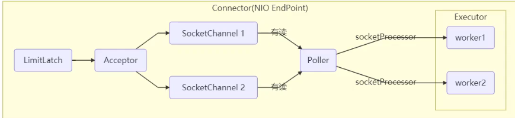

### 线程

#### 创建线程

1. 直接用 Thread 类并重写 `run` 方法。实现简单，但不符合里氏替换原则，不可以继承其他类。

2. 使用 Runnable 接口并重写 `run` 方法。让任务类脱离了 Thread 继承体系，实现解耦。

   若为Runnable，target就不为空，调用run方法时就会调用target的run()方法。

3. 使用FutureTask接口和Callable实现，FutureTask实现了RunnableFuture接口，进而实现了 `Runnable` 和 `Future` 接口。Future可以获取执行结果，判断任务是否完成，中断任务。

- 当多次调用start()，会抛出IllegalThreadStateException()异常。
- start()方法调用了start0()方法，为native方法，会调用run()方法。run()方法要么是覆盖的run()方法，要么是target的run()方法

---

#### sleep  & yield

sleep:

1. 当前线程从 Running 进入 Timed Waiting 状态
2. 是Thread类中的方法，不释放锁，释放CPU
3. 不能被中断，设置打断标记，并抛出 InterruptedException，并清除打断标记 

yield:

1. 当前线程从 Running 进入 Runnable 状态
2. 是Thread类中的方法，不释放锁，释放CPU
3. 不能被中断，设置打断标记，并抛出 InterruptedException，并清除打断标记 

---

#### join

1. 当前线程必须等待调用线程执行完毕/指定时间才能继续执行。
2. 底层会调用wait()方法
3. 当前线程从 Running 进入 Waiting/Timed Waiting 状态
4. 是Thread类中的方法，释放锁，抢占CPU
5. 不能被中断，设置打断标记，并抛出 InterruptedException，并清除打断标记 

---

#### interrupt

1. 中断并不是真正去中断，而是设置中断标记
2. 如果中断的正在运行或park的线程，则会设置 中断标记 ；
3. 如果被中断线程正在 sleep，wait，join 会设置中断标记，并抛出 InterruptedException，并清除 中断标记 ；
4. synchronized的等待线程不可以被中断，ReentrantLock的等待线程可以被中断(lock.lockInterruptibly())。
5. 两个判断中断状态的方法：
   - isInterrupted()是一个Thread的实例方法，不会清除中断标记
   - interrupted()是一个静态方法，会清除中断标记

---

#### 终止线程

1. ~~使用stop()终止线程~~
   - 这个方法会将线程直接杀掉，没有任何喘息机会，一旦线程被杀死，后面的代码逻辑就再也无法得到执行，而且我们无法确定线程关闭的时机，也就是说线程有可能在任何一行代码突然停止执行，这是非常危险的。
   - 假如这个线程正持有某个锁，贸然将其杀死，会导致该线程持有的锁马上被释放，而曾经被该锁保护的资源，可能正处于一种非原子的状态中，此时被其他线程访问到，会产生不可预知的风险。
2. ~~使用suspend()挂起线程，resume()恢复线程~~
3. 使用中断

---

#### 守护线程

守护线程是一种支持型线程，当主线程死亡后，守护线程会跟着死亡。可以通过 `setDaemon(true)` 将线程设置为守护线程，但必须在线程启动前设置。

Tomcat 中的 Acceptor 和 Poller 线程都是守护线程，所以 Tomcat 接收到 shutdown 命令后，不会等待它们处理完当前请求。

---

#### 线程状态

OS五种状态：创建状态，就绪态，运行态，阻塞态，终止态。

JAVA六种状态：

- NEW：线程被创建且未启动，还未调用 `start`  方法。
- RUNNABLE ：当调用了 `start()` 方法之后的状态，注意，Java API 层面的 `RUNNABLE` 状态涵盖了操作系统层面的【就绪状态】、【运行状态】和【阻塞状态(os层面的阻塞状态/IO阻塞状态】（由于 BIO 导致的线程阻塞，在 Java 里无法区分，仍然认为是可运行）
- BLOCKED：抢占锁失败
- WAITING：调用wait(),join(),park()后的状态
- TIME_WAITING：调用sleep(100), wait(100), join(100), parkNanos(100), parkUntil(100)后的状态
- TERMINATED：终止状态，表示当前线程已执行完毕或异常退出。

---

#### ThreadLocal

提供线程内的局部变量，不同的线程之间不会相互干扰，这种变量在线程的生命周期内起作用，减少同一个线程内多个函数或组件之间一些公共变量传递的复杂度。

ThreadLoacl 有一个静态内部类 ThreadLocalMap，其 Key 是 ThreadLocal 对象，值是 Entry 对象，Entry 中只有一个 Object 类的 vaule 值。ThreadLocal 是线程共享的，但 ThreadLocalMap 是每个线程私有的。ThreadLocal 主要有 set、get 和 remove 三个方法。

|        | synchronized                                                 | ThreadLocal                                                  |
| ------ | ------------------------------------------------------------ | ------------------------------------------------------------ |
| 原理   | 同步机制采用’以时间换空间’的方式, 只提供了一份变量,让不同的线程排队访问 | ThreadLocal采用’以空间换时间’的方式, 为每一个线程都提供了一份变量的副本,从而实现同时访问而相不干扰 |
| 侧重点 | 多个线程之间访问资源的同步性                                 | 多线程中让每个线程之间的数据相互隔离                         |

---

### 线程问题

#### 临界区

临界区就是访问共享资源的代码，解决共享资源的竞争问题：

- 阻塞式方法：synchronized，Reentrantlock，ReentrantReadWritelock，StampedLock，Semaphore
- 非阻塞式方法：CAS

---

#### synchronized

1. 可以作用于方法和代码块。锁实例对象等价于锁实例方法，锁类对象等价于锁静态方法。不同之处在于字节码层面：

   代码块会使用 `monitorenter` 和 `monitorexit` 字节码指令获取和释放 monitor，monitorenter尝试获取对象锁，如果这个对象没有被锁定，或当前线程已经持有锁，就把锁的计数器加 1，monitorexit将锁计数器减 1，一旦计数器为 0 锁随即就被释放；

   方法会设置一个ACC_SYNCHRONIZED方法，告诉JVM这是一个同步方法，在进入该方法之前先获取相应的锁，锁的计数器加1，方法结束后计数器-1。

   

2. synchronized的等待线程不可以被中断。

3. 

   - 第一次获取锁时，使用CAS将对象头的Mark Word设置为偏向锁表示，并指明线程ID偏向于哪一个线程。当重入时，若线程ID与自己线程ID相同，则直接重入(不用像轻量级锁那样创建多个Local Reconrd)。

     在没有发生竞争的情况下，当另一个线程获取对象锁时，偏向锁就会上升为轻量锁；如果超过20个对象对同一个线程撤销偏向时，那么第20个及以后的对象可以将撤销对该线程的偏向变为偏向当前线程，叫做**批量重偏向**。如果线程撤销超过40次，jvm知道竞争太激烈，整个类的所有对象都会变为不可偏向，新建的对象也是不可偏向的，叫做**批量撤销**。当发生竞争的情况下，会转为重量锁。

   - 获取轻量锁，创建一个Local Record，值为Local Record的地址，尝试用CAS交换地址和对象头的Mark Word。若交换成功，获取锁；若交换失败，若是当前线程获取锁，则那么那么再添加一条 Lock Record 作为重入的计数，值为null，若是其它线程获取锁，进入锁膨胀，转换为重量级锁。

     当前线程释放锁时，若锁记录的值为null，则删除；不为null，则尝试CAS交换值和Mark Word，成功则解锁成功，失败则表明进行了锁膨胀升级为重量级锁，进入重量级锁解锁流程。

   - 重量级锁是依赖对象内部的monitor锁来实现的，而monitor又依赖操作系统的MutexLock(互斥锁)来实现的，所以重量级锁也被成为**互斥锁**。

     若获取锁冲突，进行锁膨胀：为对象申请Monitor，让Mark Word指向Monitor，然后自己进入Monitor 的EntryList 变成BLOCKED状态。当线程退出synchronized同步块时，尝试CAS交换值和Mark Word，失败，进入重量级锁解锁流程，即按照Monitor的地址找到Monitor对象，将Owner设置为null，唤醒EntryList 中的某个线程(不公平的)。

     重量级锁竞争的时候，还可以使用自旋来进行优化，如果当前线程自旋成功，那么当前线程就可以不用进行上下文切换就获得了锁，并设置owner为当前线程。

     当owner线程调用wait方法，即可进入WaitSet变为WAITING状态/ TIME_WAITING状态。WaitSet中的线程会在Owner线程调用notify或者notifyAll时唤醒，进入EntryList等待获取锁;或者等待时间结束后进入EntryList。

     >Q：重量级锁为什么开销大？
     >
     >A：唤醒一个线程时，都需要操作系统来帮忙，这就需要从**用户态**转换到**内核态**，而转换状态是需要消耗很多时间的，有可能比用户执行代码的时间还要长。

     

4. 作用：
   - **原子性**：**所谓原子性就是指一个操作或者多个操作，要么全部执行并且执行的过程不会被任何因素打断，要么就都不执行。** 被`synchronized`修饰的类或对象的所有操作都是原子的，因为在执行操作之前必须先获得类或对象的锁，直到执行完才能释放。
   - **可见性**： **可见性是指多个线程访问一个资源时，该资源的状态、值信息等对于其他线程都是可见的。** synchronized和volatile都具有可见性，synchronized规定，线程在加锁时， 先清空工作内存→在使用共享变量时从主内存中拷贝共享变量的到工作内存 →执行完代码→将更改后的共享变量的值刷新到主内存中→释放互斥锁。
   - **有序性**：**有序性值程序执行的顺序按照代码先后执行**  synchronized和volatile都具有有序性，**synchronized代码块内部可以被重排序，若该变量整个都在synchronized代码块的保护范围内，就不会出现重排序问题**。 Java允许编译器和处理器对指令进行重排，但是指令重排并不会影响单线程的顺序，它影响的是多线程并发执行的顺序性。synchronized保证了每个时刻都只有一个线程访问同步代码块，也就确定了线程执行同步代码块是分先后顺序的，保证了有序性。
5. 锁消除：JIT若发现加锁没有意义，就会将锁去掉。
6. 锁粗化：JIT若发现代码里连续多次加锁释放锁的代码，会给合并为一个锁

---

#### wait&notify

1. wait是重量级锁，需要和synchronized一起使用。
2. 调用wait方法，进入WaitSet，当前线程从 Running 进入 Waiting/Timed Waiting 状态。WaitSet中的线程会在Owner线程调用notify或者notifyAll时唤醒，进入EntryList等待获取锁;或者等待时间结束后进入EntryList。
3. 是Object类中的方法，释放锁，释放CPU
4. 不能被中断，设置打断标记，并抛出 InterruptedException，并清除打断标记 

---

#### park&unpark

1. 是LockSupport 中的方法，可以进行精确的阻塞和唤醒

2. 不必和synchronized一起使用，unpark可以先于park调用。

3. 调用park时，若\_counter=0，则获取\_mutex互斥锁，进入\_cond条件变量阻塞，并设置_counter=0。若\_counter=1，则直接执行，并置\_counter=0；

   调用unpark时，置\_counter=1，唤醒\_cond条件变量中阻塞的线程，置\_counter=0

---

#### ReentrantLock

是可重入锁，可中断，可设置公平锁，锁超时，可拥有多个条件变量。是基于AQS实现的，AQS的state表示重入次数，属于独占模式。

一般优先考虑 synchronized：

1. synchronized 是语法层面的同步，足够简单。
2.  Lock 必须手动在 finally 释放锁，而synchronized 可以由 JVM 来确保即使出现异常也能正常释放锁。
3.  JVM 更可能针对synchronized 优化，因为 JVM 可以在线程和对象的元数据中记录锁的相关信息。

1. 获取锁：

   - CAS操作抢占锁，抢占成功则修改锁的状态为1，并设置锁的owner
   - 抢占不成功
     - 先通过**tryAcquire**尝试获取锁。若锁状态为0，则CAS操作抢占锁，抢占成功则修改锁的状态为1，并设置锁的owner；若锁状态不为0，则判断是否是owner线程，若是，则再次获取锁，并将锁状态+1
     - 若tryAcquire没有获取锁。**addWaiter(Node)**：新建一个Node节点插入到当前AQS队列的尾部，如没有AQS队列，则新建一个并插入。**acquireQueued(Node)**：通过自旋获取锁或阻塞

2. 释放锁：

   - 获取锁的状态值，将状态值 -1
   - 判断当前线程是否是锁的owner线程，若不是则抛出异常。
   - 若状态值为0，则锁的owner设为null
   - 通过unpark唤醒头节点下一个状态不为CANCELLED的节点

3. 可重入：state表示重入次数，若没有通过CAS获取锁，tryAcquire()中会判断当前线程是否是owner线程。

4. 不可打断模式(lock())：即使它被打断，仍会驻留在AQS队列中，一直要等到获得锁后方能得知自己被打断了，仅仅是设置了打断标记

   可打断模式(lockInterruptibly)：打断后，会抛出异常。

5. 公平锁：两点不同：在lock()方法开始的时候非公平锁会尝试cas抢占锁插一次队；在tryAcquire()方法发现state为0的时候，非公平锁会抢占一次锁，而公平锁会判断AQS链表中是否存在等待的线程，没有等待的线程才会去抢占锁。

6. 锁超时：tryLock获取锁，指定时间没获取到就超时

7. 条件变量：使用lock.newCondition()创建条件变量，**await 前需要获得锁**。await 执行后，会释放锁，进入 conditionObject 等待

---

### JMM

#### JMM

JMM(java内存模型) 规定所有变量都存储在主内存，每条线程有自己的工作内存，工作内存中保存变量的主内存副本，线程对变量的所有操作都必须在工作内存进行，不能直接读写主内存。

JMM 基本原则：只要不改变程序执行结果，编译器和处理器怎么优化都行。

---

#### 重排序

为了提高性能，编译器和处理器通常会对指令进行重排序，重排序指从源代码到指令序列的重排序，分为三种：

- 编译器重排序，编译器在不改变单线程程序语义的前提下可以重排语句的执行顺序
- 处理器重排序，如果不存在数据依赖性，处理器可以改变语句对应机器指令的执行顺序。
- 内存系统的重排序。

---

#### 原子性，可见性，有序性

**原子性**：原子性指操作要么全部成功，要么全部失败。基本数据类型的访问都具备原子性，例外就是 long 和 double。

**可见性**： **可见性是指多个线程访问一个资源时，该资源的状态、值信息等对于其他线程都是可见的。** 不可见是由于主线程和工作内存的不一致性引起的。synchronized和volatile都具有可见性，synchronized规定，线程在加锁时， 先清空工作内存→在使用共享变量时从主内存中拷贝共享变量的到工作内存 →执行完代码→将更改后的共享变量的值刷新到主内存中→释放互斥锁。对 volatile 变量的写指令后会加入写屏障，写屏障（sfence）保证在该屏障之前的，对共享变量的改动，都同步到主存当中；对 volatile 变量的读指令前会加入读屏障，读屏障（lfence）保证在该屏障之后，对共享变量的读取，加载的是主存中最新数据。

**有序性**：**有序性值程序执行的顺序按照代码先后执行。** Java允许编译器和处理器对指令进行重排，但必须符合as-if-serial和happens-before规则。synchronized和volatile都具有有序性，**synchronized代码块内部可以被重排序，若该变量整个都在synchronized代码块的保护范围内，就不会出现重排序问题**。volatile：写屏障会确保指令重排序时，**不会将写屏障之后的代码排在写屏障之前**；读屏障会确保指令重排序时，**不会将读屏障之后的代码排在读屏障之前**。

---

#### as-if-serial

as-if-serial语义的意思是：不管编译器和CPU如何重排序，必须保证在单线程情况下程序的结果是正确的。 以下数据有依赖关系，不能重排序。

---

#### happens-before

先行发生原则，指两项操作间的偏序关系。JMM 存在一些天然的 happens-before 关系，如果两个操作的关系不在此列且无法从中推导，虚拟机就可以对其重排序：

- 一个线程内写在前面的操作逻辑上先行发生于后面的。
- unlock 先行发生于后面对同一个锁的 lock。后面指时间上的先后顺序。
- 对 volatile 变量的写先行发生于后面的读。
- 线程的 `start` 方法先行发生于线程的每个动作。
- 线程中所有操作先行发生于对线程的终止检测。
- 对象的初始化先行发生于 `finalize` 方法。
- 如果 A 先行发生于 B，B 先行发生于 C，那么 A 先行发生于 C 。

as-if-serial 保证单线程程序的执行结果不变，happens-before 保证正确同步的多线程程序的执行结果不变。这两种语义的目的都是`为了在不改变程序执行结果的前提下尽可能提高程序并行度`。

---

#### volatile

保证了可见性和有序性。

对 volatile 变量的写指令后会加入写屏障，写屏障（sfence）保证在该屏障之前的，对共享变量的改动，都同步到主存当中；对 volatile 变量的读指令前会加入读屏障，读屏障（lfence）保证在该屏障之后，对共享变量的读取，加载的是主存中最新数据。

写屏障会确保指令重排序时，**不会将写屏障之后的代码排在写屏障之前**；读屏障会确保指令重排序时，**不会将读屏障之后的代码排在读屏障之前**。

使用：volatile主要用在**一个线程改多个线程读**时的来保证可见性，和double-checked locking模式中保证synchronized代码块外的共享变量的重排序问题

---

#### CAS

1. CAS 是基于`乐观锁`的思想，不怕别的线程来修改共享变量，就算改了也没关系，可以进行重试。
2. CAS 体现的是无锁并发、`无阻塞`并发，无阻塞解决临界区问题。
3. CAS会出现ABA问题，juc 包提供了一个 `AtomicStampedReference `类，通过控制变量值的版本来解决 ABA 问题。

---

#### 原子类

1. 原子基本类型：AtomicInteger，AtomicLong，AtomicBoolean 

   AtomicInteger 的 `getAndIncrement` 调用 Unsafe 类的 `getAndAddInt` 方法以原子方式将当前的值加 1，该方法调用 `compareAndSwapInt` 更新值。

   AtomicBoolean 是先转成整形再使用 `compareAndSwapInt` 。

2. 原子引用

   适用于普通的对象引用，底层使用的是`compareAndSwapObject`实现CAS,比较的是两个对象的地址是否相等。

   - AtomicReference：引用类型原子类
   - AtomicStampedReference：原子更新带有版本号的引用类型。该类将整数值与引用关联起来，可用于解决原子的更新数据和数据的版本号，可以解决使用 CAS 进行原子更新时可能出现的 ABA 问题。
   - AtomicMarkableReference ：原子更新带有标记的引用类型。并不关心引用变量更改了几次，只是单纯的关心是否更改过。

3. 原子数组

   CAS更新数组里的某个元素

   - AtomicIntegerArray：整形数组原子类
   - AtomicLongArray：长整形数组原子类
   - AtomicReferenceArray ：引用类型数组原子类

4. 原子属性

   利用字段更新器，可以针对对象的某个域（Field）进行原子操作，只能配合 volatile 修饰的字段使用，否则会出现异常`IllegalArgumentException`：

   - AtomicIntegerFieldUpdater
   - AtomicLongFieldUpdater
   - AtomicReferenceFieldUpdater

5. 原子累加器

   设置一个base和多个cell，多线程并可以并行的累加，最后将结果汇总。

   LongAdder有三个属性：

   - base：若没有cells且当前线程无法创建，且没有竞争，则用 cas 累加base

   - cells： cell数组, 懒惰初始化
   - cellsBusy：在 cells 创建或扩容时, 置为 1, **表示加锁**

   

---

#### Unsafe

LockSupport的park方法，cas相关的方法和原子类底层都是通过Unsafe类来实现的。Unsafe 对象不能直接调用，只能通过反射获得。

Unsafe 只提供三种 CAS 方法：`compareAndSwapInt`、`compareAndSwapLong` 和 `compareAndSwapObject`

---

#### 线程安全类

1. String
2. Integer
3. StringBuffer
4. Random
5. Vector
6. Hashtable
7. java.util.concurrent 包下的类

`String`和`Integer`类都是不可变的类，因为其类内部状态是不可改变的，因此它们的方法都是线程安全的。

---

#### final

可以使用不可变设计来解决并发问题。

final 变量表示常量，只能被赋值一次，赋值后值不再改变。

- 修饰基本数据类型时，该值在初始化后不能改变。
- 修饰引用类型时，引用指向的对象在初始化后不能改变，但该对象的内容可以发生变化。

final 类不能被继承，成员变量可以根据需要设为final，所有成员方法都会被隐式地指定为 final 方法

final 方法不能被重写，final方法比非final方法要快，因为在编译的时候已经静态绑定了，不需要在运行时再动态绑定。

**内存语义：**

- 编译器会在 final 域的写后，构造方法的 return 前插入一个 Store Store 屏障，确保在对象引用为任意线程可见之前，对象的 final 域已经被正确初始化过了。

- 编译器在读 final 域操作的前面插入一个 Load Load 屏障，确保在读一个对象的 final 域前一定会先读包含这个 final 域的对象引用。

---

### 线程池

通过创建一定数量的线程，让他们时刻准备就绪等待新任务的到达，而任务执行结束之后再重新回来继续待命。

---

#### 优点

降低资源消耗，复用已创建的线程，降低开销、控制最大并发数。

隔离线程环境，可以配置独立线程池，将较慢的线程与较快的隔离开，避免相互影响。

实现任务线程队列缓冲策略和拒绝机制。

实现某些与时间相关的功能，如定时执行、周期执行等。

---

#### 状态

---

#### 构造函数

1. corePoolSize 核心线程数目 (最多保留的线程数)
2. maximumPoolSize 最大线程数目(核心线程数加上救急线程数)
3. keepAliveTime 多余空闲线程的生存时间。当前线程池数量超过 corePoolSize 时，当空闲时间达到 keepAliveTime 值时，多余空闲线程会被销毁直到只剩下 corePoolSize 个线程为止
4. unit keepAliveTime 的时间单位
5. workQueue 阻塞队列，被提交但尚未被执行的任务
6. threadFactory 线程工厂 - 可以为线程创建时起个好名字
7. handler 拒绝策略，表示当队列满了并且工作线程大于等于线程池的最大线程数(maximumPoolSize)时，如何拒绝新的任务

---

#### 处理流程

1. 线程池中刚开始没有线程，当一个任务提交给线程池后，线程池会创建一个新线程来执行任务。
2. 当线程数达到 corePoolSize 并没有线程空闲，这时再加入任务，新加的任务会被加入workQueue 队列排队，直到有空闲的线程。
3. 如果队列选择了有界队列，那么任务超过了队列大小时，会创建 maximumPoolSize - corePoolSize 数目的线程来救急。
4. 如果线程到达 maximumPoolSize 仍然有新任务这时会执行拒绝策略。拒绝策略 jdk 提供了 下面的前4 种实现，其它著名框架也提供了实现
   1. ThreadPoolExecutor.AbortPolicy让调用者抛出 RejectedExecutionException 异常，这是默认策略
   2. ThreadPoolExecutor.CallerRunsPolicy 让调用者运行任务
   3. ThreadPoolExecutor.DiscardPolicy 放弃本次任务
   4. ThreadPoolExecutor.DiscardOldestPolicy 放弃队列中最早的任务，本任务取而代之
   5. Dubbo 的实现，在抛出 RejectedExecutionException 异常之前会记录日志，并 dump 线程栈信息，方便定位问题
   6. Netty 的实现，是创建一个新线程来执行任务
   7. ActiveMQ 的实现，带超时等待（60s）尝试放入队列，类似我们之前自定义的拒绝策略
   8. PinPoint 的实现，它使用了一个拒绝策略链，会逐一尝试策略链中每种拒绝策略
5. 当高峰过去后，超过corePoolSize 的救急线程如果一段时间没有任务做，需要结束节省资源，这个时间由keepAliveTime 和 unit 来控制。

---

#### 创建线程池

1. **newFixedThreadPool**
   - **核心线程数 == 最大线程数**（没有救急线程被创建），因此也无需超时时间
   - **阻塞队列是无界的**，可以放任意数量的任务
   - 适用于任务量已知，相对耗时的任务

2. **newCachedThreadPool**
   - 核心线程数是 0， 最大线程数是 Integer.MAX_VALUE，救急线程的空闲生存时间是 60s
   - 队列采用了 SynchronousQueue 实现特点是，它没有容量，**提交或者消费线程会阻塞，只有有一对提交和消费线程，才同时退出**
   - 适合任务数比较密集，但每个任务执行时间较短的情况

3. **newSingleThreadExecutor**

   - **核心线程数和最大线程数为 1**，任务执行完毕，这唯一的线程也不会被释放。
   - **阻塞队列是无界的**
   - 希望多个任务排队执行。

4. **newScheduledThreadPool**

   - 核心线程数固定，最大线程数为Integer.MAX_VALUE，keepAliveTime=0，即只要线程数大于核心线程数，且线程空闲立马销毁。

   - **阻塞队列是无界的**。

   - schedule()：系统启动后，需要等待多久执行

     scheduleAtFixedRate()和scheduleWithFixedDelay()：周期执行

都会产生OOM问题，不推荐使用Executors方法创建线程池。

前三个都是ThreadPoolExecutor。

---

#### 提交线程池

- execute()：执行任务(Runnable)
- submit()：提交一个任务（Callable），返回值Future可以获取执行结果
- invokeAll() ：提交一个任务集合，全部执行，可以设置超时时间
- invokeAny()：提交一个任务集合，那个任务执行完毕返回结果，可以设置超时时间

---

#### 关闭线程池

可以调用 `shutdown` 或 `shutdownNow` 方法关闭线程池，原理是遍历线程池中的工作线程，逐个调用 `interrupt` 方法中断线程。

 `shutdown` 只是将线程池的状态设为 SHUTDOWN，然后中断没有正在执行任务的线程。而 `shutdownNow` 将线程池的状态设为 STOP，然后尝试停止正在执行或暂停任务的线程，并返回等待执行任务的列表。

通常调用 `shutdown` 来关闭线程池，如果任务不一定要执行完可调用 `shutdownNow`。

---

#### 饥饿问题

指一个任务始终得不到执行，可以**不同的任务类型，采用不同的线程池。**

---

#### 线程数量设置

- CPU 密集型运算：**线程数=cpu 核数 + 1** 。+1 是保证当线程由于页缺失故障（操作系统）或其它原因导致暂停时，额外的这个线程就能顶上去，保证 CPU 时钟周期不被浪费
- I/O 密集型运算：**线程数 = 核数 * 期望 CPU 利用率 * 总时间(CPU计算时间+等待时间) / CPU 计算时间**

---

#### 阻塞队列

**ArrayBlockingQueue**，由数组组成的有界阻塞队列，默认情况下不保证线程公平。

**LinkedBlockingQueue**，由链表组成的有界阻塞队列，队列的默认和最大长度为 Integer 最大值。

**PriorityBlockingQueue**，支持优先级的无界阻塞队列，默认情况下元素按升序排序。可自定义 `compareTo` 方法指定排序规则，或者初始化时指定 Comparator 排序，不能保证同优先级元素的顺序。

**DelayQueue**，支持延时获取元素的无界阻塞队列，使用优先级队列实现。创建元素时可以指定多久才能从队列中获取当前元素，只有延迟期满时才能从队列中获取元素，适用于缓存和定时调度。

**SynchronousQueue**，不存储元素的阻塞队列，每一个 put 必须等待一个 take。默认使用非公平策略，适用于传递性场景，吞吐量高。

**LinkedBlockingDeque**，链表组成的双向阻塞队列，可从队列的两端插入和移出元素，多线程同时入队时减少了竞争。

---

#### Tomacat线程池

1. **LimitLatch** 用来限流，可以控制最大连接个数，类似 J.U.C 中的 Semaphore 后面再讲
2. **Acceptor** 只负责【接收新的 socket 连接】
3. **Poller** 只负责监听 socket channel（acceptor通过ConcurrentLinkedQueue传送给poller） 是否有【可读的 I/O 事件】，一旦可读，封装一个任务对象（socketProcessor），提交给 Executor 线程池处理
4. **Executor** 线程池中的工作线程最终负责【处理请求】

Executor配置：

---

#### Fork/Join

fork出一个线程执行算法上相同的小任务，最终通过join合并结果。

### JUC

---

#### 原子类

看上面

---

#### AQS

- 基于先进先出**FIFO**实现的等待队列，AQS队列是由Node节点组成的**双向链表**实现的，所有的操作都是在这个AQS队列当中，如果一个线程获取锁就直接成功，如果失败了就将其放入等待队列当中。

- 用 state 属性来表示资源的状态

  - getState - 获取 state 状态
  - setState - 设置 state 状态
  - compareAndSetState - cas 机制设置 state 状态

- 每当有新线程请求同步状态时都会进入一个等待队列，等待队列通过双向链表实现，线程被封装在链表的 Node 节点中，Node 的等待状态包括：CANCELLED(1，取消)，SIGNAL(-1，等待被唤醒)，CONDITION(-2，线程正在等待)，PROPAGATE(-3，后继节点会传播唤醒操作，只作用于共享模式)，其中ReentrantLock涉及到的状态就是SIGNAL，CANCELLED。

- 两种模式

  - **独占模式**下锁只会被一个线程占用，其他线程必须等持有锁的线程释放锁后才能获取锁。(**ReentrantLock**)

    获取同步状态时，调用 `acquire` 方法的 `tryAcquire` 方法安全地获取同步状态，获取失败的线程会被构造同步节点并通过 `addWaiter` 方法加入到同步队列的尾部，在队列中自旋。之后调用 `acquireQueued` 方法使得节点以死循环的方式获取同步状态，如果获取不到则阻塞，被阻塞线程的唤醒依靠前驱节点的出队或中断。后继节点的线程被唤醒后需要检查自己的前驱节点是否是头节点，目的是维护同步队列的 FIFO 原则，节点之间在循环检查的过程中基本不通信，而是简单判断自己的前驱是否为头节点。

    释放同步状态时，同步器调用 `tryRelease` 方法释放同步状态，然后调用 `unparkSuccessor` 方法唤醒头节点的后继节点，使后继节点重新尝试获取同步状态。

  - **共享模式**下多个线程可以获取同一个锁。(**ReentrantReadWriteLock**，**semaphoer**)

    获取同步状态时，调用 `acquireShared` 方法的 `tryAcquireShared` 方法，返回值为 int 类型，值不小于 0 表示能去获取锁。

    释放同步状态时，调用 `releaseShared` 方法，释放后会唤醒后续处于等待状态的节点。它和独占式的区别在于 `tryReleaseShared` 方法必须确保同步状态安全释放，通过循环 CAS 保证。

---

#### ReentrantLock

看上面

---

#### ReentrantReadWriteLock

读写锁在同一时刻允许多个读线程访问，在写线程访问时，所有的读写线程均阻塞。

- 读锁不支持条件变量
- **重入时升级不支持**：即持有读锁的情况下去获取写锁，**会导致获取写锁永久等待**
- **重入时降级支持**：即持有写锁的情况下去获取读锁

读写锁依赖 AQS 实现，**写锁状态占了 state 的低 16 位，而读锁使用的是 state 的高 16 位**

---

#### StampedLock

进一步优化读性能，它的特点是在**使用读锁、写锁时都必须配合【戳】使用。**

**读取支持乐观锁**，tryOptimisticRead()获取戳，然后获取数据，再validate校验戳，若正确则继续执行，否则，获取读锁再执行。

**不支持条件变量，不支持可重入**。

---

#### Semaphore

信号量用来**控制同时访问特定资源的线程数量**。

基于AQS实现,state用于存放信号量。使用 `acquire` 方法获得一个许可证，使用 `release` 方法归还许可，还可以用 `tryAcquire` 尝试获得许可。

---

#### CountdownLatch

CountDownLatch允许一个或多个线程等待其他线程完成操作。（参考join）

当线程使用countDown方法时,其实使用了``tryReleaseShared``方法以CAS的操作来减少state,直至state为0就代表所有的线程都调用了countDown方法。

当调用await方法的时候，如果state不为0，就代表仍然有线程没有调用countDown方法，那么就把已经调用过countDown的线程都放入阻塞队列Park,并自旋CAS判断state  == 0，直至最后一个线程调用了countDown，使得state == 0，于是阻塞的线程便判断成功，全部往下执行。

CountDownLatch是基于AQS实现,state 值为 count。

---

#### CyclicBarrier

CyclicBarrier循环屏障是基于同步到达某个点的信号量触发机制，允许一个或多个线程等待其他线程完成操作。每个线程调用 `await` 方法表示自己已到达屏障，若count不为0则阻塞，当count=0时，继续执行。

跟CountdownLatch一样，但这个可以重用。即当count=0时，下次使用count恢复为parties。

CyclicBarrier是基于AQS实现,state 值为 count。

---

#### Exchanger

交换者是用于线程间协作的工具类，用于进行线程间的数据交换。它提供一个同步点，在这个同步点两个线程可以交换彼此的数据。

两个线程通过 `exchange` 方法交换数据，第一个线程执行 `exchange` 方法后会阻塞等待第二个线程执行该方法，当两个线程都到达同步点时这两个线程就可以交换数据，将本线程生产出的数据传递给对方，可用于校对工作等场景。

---

### 线程安全集合

#### 分类

1. 遗留的线程安全集合如 `Hashtable` ， `Vector`

   使用锁保证线程安全

2. 使用 `Collections` 装饰的线程安全集合，如synchronizedMap,synchronizedList

3. JUC下的线程安全集合。包含三类关键字：`Blocking`、`CopyOnWrite`、`Concurrent`

   - `Blocking`  ：大部分实现基于锁，并提供用来阻塞的方法

   - `CopyOnWrite` 之类容器：修改开销相对较重

   - `Concurrent` 类型的容器。大量使用CAS，并且具有弱一致性：读取弱一致性，遍历弱一致性，大小弱一致性。

     对于线程不安全的容器，遍历时发生了修改，使用fail-fast(快速失败)机制，即抛出异常(ConcurrentModificationException)不再遍历。
     
     对于线程安全的容器，遍历时发生了修改，使用fail-safe(安全失败)机制，即在旧副本上遍历，无法读取最新数据，与CAP 理论中 C（一致性） 和 A（可用性） 的矛盾。JUC下的容器都使用fail-safe机制。
     
     >弱一致性并不是不好：数据库的 MVCC 都是弱一致性的表现；并发高和一致性是矛盾的，需要权衡
     
     

---

#### HashMap-循环死链

在JDK7中的HashMa中，会产生并发死链（环形链表），发生在扩容时，由于头插法引起的。

在JDK8中，使用`数组`加`链表/红黑树`方式这种组合结构。新元素依旧通过取模方式获取 Table 数组位置，然后再将元素加入链表尾部。一旦链表元素数量超过 8 之后，先扩容，若达到64还不行，自动转为红黑树，进一步提高了查找效率。

由于 JDK8 链表采用**尾插入法**，从而避免并发扩容情况下链表形成死链的可能。但是仍然不适合用于并发场景，依然是无法避免并发扩容情况下的死链问题。

---

#### ConcurrentHashMap-JDK8

ConcurrentHashMap 用于解决 HashMap 的线程安全和 HashTable 的低效问题。HashMap产生循环死链问题；HashTable 中所有线程都必须竞争同一把锁。

1. 懒惰创建。调用构造器时不会创建Hash表，只会记录表大小，当put时才会创建
2. 在JDK8中，对链表头结点上锁
3. 当一个哈希槽中元素数量超过 8 之后，先扩容，若达到64还不行，自动转为红黑树
4. 在元素总数的更新和计算时使用CAS操作，并使用了LongAdder思想，提高了效率

- **构造器**：在构造器中，仅仅计算table的大小，并记录在sizeCtl中

  sizeCtl：①默认为0；②调用构造器后，为table大小；③在初始化时，为-1；④在扩容时，为-N，-N对应的二进制的低16位数值为M，此时有M-1个线程进行扩容；⑤在初始化或扩容完成后，为 下一次的扩容的阈值大小。
  
- **get()**：①如果头结点的hash等于key的hash值，再比较key值 ②若hash<0表示再扩容或是红黑树，使用find()方法查找 ③否则遍历链表，比较key值

- **putVal()**：

  - 若table为空，调用**initTable()**创建table

  - 若链表头结点为空，创建头结点

  - 若链表头结点不为空

    - 若头结点的hash值为moved，帮忙扩容**helpTransfer()**
    - 否则
      - 若链表头结点hash值≥0，则表示这是一个链表，遍历链表，若key相同，则更新链表，直到最后一个结点还不相同，就插入结点。每遍历一个结点bincount+1
      - 若链表头结点hash值<0且链表头结点为TreeBin，则插入新结点或修改结点值。

  - 若链表长度(bincount) > 树化阈值(8), 将链表扩容到64之后，如果还是链表长度 > 树化阈值(8)才变红黑树

    使用同步块锁住当前槽的首元素，防止其他线程对当前槽进行增删改操作，转化完成后利用 CAS 替换原有链表。

  - 调用**addCount()**：①在baseCount或cell中+1 ②调用**sumCount()**获取总的元素个数，若大于扩容阈值，则帮助扩容或者进行扩容。

- **size()**：会调用sumCount()获取元素个数。sumCount()将baseCount和所有cell进行相加。

- **transfer()**：①构建一个nextTable，其大小为原来大小的两倍 ,这个步骤是在单线程环境下完成的 ②将原来table里面的内容复制到nextTable中，这个步骤是允许多线程操作的。若链表头为空，则表示已经处理了，将链条头替换为**ForwardingNode**；若链表头已经为ForwardingNode，则继续处理下一个链表；否者，将链表头锁住，分别进行链表和红黑树的复制。

#### ConcurrentHashMap-JDK7

1. 不是懒惰创建。调用构造器时创建一个Segment数组，Segments 数组默认大小为16，这个容量初始化指定后就不能改变了。每个Segment继承了ReentrantLock，对应一把锁，相当于一个Hash表。采用链表处理冲突。
2. 在JDK7中，对每个Segment上锁
3. 在元素总数的更新时，因为直接对Segment上锁，可以直接修改count和modCount；再元素总数计算时，先不加锁计算两次，如果前后两次的modCount一样（即两次中间没有进行新增），认为个数正确返回如果不一样，进行重试，重试次数超过 3，将所有 segment 锁住，重新计算个数返回  (即size()方法的实现)

- **构造器**：①设置segmentShift和segmentMask，segmentShift默认为28，segmentMask默认为15，即低四位为1。用于定位segment ②创建 segments and segments[0]
- **get()**：①获取key的hash值 ②将hash值无符号右移segmentShift位，并和segmentMask做与运算，从而定位segment ③通过hash值定位到链表，并循环链表找到指定元素。
- **put()**：
  - 获取key的hash值 
  - 将hash值无符号右移segmentShift位，并和segmentMask做与运算，从而定位segment 
  - 若segment为空，并通过CAS保证其它线程没有创建，则创建 
  - 调用另一个put()方法
    - tryLock()尝试加锁，如果不成功, 进入 scanAndLockForPut 流程，最多 tryLock 64 次, 不成功进入 lock 流程
    - 获取锁，则更新或新增结点，将modCount+1。若为更新结点，则count+1，并判断count是否大于阈值，若大于则调用**rehash()**扩容。
- **rehash()**：在put()中调用，因为此时已经获得了锁，因此 rehash 时不需要考虑线程安全。①构建一个newTable，其大小为原来大小的两倍 ②将原来table里面的内容复制到nextTable中，尽可能进行搬迁工作而不是重建：如果只有一个节点，那么就直接移动到新数组中的合适位置；多个节点：在同一插槽中重复使用连续序列
- **size()**：计算元素个数前，先不加锁计算两次，如果前后两次的modCount一样（即两次中间没有进行新增），认为个数正确返回；如果不一样，进行重试，重试次数超过 3，将所有 segment 锁住，重新计算个数返回

---

#### LinkedBlockingQueue 

LinkedBlockingQueue是一个基于链表的阻塞队列，有head和last两个指针。用了两把锁和 dummy 节点，两把锁分别对应于haed和last，为takeLock和putLock(ReentrantLock)。

- 当节点总数等于 1 时（就一个 `dummy` 节点，head和last都指向dummy）这时 `take` 线程会被 `notEmpty` 条件阻塞，有竞争，也会阻塞
- 当节点总数大于等于 2 时（即一个 `dummy` 节点，一个或多个正常节点），`putLock` 保证的是 last节点的线程安全，`takeLock` 保证的是head 节点(dummy)的线程安全。两把锁保证了入队和出队没有竞争

与**ArrayBlockingQueue**的性能比较：

1. Linked 实现是链表，Array 实现是数组
2. Linked 支持有界，Array 强制有界
3. Linked 是懒惰的，而 Array 需要提前初始化 Node 数组
4. Linked 每次入队会生成新 Node，而 Array 的 Node 是提前创建好的
5. Linked 两把锁，Array 一把锁

---

#### ConcurrentLinkedQueue

与LinkedBlockingQueue类似，是一个基于链表的队列，两把【锁】，同一时刻，可以允许两个线程同时（一个offer与一个poll）执行，锁使用CAS实现的。

Tomcat 的 Connector 结构中，Acceptor通过ConcurrentLinkedQueue 将 SocketChannel 传递给 Poller。

---

#### CopyOnWriteArrayList

底层实现采用了 **写入时拷贝** 的思想，增删改操作会将底层数组拷贝一份，更改操作在新数组上执行，这时不影响其它线程的并发读，实现**读写分离**，进而不需要使用锁。

适合读多写少的场景，具有读取和遍历弱一致性问题，使用 fail-safe机制。

